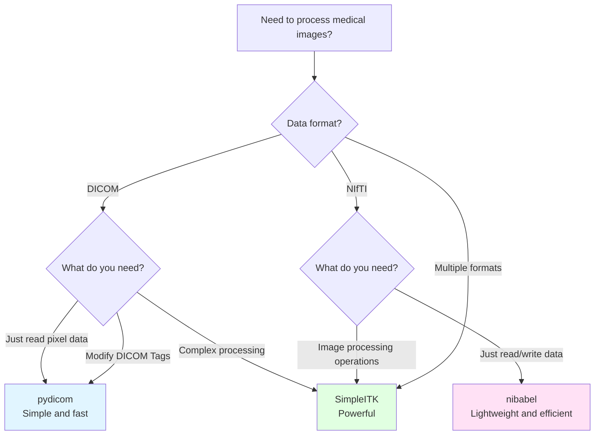
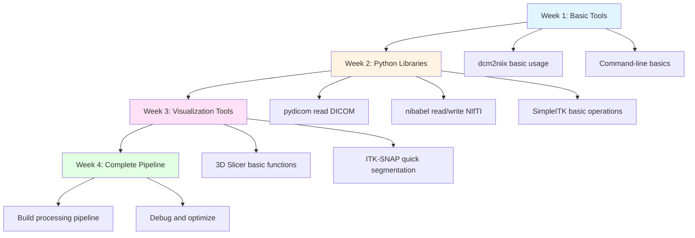

# 1.3 Common Open Source Tools

> "Tools are not the goal, but a bridge to understanding. Choosing the right tool allows you to focus on the problem itself, not technical details." —— The Spirit of Open Source

Imagine this scenario: You just joined a medical imaging research team, and your advisor gave you a hard drive containing 1000 patients' CT scan DICOM files. Your task is to: convert this data to NIfTI format, check data quality, extract lung regions, and finally train a deep learning model.

Facing this task, you might ask:
- What tool should I use to convert DICOM to NIfTI? Command-line tool or Python script?
- How can I quickly visualize and check the quality of 1000 scans?
- Which Python library is best for reading and processing medical images?
- What software do I need to install? How do they work together?

This chapter will introduce you to the open source tool ecosystem for medical imaging processing, helping you quickly select the right tool for specific scenarios and laying a solid foundation for the in-depth learning in subsequent chapters.

---

## 🗺️ Medical Imaging Processing Workflow and Tool Map

### Typical Workflow

A complete medical imaging processing project typically includes the following stages:


**Core tasks at each stage**:
- **Data Acquisition**: Obtain raw data from PACS systems, research databases, or public datasets
- **Format Conversion**: Convert DICOM to research-common formats (NIfTI, NRRD, etc.)
- **Visualization Check**: Quickly browse data to discover scanning artifacts, annotation errors, etc.
- **Preprocessing**: Denoising, registration, resampling, normalization, etc.
- **Analysis/Reconstruction**: Implement core algorithms (reconstruction, segmentation, registration, etc.)
- **Result Output**: Generate reports, visualize results, save processed data

### Tool Classification Matrix

The following table shows the applicability of different types of tools at each stage:

| Tool Type | Format Conversion | Visualization | Preprocessing | Algorithm Implementation | Typical Representatives |
|-----------|------------------|---------------|----------------|------------------------|----------------------|
| **Command-line Tools** | ⭐⭐⭐⭐⭐ | ⭐⭐ | ⭐⭐⭐ | ⭐⭐ | dcm2niix, FSL |
| **Python Libraries** | ⭐⭐⭐⭐ | ⭐⭐⭐ | ⭐⭐⭐⭐⭐ | ⭐⭐⭐⭐⭐ | pydicom, SimpleITK |
| **GUI Software** | ⭐⭐⭐ | ⭐⭐⭐⭐⭐ | ⭐⭐⭐⭐ | ⭐⭐⭐ | 3D Slicer, ITK-SNAP |
| **Complete Platforms** | ⭐⭐⭐⭐ | ⭐⭐⭐⭐ | ⭐⭐⭐⭐⭐ | ⭐⭐⭐⭐ | FreeSurfer, FSL |

::: tip 💡 Golden Rules for Tool Selection
- **Simple tasks use command-line**: Batch conversion, standardized workflows
- **Complex logic use Python**: Conditional logic, loops, integration with other libraries
- **Interactive exploration use GUI**: Data quality checking, parameter tuning, demonstrations
- **Complete workflows use platforms**: Standardized analysis pipelines (e.g., FreeSurfer cortical reconstruction)
:::

---

## 🔧 In-Depth Analysis of Core Tools

### 1. Format Conversion Tools

#### dcm2niix: The De Facto Standard for DICOM Conversion

**Official Resources**:
- 🌐 GitHub Repository: https://github.com/rordenlab/dcm2niix
- 📖 Documentation: https://github.com/rordenlab/dcm2niix/blob/master/README.md

**Design Philosophy**:
dcm2niix, developed by Chris Rorden, aims to provide the fastest and most accurate DICOM to NIfTI conversion tool. Written in C++, it has no external dependencies and can process thousands of DICOM files in seconds.

**Core Advantages**:
- **Extremely fast**: C++ implementation, 10-100 times faster than Python scripts
- **Automated processing**: Automatically identifies DICOM hierarchy (Patient → Study → Series → Instance)
- **Metadata preservation**: Outputs metadata in JSON format, preserving key scanning parameters
- **Broad compatibility**: Supports DICOM formats from major vendors like Siemens, GE, Philips, Canon
- **BIDS-friendly**: Output file naming complies with Brain Imaging Data Structure standard

**Applicable Scenarios**:
- ✅ Batch convert research datasets
- ✅ Build automated processing pipelines
- ✅ Need to preserve complete metadata
- ❌ Need to embed conversion logic in Python scripts (use SimpleITK)
- ❌ Need interactive parameter adjustment (use 3D Slicer)

**Minimal Example**:
```bash
# Basic usage: convert single directory
dcm2niix -o output_dir input_dir

# Advanced usage: custom file naming
dcm2niix -o output_dir -f "%p_%s_%t" input_dir
# %p = patient name, %s = series description, %t = time

# Output compressed format and preserve metadata
dcm2niix -z y -b y -o output_dir input_dir
```

**Comparison with Other Tools**:

| Tool | Speed | Metadata Preservation | Ease of Use | Cross-platform | Recommendation |
|------|-------|----------------------|-------------|----------------|---------------|
| **dcm2niix** | ⭐⭐⭐⭐⭐ | ⭐⭐⭐⭐⭐ | ⭐⭐⭐⭐ | ⭐⭐⭐⭐⭐ | First Choice |
| **MRIcron** | ⭐⭐⭐ | ⭐⭐⭐ | ⭐⭐⭐⭐⭐ | ⭐⭐⭐⭐ | For GUI Users |
| **pydicom** | ⭐⭐ | ⭐⭐⭐⭐⭐ | ⭐⭐⭐ | ⭐⭐⭐⭐⭐ | When Customization Needed |
| **SimpleITK** | ⭐⭐⭐ | ⭐⭐⭐⭐ | ⭐⭐⭐ | ⭐⭐⭐⭐⭐ | Python Integration |

::: warning ⚠️ Common Pitfalls
1. **Multi-echo sequences**: dcm2niix generates separate NIfTI files for each echo, requiring manual merging
2. **Enhanced scans**: Dynamic enhanced scans may be split into multiple time points, check output JSON file
3. **Coordinate system**: Default output is RAS+ coordinate system, different from some software defaults (e.g., FSL)
:::

---

### 2. Python Ecosystem

Python is the most popular programming language for medical imaging processing, with a rich set of tool libraries. The following is an in-depth introduction to three core libraries.

#### pydicom: Python Interface to DICOM

**Official Resources**:
- 🌐 Official Website: https://pydicom.github.io/
- 📦 GitHub Repository: https://github.com/pydicom/pydicom
- 📖 Documentation: https://pydicom.github.io/pydicom/stable/

**Design Philosophy**:
pydicom is a pure Python implementation of the DICOM standard library, aiming to provide complete access to all DICOM standard features. It has no external C/C++ dependencies, making it easy to install and debug.

**Core Advantages**:
- **Complete DICOM support**: Read, modify, create DICOM files
- **Flexible Tag access**: Access metadata by tag name or number
- **Pure Python implementation**: Easy to integrate into existing projects, no compilation dependencies
- **Active community**: Over 4000 stars on GitHub, quick issue response

**Applicable Scenarios**:
- ✅ Need to read/modify specific DICOM Tags
- ✅ Build automated DICOM processing pipelines
- ✅ Integrate with Pandas/NumPy for data analysis
- ✅ Develop DICOM network services (with pynetdicom)
- ❌ Need high-performance image processing (use SimpleITK)

**Minimal Example**:
```python
import pydicom
import numpy as np

# Read DICOM file
ds = pydicom.dcmread("ct_scan.dcm")

# Access metadata
print(f"Patient Name: {ds.PatientName}")
print(f"Study Date: {ds.StudyDate}")
print(f"Slice Thickness: {ds.SliceThickness} mm")

# Get pixel data
pixel_array = ds.pixel_array  # Returns NumPy array

# Apply window/level
slope = ds.RescaleSlope if hasattr(ds, 'RescaleSlope') else 1
intercept = ds.RescaleIntercept if hasattr(ds, 'RescaleIntercept') else 0
hu_array = pixel_array * slope + intercept  # Convert to HU values
```

::: details 🔍 Common Pitfalls and Solutions
**Pitfall 1: Pixel data not automatically scaled**
```python
# ❌ Wrong: Use pixel_array directly
pixel_array = ds.pixel_array  # May be raw storage values

# ✅ Correct: Apply RescaleSlope and RescaleIntercept
hu_array = ds.pixel_array * ds.RescaleSlope + ds.RescaleIntercept
```

**Pitfall 2: Cannot read compressed DICOM**
```python
# Solution: Install decompression libraries
# pip install pylibjpeg pylibjpeg-libjpeg pylibjpeg-openjpeg
```

**Pitfall 3: Not handling DICOM hierarchy**
```python
# pydicom only reads single files, need to traverse directory yourself
import os
from pathlib import Path

dicom_files = []
for root, dirs, files in os.walk("dicom_dir"):
    for file in files:
        if file.endswith(".dcm"):
            dicom_files.append(os.path.join(root, file))
```
:::

---

#### nibabel: Swiss Army Knife for Neuroimaging

**Official Resources**:
- 🌐 Official Website: https://nipy.org/nibabel/
- 📦 GitHub Repository: https://github.com/nipy/nibabel
- 📖 Documentation: https://nipy.org/nibabel/manual.html

**Design Philosophy**:
nibabel (NeuroimagingBabel) aims to provide a unified interface for accessing multiple neuroimaging formats. It is a core component of the NiPy (Neuroimaging in Python) project, focusing on correctly handling medical imaging coordinate systems and affine transformations.

**Core Advantages**:
- **Multi-format support**: NIfTI, GIFTI, CIFTI, MGH, MINC, Analyze, etc.
- **Coordinate system correctness**: Correctly handles affine matrices, avoiding common errors like left-right flipping
- **Seamless NumPy integration**: Data returned as NumPy arrays
- **Lazy loading**: Memory-efficient handling of large files

**Applicable Scenarios**:
- ✅ Neuroimaging research (fMRI, DTI, structural imaging)
- ✅ Need to handle coordinate system conversion
- ✅ Integration with scikit-learn/PyTorch/TensorFlow
- ✅ Read/write NIfTI format (most common)
- ❌ Need complex image processing operations (use SimpleITK)

**Minimal Example**:
```python
import nibabel as nib
import numpy as np

# Load NIfTI file
img = nib.load("brain.nii.gz")

# Get data array
data = img.get_fdata()  # Returns NumPy array, shape like (256, 256, 180)

# Get affine matrix (voxel coordinates → world coordinates)
affine = img.affine
print(f"Voxel size: {img.header.get_zooms()}")  # e.g., (1.0, 1.0, 1.0) mm

# Modify data and save
data_modified = data * 2  # Simple intensity scaling
img_new = nib.Nifti1Image(data_modified, affine, img.header)
nib.save(img_new, "brain_modified.nii.gz")
```

**Coordinate System Handling**:
```python
# Convert voxel coordinates to world coordinates
voxel_coords = np.array([100, 100, 90, 1])  # Homogeneous coordinates
world_coords = affine @ voxel_coords
print(f"World coordinates: {world_coords[:3]}")  # Output RAS+ coordinates

# Get image orientation information
orientation = nib.aff2axcodes(affine)
print(f"Image orientation: {orientation}")  # e.g., ('R', 'A', 'S')
```

::: tip 💡 NIfTI-1 vs NIfTI-2
- **NIfTI-1**: Most commonly used, 348-byte file header, supports up to 32767 voxels
- **NIfTI-2**: Released in 2011, 540-byte file header, supports larger image sizes
- nibabel automatically recognizes both formats, no manual specification needed
:::

---

#### SimpleITK: Industrial-Grade Image Processing Library

**Official Resources**:
- 🌐 Official Website: https://simpleitk.org/
- 📦 GitHub Repository: https://github.com/SimpleITK/SimpleITK
- 📖 Documentation: https://simpleitk.readthedocs.io/
- 📓 Jupyter Tutorials: https://github.com/InsightSoftwareConsortium/SimpleITK-Notebooks

**Design Philosophy**:
SimpleITK is a simplified interface to ITK (Insight Segmentation and Registration Toolkit), providing bindings for Python, R, Java, C#, and other languages. It encapsulates ITK's powerful image processing capabilities into an easy-to-use API while maintaining high performance.

**Core Advantages**:
- **Supports almost all medical imaging formats**: DICOM, NIfTI, NRRD, MetaImage, etc.
- **Rich built-in algorithms**: Registration, segmentation, filtering, morphological operations
- **C++ backend**: Excellent performance, suitable for large-scale data processing
- **Complete tutorials**: Official provides 100+ Jupyter Notebook tutorials

**Applicable Scenarios**:
- ✅ Need complex image processing operations (registration, segmentation, filtering)
- ✅ Multi-modal registration
- ✅ Build complete processing pipelines
- ✅ Need high-performance processing of large-scale data
- ❌ Only need simple read/write operations (use nibabel for lighter weight)

**Minimal Example**:
```python
import SimpleITK as sitk

# Read image (automatically identify format)
image = sitk.ReadImage("ct.nii.gz")

# Get image information
print(f"Image size: {image.GetSize()}")
print(f"Voxel spacing: {image.GetSpacing()}")
print(f"Image origin: {image.GetOrigin()}")

# Convert to NumPy array
array = sitk.GetArrayFromImage(image)  # Note: axis order is (z, y, x)

# Image resampling
new_spacing = [1.0, 1.0, 1.0]  # Target voxel spacing
resampler = sitk.ResampleImageFilter()
resampler.SetOutputSpacing(new_spacing)
resampler.SetInterpolator(sitk.sitkLinear)
resampled = resampler.Execute(image)

# Save result
sitk.WriteImage(resampled, "ct_resampled.nii.gz")
```

**Advanced Features Example**:
```python
# Image registration
fixed = sitk.ReadImage("ct_fixed.nii.gz")
moving = sitk.ReadImage("ct_moving.nii.gz")

# Use rigid registration
registration_method = sitk.ImageRegistrationMethod()
registration_method.SetMetricAsMeanSquares()
registration_method.SetOptimizerAsRegularStepGradientDescent(
    learningRate=1.0,
    minStep=0.001,
    numberOfIterations=200
)
registration_method.SetInterpolator(sitk.sitkLinear)

transform = registration_method.Execute(fixed, moving)
registered = sitk.Resample(moving, fixed, transform)
```

::: warning ⚠️ NumPy Array Axis Order
SimpleITK and NumPy have different axis orders:
- **SimpleITK**: (x, y, z) - follows medical imaging convention
- **NumPy**: (z, y, x) - follows array indexing convention

```python
# SimpleITK → NumPy
sitk_image = sitk.ReadImage("image.nii.gz")
numpy_array = sitk.GetArrayFromImage(sitk_image)  # Axis order becomes (z, y, x)

# NumPy → SimpleITK
sitk_image_new = sitk.GetImageFromArray(numpy_array)  # Axis order restored to (x, y, z)
sitk_image_new.CopyInformation(sitk_image)  # Copy spacing, origin, etc.
```
:::

---

#### Python Tool Selection Decision Tree



**Quick Selection Guide**:

| Scenario | Recommended Tool | Reason |
|----------|-----------------|--------|
| Read DICOM metadata | pydicom | Complete DICOM standard support |
| Batch convert DICOM→NIfTI | dcm2niix | Fastest speed, command-line friendly |
| Read/write NIfTI files | nibabel | Lightweight, correct coordinate system handling |
| Image registration/segmentation | SimpleITK | Rich built-in algorithms |
| Deep learning data loading | nibabel + PyTorch | Good integration with deep learning frameworks |
| Build complete processing pipeline | SimpleITK | One-stop solution |

---

### 3. Visualization and Interactive Tools

Medical imaging processing not only requires programming tools but also visualization software to check data quality, adjust parameters, and generate demonstration materials. The following are two of the most popular open-source visualization tools.

#### 3D Slicer: Photoshop for Medical Imaging

**Official Resources**:
- 🌐 Official Website: https://www.slicer.org/
- 📖 Documentation: https://slicer.readthedocs.io/
- 💬 Community Forum: https://discourse.slicer.org/

**Design Philosophy**:
3D Slicer is an extensible medical imaging platform originally developed by Harvard Medical School and MIT. It is not just a visualization tool, but a complete research platform that supports extending functionality through Python scripts and C++ plugins.

**Core Advantages**:
- **Powerful 3D visualization**: Supports multiplanar reconstruction (MPR), volume rendering, surface rendering
- **Rich plugin ecosystem**: Over 200 extension modules covering registration, segmentation, quantification, etc.
- **Python script support**: Run Python scripts within Slicer to automate operations
- **DICOM support**: Built-in DICOM browser, supports PACS connection
- **Cross-platform**: Full platform support for Windows, macOS, Linux

**Applicable Scenarios**:
- ✅ Interactive data exploration and quality checking
- ✅ Manual segmentation annotation (e.g., tumor delineation)
- ✅ Quick prototype verification (test algorithm effectiveness)
- ✅ Generate demonstration materials (screenshots, videos)
- ✅ Teaching demonstrations
- ❌ Batch automated processing (use command-line tools)
- ❌ Need to embed in Python workflow (use SimpleITK)

**Core Modules**:

| Module | Purpose | Typical Application |
|--------|---------|-------------------|
| **Data** | Data loading and management | Import DICOM, NIfTI, etc. |
| **Volumes** | Volume data visualization | Adjust window/level, multiplanar reconstruction |
| **Segmentation** | Image segmentation | Manual delineation, semi-automatic segmentation |
| **Registration** | Image registration | Multi-modal registration, temporal registration |
| **Quantification** | Quantitative analysis | Volume measurement, density statistics |
| **Extensions** | Extension modules | Install third-party plugins |

**Typical Workflow**:
```
1. Load data (File → Add Data)
2. Adjust display (Volumes module: window/level)
3. Create segmentation (Segmentation module: manual delineation)
4. Export results (File → Save)
```

::: tip 💡 3D Slicer Learning Curve
3D Slicer is powerful but has a steep learning curve. Recommendations:
1. Start with official tutorials: https://slicer.readthedocs.io/en/latest/user_guide/getting_started.html
2. Watch YouTube video tutorials
3. Ask questions on the forum: https://discourse.slicer.org/
4. Master basic loading, visualization, segmentation functions first, then explore advanced features
:::

---

#### ITK-SNAP: Lightweight Tool Focused on Segmentation

**Official Resources**:
- 🌐 Official Website: https://www.itksnap.org/
- 📖 Documentation: https://www.itksnap.org/pmwiki/pmwiki.php?n=Documentation.HomePage

**Design Philosophy**:
ITK-SNAP, developed by the University of Pennsylvania, focuses on manual and semi-automatic segmentation of medical images. It is lighter than 3D Slicer, starts faster, has a simpler interface, and is very suitable for quick segmentation tasks.

**Core Advantages**:
- **Gentle learning curve**: Intuitive interface, easy to learn
- **Fast startup**: 5-10 times faster than 3D Slicer
- **Focused on segmentation**: Provides multiple segmentation tools (manual, semi-automatic, automatic)
- **Snake active contour**: Classic Snake algorithm implementation
- **Multi-label support**: Can segment multiple structures simultaneously

**Applicable Scenarios**:
- ✅ Quick manual segmentation
- ✅ Teaching demonstrations (simple interface)
- ✅ Scenarios requiring fast startup
- ❌ Need complex image processing workflows (use 3D Slicer)
- ❌ Need plugin extensions (use 3D Slicer)

**3D Slicer vs ITK-SNAP Comparison**:

| Feature | 3D Slicer | ITK-SNAP |
|---------|-----------|----------|
| **Learning Curve** | Steep | Gentle |
| **Feature Range** | Broad (platform-level) | Focused on segmentation |
| **Plugin Ecosystem** | Rich (200+) | Limited |
| **Startup Speed** | Slow (10-30 seconds) | Fast (1-3 seconds) |
| **Python Scripts** | Supported | Not supported |
| **Recommended Scenario** | Research platform | Quick segmentation |
| **Community Support** | Active | Moderate |

::: info 💡 When to Choose Which Tool?
- **Choose 3D Slicer**: Need a complete research platform, willing to invest time in learning
- **Choose ITK-SNAP**: Only need quick segmentation, pursue simplicity and efficiency
- **Use both**: Use ITK-SNAP for quick viewing, use 3D Slicer for in-depth analysis
:::

---

### 4. Command-Line Tool Suite

In addition to general-purpose tools, the neuroimaging field has three long-established "heavyweight" toolkits: FSL, FreeSurfer, and AFNI. They provide complete workflows from preprocessing to statistical analysis.

#### FSL, FreeSurfer, AFNI: The Big Three of Neuroimaging

**Official Resources**:
- 🌐 **FSL**: https://fsl.fmrib.ox.ac.uk/
- 🌐 **FreeSurfer**: https://surfer.nmr.mgh.harvard.edu/
- 🌐 **AFNI**: https://afni.nimh.nih.gov/

**Common Features**:
- Command-line focused (also have GUI components)
- Focus on neuroimaging analysis (fMRI, DTI, structural imaging)
- Include complete processing workflows (preprocessing → analysis → statistics)
- Steep learning curve, but powerful functionality
- Widely used in academia

**Tool Comparison**:

| Tool | Specialty | Learning Curve | Community Support | Typical Application |
|------|-----------|----------------|------------------|-------------------|
| **FSL** | Functional MRI, Diffusion MRI | Moderate | Excellent | fMRI analysis, DTI fiber tracking |
| **FreeSurfer** | Cortical reconstruction, Morphology | Steep | Excellent | Cortical thickness, brain region segmentation |
| **AFNI** | Functional MRI, Statistical analysis | Steep | Good | fMRI time series analysis |

**FSL Core Tools**:
- **BET**: Brain Extraction Tool
- **FLIRT/FNIRT**: Linear/non-linear registration
- **FEAT**: fMRI analysis
- **TBSS**: Tract-Based Spatial Statistics

**FreeSurfer Core Workflow**:
```bash
# Complete cortical reconstruction workflow (requires 12-24 hours)
recon-all -subject subj01 -i T1.nii.gz -all
```

**AFNI Core Tools**:
- **3dvolreg**: Volume registration
- **3dDeconvolve**: fMRI statistical modeling
- **3dClustSim**: Multiple comparison correction

::: warning ⚠️ Scope of This Tutorial
These toolkits contain complete neuroimaging analysis workflows, **beyond the scope of this tutorial (preprocessing before reconstruction)**. We will use some of their functions in Chapter 2 (such as FSL's BET brain extraction), but will not deeply explain complete fMRI or DTI analysis workflows.

If your research direction is neuroimaging analysis, I recommend learning:
- **FSL Course**: https://fsl.fmrib.ox.ac.uk/fslcourse/
- **FreeSurfer Tutorial**: https://surfer.nmr.mgh.harvard.edu/fswiki/Tutorials
- **AFNI Bootcamp**: https://afni.nimh.nih.gov/pub/dist/doc/htmldoc/
:::

---

## 🧭 Tool Selection Guide

Theory is important, but in actual work, the most critical question is: **Facing a specific scenario, how do I quickly select the right tool?** The following are recommendations for several typical scenarios.

### Scenario 1: I'm a Python Developer and Want to Process DICOM Data

**Background**: You have programming experience and want to build automated workflows using Python.

**Recommended Approach**:
```
Phase 1: Data Exploration
└─ 3D Slicer (visualize and check data quality)

Phase 2: Development
├─ pydicom (read DICOM metadata and pixel data)
├─ nibabel (if need to convert to NIfTI)
└─ matplotlib (quick visualization)

Phase 3: Production
├─ dcm2niix (batch convert DICOM→NIfTI)
└─ SimpleITK (image processing operations)
```

**Example Code**:
```python
import pydicom
import nibabel as nib
import SimpleITK as sitk

# 1. Read DICOM with pydicom
ds = pydicom.dcmread("ct.dcm")
print(f"Patient: {ds.PatientName}, Slice Thickness: {ds.SliceThickness}mm")

# 2. Batch convert with dcm2niix (command-line)
# dcm2niix -o output_dir -z y input_dir

# 3. Read NIfTI with nibabel
img = nib.load("ct.nii.gz")
data = img.get_fdata()

# 4. Process with SimpleITK
sitk_img = sitk.ReadImage("ct.nii.gz")
resampled = sitk.Resample(sitk_img, new_size, sitk.Transform())
```

---

### Scenario 2: I Need to Batch Convert DICOM to NIfTI

**Background**: You have 1000 patients' DICOM data that needs to be converted to NIfTI format for research.

**Recommended Approach**:
```bash
# Option A: Simplest (recommended)
dcm2niix -o output_dir -f "%p_%s" -z y input_dir

# Option B: More control (Python script)
# Use pydicom to traverse DICOM hierarchy, then call dcm2niix
```

**Advanced Tips**:
```bash
# Batch process multiple patients
for patient_dir in /data/patients/*/; do
    dcm2niix -o /output/"$(basename "$patient_dir")" -z y "$patient_dir"
done

# Preserve BIDS-format metadata
dcm2niix -b y -z y -f "%p_%s" input_dir
# Output: patient_series.nii.gz + patient_series.json
```

---

### Scenario 3: I Need to Visualize and Check Data Quality

**Background**: You just received a batch of data and need to quickly check for scanning artifacts, annotation errors, etc.

**Recommended Approach**:

| Need | Recommended Tool | Reason |
|------|-----------------|--------|
| **Quick Browse** | ITK-SNAP | Fast startup, simple interface |
| **In-depth Analysis** | 3D Slicer | Powerful, adjustable parameters |
| **Programmatic** | matplotlib + nibabel | Automated batch checking |

**Python Automated Checking Example**:
```python
import nibabel as nib
import matplotlib.pyplot as plt
import numpy as np

def quick_check(nifti_path):
    """Quick check NIfTI file"""
    img = nib.load(nifti_path)
    data = img.get_fdata()

    # Check 1: Data range
    print(f"Data range: [{data.min():.2f}, {data.max():.2f}]")

    # Check 2: NaN or Inf values
    if np.isnan(data).any():
        print("⚠️ Warning: Data contains NaN values")

    # Check 3: Visualize middle slice
    mid_slice = data.shape[2] // 2
    plt.imshow(data[:, :, mid_slice], cmap='gray')
    plt.title(f"{nifti_path} - Slice {mid_slice}")
    plt.show()

# Batch check
import glob
for file in glob.glob("data/*.nii.gz"):
    quick_check(file)
```

---

### Scenario 4: I Need to Build a Complete Processing Pipeline

**Background**: You need to start from raw DICOM data, go through preprocessing, registration, segmentation, and finally get data ready for analysis.

**Recommended Tech Stack**:


**Complete Pipeline Example**:
```python
import subprocess
import SimpleITK as sitk
import nibabel as nib
import numpy as np

# Step 1: Format conversion
subprocess.run([
    "dcm2niix",
    "-o", "nifti_output",
    "-z", "y",
    "dicom_input"
])

# Step 2: Preprocessing (SimpleITK)
image = sitk.ReadImage("nifti_output/scan.nii.gz")

# 2.1 Resample to uniform spacing
resampled = sitk.Resample(
    image,
    [256, 256, 256],
    sitk.Transform(),
    sitk.sitkLinear,
    image.GetOrigin(),
    [1.0, 1.0, 1.0],
    image.GetDirection()
)

# 2.2 Denoising
denoised = sitk.CurvatureFlow(resampled, timeStep=0.125, numberOfIterations=5)

# Step 3: Convert to NumPy for algorithm processing
array = sitk.GetArrayFromImage(denoised)
# ... your algorithm implementation ...

# Step 4: Save results
result_image = sitk.GetImageFromArray(array)
result_image.CopyInformation(denoised)
sitk.WriteImage(result_image, "result.nii.gz")
```

::: tip 💡 Best Practices for Pipeline Design
1. **Modularity**: Make each step an independent function for testing and reuse
2. **Save intermediate results**: Save key steps for debugging
3. **Logging**: Record parameters and runtime for each step
4. **Error handling**: Catch exceptions to prevent batch processing interruption
5. **Version control**: Use Git to manage code and track parameter changes
:::

---

## 📚 Learning Resources and Community

### Official Documentation

| Tool | Documentation Link | Features |
|------|-------------------|----------|
| **dcm2niix** | https://github.com/rordenlab/dcm2niix | Detailed README, rich examples |
| **pydicom** | https://pydicom.github.io/ | Complete API documentation, tutorials |
| **nibabel** | https://nipy.org/nibabel/ | Detailed manual, code examples |
| **SimpleITK** | https://simpleitk.readthedocs.io/ | Comprehensive documentation, Jupyter tutorials |
| **3D Slicer** | https://slicer.readthedocs.io/ | User guide and developer documentation |
| **ITK-SNAP** | https://www.itksnap.org/pmwiki/pmwiki.php?n=Documentation.HomePage | Tutorials and videos |

### Recommended Tutorials

**Python Medical Imaging Processing**:
- **SimpleITK Notebooks**: https://github.com/InsightSoftwareConsortium/SimpleITK-Notebooks
  - 100+ Jupyter Notebook tutorials covering all topics from basic to advanced
  - Can run online (Binder) or locally

- **NiBabel Tutorial**: https://nipy.org/nibabel/gettingstarted.html
  - Official getting started tutorial, suitable for beginners

**Neuroimaging Analysis**:
- **FSL Course**: https://fsl.fmrib.ox.ac.uk/fslcourse/
  - Official course from University of Oxford, includes videos and practice data

- **FreeSurfer Tutorial**: https://surfer.nmr.mgh.harvard.edu/fswiki/Tutorials
  - Official tutorial from Harvard Medical School

- **Andy's Brain Book**: https://andysbrainbook.readthedocs.io/
  - Unofficial but high-quality neuroimaging tutorial covering FSL, FreeSurfer, AFNI

### Community Support

**Mailing Lists and Forums**:
- **NiPy Mailing List**: http://mail.python.org/mailman/listinfo/neuroimaging
  - Main discussion platform for Python neuroimaging community
  - Covers nibabel, nipype, and other tools

- **3D Slicer Forum**: https://discourse.slicer.org/
  - Active community with quick responses
  - Good for asking questions and sharing experiences

- **DICOM Standard Discussion**: comp.protocols.dicom (Usenet newsgroup)
  - Official discussion group for DICOM standard
  - Suitable for in-depth technical questions

**GitHub Issues**:
- Most tools are open-source on GitHub, can directly file Issues to report bugs or request features
- Search for similar issues before filing

**Stack Overflow**:
- Tags: `[medical-imaging]`, `[pydicom]`, `[simpleitk]`, `[nibabel]`
- Suitable for specific programming questions

::: info 💡 How to Ask Questions Effectively?
1. **Provide minimal reproducible example**: Simplify the problem, provide runnable code
2. **State environment information**: Operating system, Python version, library versions
3. **Describe expected and actual behavior**: Clearly state what you expect and what actually happened
4. **Attach error messages**: Complete error stack, don't use screenshots
5. **Search before asking**: Check if similar issues exist first
:::

---

## 🎯 Key Points Summary

### Three Principles for Tool Selection

1. **Simplicity first**: If a command-line tool can solve it, don't write Python scripts
   - Batch convert DICOM? Use dcm2niix, don't write conversion scripts yourself
   - Standardized preprocessing workflow? Use FSL/FreeSurfer, don't reinvent the wheel

2. **Standards first**: Prioritize tools widely used by the community
   - DICOM conversion: dcm2niix (not MRIcron or others)
   - Python DICOM library: pydicom (not dicom or others)
   - NIfTI read/write: nibabel (not parsing file headers yourself)

3. **Scenario first**: Choose tools based on specific needs, don't pursue "universal tools"
   - Quick viewing? Use ITK-SNAP (not 3D Slicer)
   - Complex processing? Use SimpleITK (not nibabel)
   - Deep learning? Use PyTorch/TensorFlow (not SimpleITK)

### Tool Relationships in Subsequent Chapters

::: warning 📖 Scope of This Tutorial
This tutorial is a **theory-oriented** introductory tutorial on medical imaging processing, focusing on understanding principles and concepts rather than complete programming practice. Code examples are only for demonstrating concepts and helping understand theory.
:::

**Chapter 2 (Preprocessing before Reconstruction)**:
- Theory introduces principles of various preprocessing workflows (dark current correction, gain correction, beam hardening correction, etc.)
- Mentions **pydicom** can be used to read scanning parameters, but won't explain programming implementation in detail
- Mentions tools like **dcm2niix**, **FSL BET**, etc., as supplements to theory

**Chapter 3 (Image Reconstruction Algorithms)**:
- Theory introduces mathematical principles of reconstruction algorithms (FBP, Fourier reconstruction, iterative reconstruction, etc.)
- Uses mathematical formulas and diagrams to explain algorithm workflows
- Does not include complete algorithm implementation code

**Chapter 4 (Reconstruction Practice and Verification)**:
- Provides **simple code examples** demonstrating basic concepts (e.g., reading data, simple processing)
- Uses **3D Slicer** and other visualization tools for result display
- Focus is on "verifying theory" rather than "building production systems"

**Positioning of Tools in This Chapter**:
- These tools are **optional learning resources** to help you explore further outside class
- If you want to do actual medical imaging processing projects, these tools are essential
- But in this tutorial, we focus more on **understanding principles** than **mastering tools**

### Recommended Learning Path



**Recommendations for Further Learning** (if you want to practice deeply):
1. **Don't try to learn all tools at once**: Master dcm2niix + pydicom + nibabel first
2. **Learn by doing**: Find a small project (e.g., convert 10 DICOM files) and practice
3. **Read official documentation**: Don't just read blog tutorials, official docs are most authoritative
4. **Join the community**: Ask questions on forums, read others' questions and answers
5. **Stay updated**: Medical imaging tools update frequently, check Release Notes regularly

::: tip 💡 Relationship Between This Tutorial and Tool Practice
The subsequent chapters of this tutorial (Chapters 2, 3) are mainly **theory introductions**, not requiring you to master these tools. But if you want to do actual medical imaging processing projects outside class, these tools are essential. Recommendation: Complete theory learning first, then selectively deepen tool practice based on interest.
:::

---

::: info 💡 Next Steps
Now you have learned about the open source tool ecosystem for medical imaging processing. In **Chapter 2 (Preprocessing before Reconstruction)**, we will deeply learn the **theoretical principles** of modality-specific correction workflows:
- **2.1 CT**: From detector signal to corrected projection (dark current correction, gain correction, beam hardening correction)
- **2.2 MRI**: k-space data preprocessing (phase correction, motion correction, parallel imaging)
- **2.3 X-ray**: Direct imaging correction (flat-field correction, scatter correction)

Chapter 2 will use mathematical formulas, diagrams, and theoretical analysis to help you understand the **why** and **how** of these preprocessing workflows. If you want to further practice, you can combine the tools introduced in this chapter for exploration outside class.
:::

