# 2.1 CT: From Detector Signal to Corrected Projection

> "Before a CT image is reconstructed, the raw data has already undergone a complex series of physical and mathematical transformations. Understanding this process is understanding the soul of CT imaging." —— The Wisdom of Medical Imaging Engineering

Imagine this scenario: When a radiologist sees a clear CT image, few realize how much correction and processing the data behind that image has undergone. From the moment X-ray photons are captured by the detector, the data begins a complex transformation journey—from physical signals to digital projection values, and finally to the reconstructed image.

This chapter will systematically introduce the first stage of this process: **from detector signal to corrected projection**. We will deeply explore how detectors capture photons, how photons are converted to projection values, and the industry-standard correction workflow. This content is the foundation for understanding CT reconstruction and the key to optimizing image quality.

---

## What is Preprocessing?

**Preprocessing** refers to a series of processing steps performed on raw data before image reconstruction. The purposes of these steps are:

- **Eliminate systematic errors**: Remove various deviations introduced by the detector and scanning system
- **Correct physical effects**: Compensate for physical phenomena such as X-ray attenuation and scattering
- **Improve data quality**: Enhance signal-to-noise ratio, reduce artifacts
- **Prepare for reconstruction**: Convert raw signals to projection values suitable for reconstruction algorithms

::: tip 💡 Importance of Preprocessing
The quality of preprocessing directly affects the quality of the final image. Even with the most advanced reconstruction algorithms, improper preprocessing cannot produce high-quality images. This is why modern CT scanners invest significant engineering and algorithmic resources in preprocessing.
:::

---

## CT Detector and Photon Acquisition

### Basic Structure of Detectors

The detector in a modern CT scanner is a precision electronic device array whose main function is to capture X-ray photons and convert them into measurable electrical signals.

**Geometric characteristics of detector arrays**:

- **Arrangement**: Detector elements arranged in one-dimensional or two-dimensional arrays
- **Geometric configuration**:
  - **Fan-beam geometry**: Single-row detector, X-ray source and detector form a fan shape
  - **Cone-beam geometry**: Multi-row detector, X-ray source and detector form a cone
- **Element size**: Modern CT detector elements typically range from 0.5-1.0 mm
- **Array density**: Up to 1000+ elements arranged in a row

::: info 💡 Advantages of Multi-row Detectors
The emergence of multi-row detectors (Multi-slice detectors) was a major advance in CT technology. It allows acquisition of multi-layer data in a single rotation, greatly improving scanning speed and temporal resolution. Modern CT scanners typically feature 64-320 row detectors.
:::

---

### Scintillator Detectors

**Working Principle**: X-ray photons excite scintillator material, producing visible light; photomultiplier tubes (PMT) or photodiodes (PD) convert visible light into electrical signals.

**Photon Conversion Process**:

**Common Scintillator Materials**:

- **CsI (Cesium Iodide)**: High luminescence efficiency, widely used in medical imaging
- **BGO (Bismuth Germanate)**: High density, suitable for high-energy X-rays
- **YSO (Yttrium Silicate)**: Fast response, suitable for applications requiring high temporal resolution

**Performance Indicators**:

- **Energy Resolution**: Approximately 15-20% (relatively low)
- **Temporal Resolution**: Approximately 100-200 ns
- **Optical Crosstalk**: Optical interference between adjacent detector elements

::: warning ⚠️ Limitations of Scintillator Detectors
The main disadvantage of scintillator detectors is their low energy resolution, which cannot distinguish photons of different energies. This limits their use in energy-related applications (such as photon-counting CT, dual-energy CT). Additionally, optical crosstalk reduces spatial resolution.
:::

---

### Direct Conversion Detectors

**Working Principle**: X-ray photons directly generate electron-hole pairs in semiconductor material, without an intermediate light conversion process.

**Photon Conversion Process**:

**Common Semiconductor Materials**:

- **CdTe (Cadmium Telluride)**: High atomic number, high absorption efficiency
- **CdZnTe (Cadmium Zinc Telluride)**: Improved CdTe, better energy resolution

**Performance Indicators**:

- **Energy Resolution**: Approximately 5-10% (significantly improved)
- **Temporal Resolution**: Approximately 10-50 ns (faster)
- **Photon Counting Capability**: Ability to count individual photons and measure their energy

::: tip 💡 Advantages of Direct Conversion Detectors
The high energy resolution of direct conversion detectors enables photon counting and energy-resolved imaging. This lays the foundation for advanced technologies such as dual-energy CT and photon-counting CT. Although more expensive, their performance advantages make them standard in high-end CT scanners.
:::

---

### Photon Counting Detectors

**Working Principle**: Capable of counting individual photons and measuring their energy, representing the latest generation of detector technology.

**Key Characteristics**:

- **Single Photon Counting**: Each photon is individually counted and measured
- **Energy Resolution**: Up to 1-2%
- **No Noise Amplification**: Better noise characteristics compared to traditional detectors
- **Energy Classification**: Can classify and acquire based on photon energy

**Clinical Application Prospects**:

- Lower radiation dose
- Higher contrast resolution
- Energy-dependent diagnostic information

::: info 💡 Current Status of Photon Counting CT
Photon counting CT is at the forefront of CT technology. Major manufacturers like Siemens and GE have already released commercial photon counting CT systems. This technology is expected to become standard in high-end CT within 5-10 years.
:::

---

### Detector Type Comparison

| Feature                        | Scintillator Detector | Direct Conversion Detector | Photon Counting Detector |
| ------------------------------ | --------------------- | -------------------------- | ------------------------ |
| **Energy Resolution**          | 15-20%                | 5-10%                      | 1-2%                     |
| **Temporal Resolution**        | 100-200 ns            | 10-50 ns                   | <10 ns                   |
| **Photon Counting Capability** | ❌ No                  | ⚠️ Partial                  | ✅ Yes                    |
| **Cost**                       | Low                   | Medium                     | High                     |
| **Clinical Application**       | Widespread            | High-end systems           | Cutting-edge research    |
| **Main Advantage**             | Mature and reliable   | High resolution            | Optimal performance      |
| **Main Disadvantage**          | Low resolution        | High cost                  | Extremely high cost      |

---

## Photon Counting to Projection Value Conversion

### Physical Foundation of Lambert-Beer Law

The physical foundation of CT imaging is the attenuation law of X-rays in matter, described by the **Lambert-Beer Law**.

**X-ray Attenuation Mechanisms**:

When X-rays pass through matter, photons are absorbed or scattered through the following mechanisms:

- **Photoelectric Effect**: Photon is completely absorbed by an atom, releasing inner-shell electrons
- **Compton Scattering**: Photon collides with outer-shell electrons, changing direction and energy
- **Pair Production**: High-energy photon converts to electron-positron pair near nucleus

```mermaid
graph LR
    A["Incident X-rays<br/>Intensity I₀"] -->|Pass Through Matter| B["Photoelectric Effect: Photon Absorbed"]
    A -->|Pass Through Matter| C["Compton Scattering: Photon Direction Changed"]
    A -->|Pass Through Matter| D["Pair Production: High-energy Photon"]
    B -->|Attenuation| E["Transmitted X-rays: Intensity I"]
    C -->|Attenuation| E
    D -->|Attenuation| E
    E -->|Exponential Attenuation| F["Projection Value: p = -ln(I/I₀)"]
    style A fill:#3a3a3a,stroke:#666,color:#e0e0e0
    style B fill:#2a2a2a,stroke:#555,color:#e0e0e0
    style C fill:#2a2a2a,stroke:#555,color:#e0e0e0
    style D fill:#2a2a2a,stroke:#555,color:#e0e0e0
    style E fill:#2a2a2a,stroke:#555,color:#e0e0e0
    style F fill:#3a3a3a,stroke:#666,color:#e0e0e0
```

**Mathematical Expression of Lambert-Beer Law**:

$$I = I_0 e^{-\mu x}$$

Where:
- $I_0$ is the incident X-ray intensity
- $I$ is the transmitted X-ray intensity
- $\mu$ is the linear attenuation coefficient (unit: cm⁻¹)
- $x$ is the material thickness (unit: cm)

**Physical Meaning**:

- Attenuation is exponential, not linear
- Linear attenuation coefficient $\mu$ depends on the atomic number of the material and X-ray energy
- Materials with high atomic number (such as bone, metal) have larger $\mu$ values and stronger attenuation

::: warning ⚠️ Complexity of Polychromatic X-rays
Actual medical CT uses polychromatic X-rays (energy spectrum typically ranges from 20-140 keV). Different energy photons have different attenuation coefficients, leading to beam hardening effects that require special correction methods.
:::

---

## Industry-Standard Correction Workflow

### Overview of Correction Workflow

From raw detector signals to corrected projection values, a series of standardized correction steps are required. The order of these steps is important, as some corrections depend on the results of previous steps.

**Complete Correction Workflow**:

::: tip 💡 Importance of Correction Order
The order of correction steps is not arbitrary. Generally, system-level corrections (such as dark current, gain) should be performed first, followed by physical effect corrections (such as beam hardening, scatter). Incorrect order may result in poor correction or introduce new artifacts.
:::

---

### Dark Current Correction

**Principle**: Detectors produce background signals even without X-ray irradiation, called dark current. Dark current is a systematic background signal composed of thermal noise, leakage current, and electronic noise, and must be eliminated before subsequent corrections.

**Sources of Dark Current**:

- **Thermal Noise**: Random signals from thermal motion of detector elements, exponentially related to temperature
- **Leakage Current**: Leakage current of semiconductor material, related to bias voltage and temperature
- **Electronic Noise**: Noise from readout circuits, including amplifier noise and ADC noise

**Detailed Correction Algorithm**:

**Step 1: Acquire Dark Current Reference Data**
- Turn off X-ray source
- Maintain detector bias voltage and readout parameters same as actual scanning
- Acquire $N_{\text{dark}}$ frames of data (typically 10-100 frames)
- Acquire signals from all detector elements for each frame

**Step 2: Calculate Dark Current Average**
$$I_{\text{dark}, i} = \frac{1}{N_{\text{dark}}} \sum_{k=1}^{N_{\text{dark}}} I_{\text{dark}, i}^{(k)}$$

Where $i$ is the detector element index, $k$ is the frame index.

**Step 3: Calculate Dark Current Standard Deviation (for quality control)**
$$\sigma_{\text{dark}, i} = \sqrt{\frac{1}{N_{\text{dark}}} \sum_{k=1}^{N_{\text{dark}}} (I_{\text{dark}, i}^{(k)} - I_{\text{dark}, i})^2}$$

**Step 4: Apply Correction**
$$I_{\text{corrected}, i} = I_{\text{measured}, i} - I_{\text{dark}, i}$$

Apply this correction to all detector elements and all projection angles.

**Quality Control Checks**:
- Dark current values should be uniformly distributed, standard deviation $\sigma_{\text{dark}, i}$ should be less than 1% of average
- If a detector element has abnormally high dark current, it may indicate element failure
- Dark current varies with temperature; for every 10°C increase, dark current approximately doubles

**Practical Application**:

- **Pre-scan Correction**: Acquire new dark current reference data before each scan
- **Temperature Compensation**: For long scans, may need to periodically update dark current reference
- **Real-time Monitoring**: Some high-end systems support real-time monitoring of dark current changes during scanning

::: warning ⚠️ Importance of Dark Current Correction
Dark current correction must be the first correction step, as subsequent gain correction and projection value calculation depend on accurate dark current elimination. Incomplete dark current correction leads to systematic CT value deviations.
:::

---

### Gain Correction

**Principle**: Different detector elements have varying sensitivity due to manufacturing process variations, electronic differences, and aging effects. Gain correction establishes sensitivity coefficients for each detector element to uniformize the response of all elements.

**Sources of Gain Non-uniformity**:

- **Manufacturing Process Variations**: Microscopic differences in detector element manufacturing (±5-10%)
- **Electronic Differences**: Readout circuit gain variations, including amplifier gain and bias
- **Aging Effects**: Performance degradation from long-term use, especially at high count rates
- **Temperature Drift**: Sensitivity changes from detector temperature variations

**Detailed Correction Algorithm**:

**Step 1: Acquire Flat-Field Reference Data**
- Acquire data under uniform X-ray irradiation (no scanned object)
- Use same X-ray parameters as actual scanning (kVp, mA)
- Acquire $N_{\text{flat}}$ frames of data (typically 10-100 frames)
- Ensure count rate is high enough (>10⁶ counts/second) for good statistics

**Step 2: Calculate Flat-Field Average**
$$I_{\text{flat}, i} = \frac{1}{N_{\text{flat}}} \sum_{k=1}^{N_{\text{flat}}} I_{\text{flat}, i}^{(k)}$$

**Step 3: Calculate Reference Intensity**
$$I_{\text{ref}} = \frac{1}{N_{\text{det}}} \sum_{i=1}^{N_{\text{det}}} I_{\text{flat}, i}$$

Where $N_{\text{det}}$ is the total number of detector elements.

**Step 4: Calculate Gain Coefficients**
$$G_i = \frac{I_{\text{ref}}}{I_{\text{flat}, i}}$$

This coefficient represents the deviation of the $i$-th detector element relative to average sensitivity.

**Step 5: Apply Correction**
$$I_{\text{corrected}, i} = (I_{\text{measured}, i} - I_{\text{dark}, i}) \times G_i$$

Note: Gain correction must be performed after dark current correction.

**Quality Control Checks**:
- Gain coefficients should be in the range 0.9-1.1 (±10%)
- If an element's gain coefficient deviates too much (>±20%), it may indicate element failure
- Standard deviation of gain coefficients should be < 5%

**Practical Application Parameters**:

- **Correction Frequency**: Perform complete gain calibration weekly or monthly
- **Quick Calibration**: Some systems support quick gain calibration (<1 minute)
- **Dynamic Correction**: High-end systems can adjust gain coefficients in real-time during scanning

::: tip 💡 Importance of Gain Correction
Gain correction directly affects the uniformity of projection data. Incomplete gain correction leads to ring artifacts and streak artifacts. Modern CT scanners typically perform quality checks after gain correction to ensure all detector elements' responses are within acceptable ranges.
:::

---

### Air Calibration

**Principle**: Acquire reference data without any scanned object for use in subsequent projection value calculation.

**Purpose of Air Calibration**:

- Obtain reference intensity $I_0$ for calculating projection values $p = -\ln(I/I_0)$
- Eliminate X-ray source intensity fluctuations
- Establish baseline for projection values

**Air Calibration Acquisition Conditions**:

- No objects in the scan field of view
- X-ray parameters (kVp, mA) same as actual scanning
- Acquire sufficient projections to obtain stable average

**Practical Application**:

- Air calibration typically performed before each scan
- Some systems support continuous air calibration
- Stability of air calibration directly affects accuracy of projection values

::: warning ⚠️ Stability Requirements for Air Calibration
Air calibration data must be stable and reliable. Improper air calibration leads to systematic deviations in projection values, which in turn affects CT value accuracy in reconstructed images.
:::

### Beam Hardening Correction

**Principle**: X-rays are polychromatic; low-energy photons are preferentially absorbed, causing the average energy of the beam to increase ("harden"). This spectral change causes the effective attenuation coefficient to vary nonlinearly with material thickness, violating the linear assumption of Lambert-Beer Law.

**Physical Process of Beam Hardening**:

1. **Initial Energy Spectrum**: Polychromatic spectrum produced by X-ray source (typically 20-140 keV)
2. **Selective Absorption**: Low-energy photons preferentially absorbed, high-energy photons preferentially transmitted
3. **Spectrum Change**: Average energy of transmitted X-rays increases, spectrum becomes "harder"
4. **Attenuation Coefficient Change**: Effective attenuation coefficient $\mu_{\text{eff}}$ changes with spectrum change, no longer constant

**Clinical Manifestations of Beam Hardening**:

- **Cupping Artifact**: Center of uniform object has lower CT value, edges higher, forming "cup" shape
- **Dark Band Artifact**: Dark band appears between two high-density objects (e.g., bones)
- **Streaking Artifact**: Streaks radiating outward from high-density objects

**Two Common Industry Correction Methods**:

#### 1. Water Beam Hardening Correction

**Applicable Scenarios**: When scanned object is mainly composed of water or water-like material (soft tissue, cerebrospinal fluid)

**Physical Principle**:

Water is the main component of human body (approximately 60-70%). In water, X-ray attenuation is mainly determined by photoelectric effect and Compton scattering. By establishing the spectrum-attenuation relationship for a single material (water), polychromatic X-rays can be linearized.

**Correction Method**:

1. **Establish water attenuation curve**:
   - Scan water of different thicknesses
   - Measure relationship between projection value $p_{\text{measured}}$ and water thickness $x$
   - Due to polychromatic effects, relationship is nonlinear: $p_{\text{measured}} = f(x)$ (nonlinear)

2. **Polynomial fitting**:
   $$p_{\text{measured}} = a_0 + a_1 x + a_2 x^2 + a_3 x^3 + \ldots$$

3. **Invert to obtain linearization function**:
   $$x = g(p_{\text{measured}})$$

4. **Apply correction**:
   $$p_{\text{corrected}} = \mu_{\text{water}} \cdot g(p_{\text{measured}})$$

   Where $\mu_{\text{water}}$ is the linear attenuation coefficient of water.

**Practical Application Parameters**:

- **Correction Polynomial Order**: Typically 2-3
- **Correction Coefficients**: Determined by X-ray tube voltage (kVp) and filter type
- **Update Frequency**: Perform calibration weekly or monthly

::: info 💡 Advantages of Water Beam Hardening Correction
Water beam hardening correction is the simplest and most stable method because water has uniform composition and well-defined attenuation characteristics. It is applicable to most clinical CT scans, especially head and abdominal imaging.
:::

#### 2. Bone Beam Hardening Correction

**Applicable Scenarios**: When scanned object contains large amounts of bone or high-density material (pelvis, spine, extremities)

**Physical Principle**:

X-ray attenuation coefficient of bone differs from water, mainly because bone contains high atomic number elements like calcium and phosphorus. In bone, low-energy photon attenuation is stronger, leading to more pronounced spectrum hardening effects. Pure water beam hardening correction results in underestimated CT values in bone regions.

**Correction Method**:

1. **Establish two-material model**:
   - Assume scanned object composed of water and bone
   - Scan water and bone separately, establish respective attenuation curves

2. **Material decomposition**:
   For mixed material, projection value is:
   $$p_{\text{measured}} = \int_{\text{ray}} [\mu_{\text{water}}(E) \cdot f_{\text{water}} + \mu_{\text{bone}}(E) \cdot f_{\text{bone}}] \, dE$$

   Where $f_{\text{water}}$ and $f_{\text{bone}}$ are volume fractions of water and bone along the ray.

3. **Iterative correction**:
   - Initial assumption: all water
   - Reconstruct image, identify bone regions
   - Apply bone beam hardening correction based on bone regions
   - Repeat until convergence

4. **Apply correction**:
   $$p_{\text{corrected}} = p_{\text{measured}} - \Delta p_{\text{bone}}$$

   Where $\Delta p_{\text{bone}}$ is projection value deviation caused by bone beam hardening.

**Practical Application Parameters**:

- **Bone Density Assumption**: Typically 1.85 g/cm³ (cortical bone)
- **Correction Strength**: Can be adjusted based on scan region (head 0.5-1.0, spine 1.0-1.5)
- **Computational Complexity**: 3-5 times higher than water beam hardening

::: warning ⚠️ Challenges of Bone Beam Hardening Correction
Bone beam hardening correction requires accurate identification of bone regions, which is difficult in low-contrast situations or with metal implants. Overcorrection may result in overestimated CT values in bone regions, even introducing new artifacts.
:::

#### Water vs. Bone Beam Hardening Correction Comparison

| Feature                           | Water Beam Hardening | Bone Beam Hardening        |
| --------------------------------- | -------------------- | -------------------------- |
| **Applicable Scenarios**          | Soft tissue dominant | Bone dominant              |
| **Computational Complexity**      | Low                  | High                       |
| **Correction Accuracy**           | Moderate             | High                       |
| **Soft Tissue CT Value Accuracy** | High                 | Moderate                   |
| **Bone CT Value Accuracy**        | Moderate             | High                       |
| **Computation Time**              | <100 ms              | 500-1000 ms                |
| **Common Applications**           | Head, abdomen, chest | Spine, pelvis, extremities |
| **Clinical Recommendation**       | Standard approach    | Special needs              |

**Correction Workflow Selection**:

::: tip 💡 Importance of Beam Hardening Correction
Beam hardening is one of the most common artifacts in CT imaging. Effective beam hardening correction is essential for obtaining accurate CT values and high-quality images. Modern CT scanners typically automatically select appropriate correction methods based on scan region.
:::

---

### Scatter Correction

**Principle**: X-rays scattered within the patient are mistakenly counted by the detector as directly transmitted photons, causing overestimated projection values. This scattered signal reduces image contrast, increases noise, and produces various artifacts.

**Physical Process of Scattering**:

1. **Initial Photons**: Photons emitted directly from X-ray source
2. **Compton Scattering**: Photons collide with electrons in patient, changing direction and energy
3. **Scattered Photons Reach Detector**: Scattered photons reach detector from various directions
4. **False Signal**: Scattered photons counted as directly transmitted photons

**Impact of Scattering on Projection Values**:

- **Overestimated Projection Values**: $p_{\text{measured}} = p_{\text{true}} + p_{\text{scatter}}$
- **Reduced Contrast**: Scattering increases background signal, reducing SNR
- **CT Value Deviation**: Reconstructed image CT values inaccurate, especially in low-density regions
- **Artifact Generation**: Non-uniform scattering leads to streak and cupping artifacts

**Scatter Correction Methods**:

#### Hardware Method: Anti-scatter Grid

**Principle**: Use lead grid to absorb scattered photons, allowing only direct photons to pass

**Structure**:
- Lead strip spacing: Typically 1-2 mm
- Lead strip thickness: 0.1-0.2 mm
- Grid Ratio: Typically 12:1 to 16:1

**Performance Indicators**:
- **Scatter Elimination Rate**: 60-80%
- **Primary Photon Transmission**: 70-85%
- **Grid Factor**: 1.2-1.5 (need to increase exposure to compensate for absorption)

**Advantages**:
- Simple and reliable
- Real-time effective
- No complex algorithms needed

**Disadvantages**:
- Increases patient dose (grid factor)
- May produce grid line artifacts
- Limited effectiveness for large field-of-view imaging

#### Software Method: Measurement-Based Scatter Correction

**Principle**: Estimate or measure scatter distribution, subtract scatter contribution from projection values

**Algorithm Steps**:

**Step 1: Scatter Distribution Estimation**
- Method 1: Use small aperture collimator to measure scatter distribution
- Method 2: Monte Carlo simulation based on patient geometry and X-ray spectrum
- Method 3: Use machine learning model to predict scatter distribution

**Step 2: Calculate Scatter Projection Values**
$$p_{\text{scatter}}(\theta) = f(\text{patient geometry}, \text{X-ray spectrum}, \theta)$$

Where $\theta$ is the projection angle.

**Step 3: Scatter Correction**
$$p_{\text{corrected}}(\theta) = p_{\text{measured}}(\theta) - p_{\text{scatter}}(\theta)$$

**Step 4: Quality Control**
- Check if corrected projection values are in reasonable range
- Overcorrection may result in negative projection values

**Algorithm Complexity**:
- Monte Carlo simulation: 1-10 seconds
- Machine learning prediction: <100 ms

#### Iterative Method: Reconstruction-Based Scatter Correction

**Principle**: Iteratively improve scatter correction through reconstruction and scatter estimation

**Algorithm Steps**:

**Initialization**: $k = 0$, $p_{\text{corrected}}^{(0)} = p_{\text{measured}}$

**Iteration Loop**:

1. **Reconstruct Image**: $I^{(k)} = \text{Reconstruct}(p_{\text{corrected}}^{(k)})$

2. **Forward Projection**: $p_{\text{forward}}^{(k)} = \text{ForwardProject}(I^{(k)})$

3. **Scatter Estimation**: $p_{\text{scatter}}^{(k)} = p_{\text{measured}} - p_{\text{forward}}^{(k)}$

4. **Scatter Correction**: $p_{\text{corrected}}^{(k+1)} = p_{\text{measured}} - \alpha \cdot p_{\text{scatter}}^{(k)}$

   Where $\alpha$ is correction factor (typically 0.5-1.0)

5. **Convergence Check**: If $||p_{\text{corrected}}^{(k+1)} - p_{\text{corrected}}^{(k)}|| < \epsilon$, stop; otherwise $k = k+1$, return to step 1

**Number of Iterations**: Typically 2-5 iterations

**Algorithm Complexity**: $O(N_{\text{iter}} \times T_{\text{recon}})$, typically 5-20 seconds

**Practical Application**:

- **Medical CT**: Mainly uses combination of anti-scatter grid + software correction
- **Cone-beam CT**: Due to large field-of-view, scatter problem more severe, usually requires more complex correction
- **Low-dose CT**: Scatter relative to signal ratio higher, requires finer correction

**Scatter Correction Method Comparison**:

| Method                     | Scatter Elimination Rate | Computation Time | Complexity | Application Scenario              |
| -------------------------- | ------------------------ | ---------------- | ---------- | --------------------------------- |
| **Anti-scatter Grid**      | 60-80%                   | 0 ms             | Low        | Standard medical CT               |
| **Measurement-Based**      | 70-90%                   | 100-1000 ms      | Medium     | High-precision applications       |
| **Monte Carlo Simulation** | 80-95%                   | 1-10 s           | High       | Research and special applications |
| **Iterative Method**       | 85-95%                   | 5-20 s           | High       | Low-dose and special applications |

::: warning ⚠️ Challenges of Scatter Correction
Scatter correction is one of the most challenging tasks in CT preprocessing. Scatter distribution is complex, affected by many factors including patient size and scanning parameters. Overcorrection may degrade image quality, even introducing new artifacts.
:::

---

### Ring Artifact Correction

**Principle**: Detector element failure or calibration errors cause concentric rings centered at the scan center to appear in reconstructed images. This is because each detector element rotates once during scanning, and its failure forms a ring in the reconstructed image.

**Sources of Ring Artifacts**:

- **Detector Failure**: A detector element has abnormal response or complete failure
- **Calibration Error**: Inaccurate gain or dark current calibration, causing signal deviation in that element
- **Electronic Problems**: Readout circuit failure or excessive noise
- **Non-uniform Aging**: Some detector elements age faster than others

**Characteristics of Ring Artifacts**:

- **Fixed Position**: Concentric rings centered at scan center, same position on all slices
- **Density Appearance**: Usually appears as high-density ring (failed element signal too high) or low-density ring (failed element signal too low)
- **Width**: Typically 1-3 pixels wide

**Detailed Correction Algorithm**:

#### Sinogram Domain Correction

**Advantage**: Direct correction on raw data, best effect

**Algorithm Steps**:

**Step 1: Anomaly Detection**
- For each detector element $i$, calculate projection value sequence for all projection angles: $\{p_i(\theta_1), p_i(\theta_2), \ldots, p_i(\theta_N)\}$
- Calculate median of this sequence: $p_i^{\text{median}}$
- Calculate deviation: $\Delta p_i(\theta) = p_i(\theta) - p_i^{\text{median}}$
- If $|\Delta p_i(\theta)| > T \cdot \sigma_i$ (where $T$ is threshold, typically 3-5, $\sigma_i$ is standard deviation), mark as anomaly

**Step 2: Anomaly Repair**
- For detected anomalies, use data from adjacent detector elements for interpolation:
$$p_i^{\text{corrected}}(\theta) = \frac{p_{i-1}(\theta) + p_{i+1}(\theta)}{2}$$

- Or use more complex weighted interpolation:
$$p_i^{\text{corrected}}(\theta) = w_1 \cdot p_{i-1}(\theta) + w_2 \cdot p_{i+1}(\theta)$$

Where weights $w_1, w_2$ are determined based on reliability of adjacent elements.

**Step 3: Smoothing**
- Apply light smoothing to repaired data to avoid introducing new artifacts
- Use median filtering or Gaussian filtering

**Algorithm Complexity**: $O(N_{\text{det}} \times N_{\text{angle}})$, typically <100 ms

#### Image Domain Correction

**Advantage**: Can handle complex cases undetectable in projection domain

**Algorithm Steps**:

**Step 1: Ring Artifact Detection**
- In reconstructed image, calculate intensity changes in radial direction
- Detect periodic intensity fluctuations (corresponding to ring artifacts)

**Step 2: Ring Artifact Separation**
- Use Fourier or wavelet transform to separate ring artifacts
- Ring artifacts mainly concentrated in low-frequency components

**Step 3: Artifact Removal**
- Subtract separated ring artifacts from image
- Or use advanced methods like non-local means filtering

**Algorithm Complexity**: $O(N_x \times N_y \times \log(N_x))$, typically 500-1000 ms

**Practical Application**:

- **Preventive Calibration**: Regularly perform gain and dark current calibration to prevent ring artifacts
- **Automatic Detection**: Modern CT scanners equipped with automatic ring artifact detection system
- **Real-time Repair**: Some systems support real-time detection and repair during scanning
- **Offline Processing**: For existing data, offline ring artifact correction can be performed

**Quality Control Indicators**:

- **Ring Artifact Intensity**: Should be < 5 HU (Hounsfield Units)
- **Detection Sensitivity**: Should detect > 10% detector failures
- **Repair Accuracy**: Repaired image quality should be comparable to normal scan

::: warning ⚠️ Limitations of Ring Artifact Correction
Although ring artifact correction can significantly improve image quality, it cannot completely eliminate all artifacts. For severe detector failures (such as multiple adjacent elements failing), more complex algorithms or hardware repair may be needed.
:::

---

### Other Correction Steps

Depending on specific application scenarios, other corrections may be needed:

**Metal Artifact Reduction (MAR)**:
- Performed when patient has metal implants
- Usually performed in projection domain
- Uses interpolation or iterative methods

**Motion Correction**:
- Performed when patient moves
- Uses motion estimation and compensation algorithms
- Particularly important for cardiac and abdominal imaging

**Dose Optimization-Related Corrections**:
- Noise correction for low-dose scans
- Adaptive filtering
- Preprocessing for iterative reconstruction

### Complete Data Flow

The complete data flow from raw signal to corrected projection values can be summarized as follows:

::: tip 💡 Importance of Preprocessing
Preprocessing is the most easily overlooked but most important step in CT imaging. High-quality preprocessing is a necessary condition for obtaining high-quality reconstructed images. Investing time in understanding and optimizing the preprocessing workflow will yield significant long-term benefits.
:::

---

::: info 💡 Next Steps

After complete preprocessing, raw detector signals have been converted to corrected projection values (Sinogram). These projection values can now enter the **reconstruction stage**.

The next chapter (2.2) will introduce MRI k-space data preprocessing, showing how preprocessing workflows for different imaging modalities each have their own characteristics. Chapter 3 will deeply introduce CT reconstruction algorithms, explaining how to reconstruct the final CT image from Sinogram.
:::

