# 5.2 U-Net and its Variants

> "U-Net is not just a network architecture, but a revolutionary thinking in medical image segmentation—proving that carefully designed architectures can surpass brute-force training on large datasets." — — Ronneberger et al., "U-Net: Convolutional Networks for Biomedical Image Segmentation", MICCAI 2015

In the previous section, we learned how to preprocess medical images from different modalities into formats suitable for deep learning. Now, we enter the core task of medical image AI: **image segmentation**. The goal of image segmentation is to assign a class label to each pixel in an image, such as segmenting tumor and edema regions in brain MRI, or segmenting organs and vessels in CT.

In 2015, the **U-Net** architecture proposed by Ronneberger et al. completely revolutionized the medical image segmentation field. Its unique design philosophy and excellent performance made it the benchmark model for medical image segmentation, still widely used and improved today.

---

## ⚡ U-Net's Success in Medical Imaging

### Special Challenges of Medical Image Segmentation

Compared to natural image segmentation, medical image segmentation faces unique challenges:

| Challenge | Natural Image Segmentation | Medical Image Segmentation | U-Net's Solution |
|----------|---------------------------|----------------------------|-------------------|
| **Data Scarcity** | Millions of labeled images | Usually only hundreds | Skip connections enhance feature transfer |
| **Boundary Precision Requirements** | Relatively relaxed | Sub-pixel level precision requirements | Multi-scale feature fusion |
| **Class Imbalance** | Relatively balanced | Lesion regions usually very small | Deep supervision techniques |
| **3D Structure Understanding** | Primarily 2D | Need 3D context information | Extended to 3D versions |

### U-Net's Revolutionary Design Philosophy

U-Net's success stems from three core design principles:

1. **Encoder-Decoder Structure**: Compress information like a funnel, then gradually restore
2. **Skip Connections**: Directly transfer shallow features to avoid information loss
3. **Fully Convolutional Network**: Adapt to input images of any size


*U-Net's core idea: Encoder extracts semantic features, decoder restores spatial resolution, skip connections ensure details aren't lost*

---

## 🔧 U-Net Architecture Deep Dive

### Basic U-Net Architecture

Let's deeply understand U-Net's network structure and data flow:


*Figure: U-Net's encoder-decoder structure showing how skip connections transfer shallow features to deep layers to preserve spatial details.*[📄 [Mermaid Source](./mermaid-assets/source-files/03-unet-architecture-en.mmd)]

```mermaid
graph TD
    subgraph "Encoder Path (Contracting Path)"
        A[Input: 512×512×1] --> B[Conv3×3+ReLU ×2]
        B --> C[64 channels]
        C --> D[MaxPool2×2]
        D --> E[Conv3×3+ReLU ×2]
        E --> F[128 channels]
        F --> G[MaxPool2×2]
        G --> H[Conv3×3+ReLU ×2]
        H --> I[256 channels]
        I --> J[MaxPool2×2]
        J --> K[Conv3×3+ReLU ×2]
        K --> L[512 channels]
        L --> M[MaxPool2×2]
        M --> N[Conv3×3+ReLU ×2]
        N --> O[1024 channels]
    end

    subgraph "Decoder Path (Expanding Path)"
        O --> P[Up-Conv2×2]
        L --> P
        P --> Q[Concat: 1024+512=1536]
        Q --> R[Conv3×3+ReLU ×2]
        R --> S[512 channels]
        S --> T[Up-Conv2×2]
        I --> T
        T --> U[Concat: 512+256=768]
        U --> V[Conv3×3+ReLU ×2]
        V --> W[256 channels]
        W --> X[Up-Conv2×2]
        F --> X
        X --> Y[Concat: 256+128=384]
        Y --> Z[Conv3×3+ReLU ×2]
        Z --> AA[128 channels]
        AA --> AB[Up-Conv2×2]
        C --> AB
        AB --> AC[Concat: 128+64=192]
        AC --> AD[Conv3×3+ReLU ×2]
        AD --> AE[64 channels]
        AE --> AF[Conv1×1]
        AF --> AG[Output: Segmentation Map]
    end

    style A fill:#E8F8F5
    style AG fill:#FADBD8

    classDef skip fill:#F9F,stroke:#333,stroke-width:2px;
    linkStyle 7,11,15,19 stroke-width:2px,fill:none,stroke:blue,stroke-dasharray: 5 5;
```

<details>
<summary>📖 View Original Mermaid Code</summary>


</details>

### Detailed Analysis of Key Components

#### 1. Encoder (Contracting Path)

The encoder's role is to **extract multi-level features**:

```python
import torch
import torch.nn as nn
import torch.nn.functional as F

class EncoderBlock(nn.Module):
    def __init__(self, in_channels, out_channels):
        super().__init__()
        self.conv1 = nn.Conv2d(in_channels, out_channels, 3, padding=1)
        self.conv2 = nn.Conv2d(out_channels, out_channels, 3, padding=1)
        self.pool = nn.MaxPool2d(2)

    def forward(self, x):
        x = F.relu(self.conv1(x))
        x = F.relu(self.conv2(x))
        return self.pool(x), x  # Return pooled result and skip connection features
```

**Encoder characteristics:**
- **Increasing feature channels**: 64 � 128 � 256 � 512 � 1024
- **Decreasing spatial dimensions**: Halved through 2�2 max pooling
- **Expanding receptive field**: Deeper features have larger receptive fields

#### 2. Decoder (Expanding Path)

The decoder's role is to **restore spatial resolution**:

```python
class DecoderBlock(nn.Module):
    def __init__(self, in_channels, out_channels):
        super().__init__()
        self.upconv = nn.ConvTranspose2d(in_channels, out_channels, 2, stride=2)
        self.conv1 = nn.Conv2d(out_channels * 2, out_channels, 3, padding=1)  # Channels double after skip connection
        self.conv2 = nn.Conv2d(out_channels, out_channels, 3, padding=1)

    def forward(self, x, skip_connection):
        x = self.upconv(x)

        # Handle size mismatch
        if x.shape != skip_connection.shape:
            x = F.interpolate(x, size=skip_connection.shape[2:], mode='bilinear', align_corners=False)

        x = torch.cat([x, skip_connection], dim=1)  # Skip connection
        x = F.relu(self.conv1(x))
        x = F.relu(self.conv2(x))
        return x
```

#### 3. Skip Connections

Skip connections are U-Net's **core innovation**:

**Why are skip connections so important?**

1. **Information Transfer**: Directly transfer shallow spatial information
2. **Gradient Flow**: Alleviate vanishing gradient problem
3. **Multi-scale Fusion**: Combine high-level semantics with low-level details

```python
def visualize_skip_connections():
    """
    Visualize the role of skip connections
    """
    import matplotlib.pyplot as plt

    # Simulate feature maps
    # Deep features: rich semantic information but low spatial resolution
    deep_features = np.random.rand(8, 8) * 0.5 + 0.5
    # Shallow features: rich spatial details but limited semantic information
    shallow_features = np.random.rand(32, 32) * 0.3 + 0.2

    fig, axes = plt.subplots(1, 3, figsize=(15, 5))

    axes[0].imshow(deep_features, cmap='viridis')
    axes[0].set_title('Deep Features (Semantics)')
    axes[0].axis('off')

    axes[1].imshow(shallow_features, cmap='viridis')
    axes[1].set_title('Shallow Features (Details)')
    axes[1].axis('off')

    # Fusion effect visualization
    fused = np.random.rand(32, 32) * 0.8 + 0.1
    axes[2].imshow(fused, cmap='viridis')
    axes[2].set_title('Skip Connection Fusion Result')
    axes[2].axis('off')

    plt.tight_layout()
    plt.show()
```

### Complete U-Net Implementation

```python
class UNet(nn.Module):
    def __init__(self, in_channels=1, num_classes=2):
        super().__init__()

        # Encoder
        self.enc1 = EncoderBlock(in_channels, 64)
        self.enc2 = EncoderBlock(64, 128)
        self.enc3 = EncoderBlock(128, 256)
        self.enc4 = EncoderBlock(256, 512)

        # Bottleneck layer
        self.bottleneck = nn.Sequential(
            nn.Conv2d(512, 1024, 3, padding=1),
            nn.ReLU(),
            nn.Conv2d(1024, 1024, 3, padding=1),
            nn.ReLU()
        )

        # Decoder
        self.dec4 = DecoderBlock(1024, 512)
        self.dec3 = DecoderBlock(512, 256)
        self.dec2 = DecoderBlock(256, 128)
        self.dec1 = DecoderBlock(128, 64)

        # Output layer
        self.final_conv = nn.Conv2d(64, num_classes, 1)

    def forward(self, x):
        # Encoding process
        x1, skip1 = self.enc1(x)    # 64 channels
        x2, skip2 = self.enc2(x1)   # 128 channels
        x3, skip3 = self.enc3(x2)   # 256 channels
        x4, skip4 = self.enc4(x3)   # 512 channels

        # Bottleneck layer
        bottleneck = self.bottleneck(x4)

        # Decoding process
        x = self.dec4(bottleneck, skip4)
        x = self.dec3(x, skip3)
        x = self.dec2(x, skip2)
        x = self.dec1(x, skip1)

        # Final output
        return self.final_conv(x)
```

---

## 🚀 Key U-Net Variants

### 1. V-Net: 3D Medical Image Segmentation

#### Motivation for V-Net

Many medical images (like CT, MRI) are essentially 3D data, and using 2D networks will lose inter-slice information.

#### Key Innovations of V-Net

**Residual Learning**: Introduce residual blocks to solve deep network training problems

```python
class ResidualBlock(nn.Module):
    def __init__(self, in_channels):
        super().__init__()
        self.conv1 = nn.Conv3d(in_channels, in_channels, 3, padding=1)
        self.conv2 = nn.Conv3d(in_channels, in_channels, 3, padding=1)
        self.conv3 = nn.Conv3d(in_channels, in_channels, 1)  # 1�1�1 convolution

    def forward(self, x):
        residual = x
        out = F.relu(self.conv1(x))
        out = F.relu(self.conv2(out))
        out = self.conv3(out)
        return F.relu(out + residual)  # Residual connection
```

**V-Net architecture features:**
- Uses 3D convolution operations
- Introduces residual learning
- Deeper network structures (usually 5 layers or more)


*V-Net architecture: Designed specifically for 3D medical image segmentation, using 3D convolutions and residual connections*

### 2. U-Net++ (Nested U-Net)

#### Design Motivation

The original U-Net's skip connections might not be fine enough; U-Net++ improves feature fusion through **dense skip connections**.

#### Core Innovation of U-Net++

**Dense Skip Connections**: Establish connections between decoder layers at different depths


**U-Net++ advantages:**
- More refined feature fusion
- Improved gradient flow
- Better segmentation accuracy

### 3. Attention U-Net

#### Design Motivation

Not all skip connection features are equally important; attention mechanisms can **automatically learn feature importance**.

#### Attention Gate

```python
class AttentionGate(nn.Module):
    def __init__(self, in_channels, out_channels):
        super().__init__()
        self.W_g = nn.Conv2d(in_channels, out_channels, 1)
        self.W_x = nn.Conv2d(out_channels, out_channels, 1)
        self.psi = nn.Conv2d(out_channels, 1, 1)
        self.sigmoid = nn.Sigmoid()

    def forward(self, g, x):
        # g: Features from decoder
        # x: Skip connection features from encoder
        g1 = self.W_g(g)
        x1 = self.W_x(x)
        psi = self.sigmoid(self.psi(F.relu(g1 + x1)))

        # Weighted features
        return x * psi
```


*Attention U-Net automatically learns skip connection importance through attention mechanisms, suppressing irrelevant regions and highlighting relevant features*

### 4. nnU-Net: Fully Automated Medical Image Segmentation Framework

#### nnU-Net's Revolutionary Aspect

nnU-Net ("No New U-Net") is not a new network architecture but a **fully automated configuration framework**:

- Automatically analyzes dataset characteristics
- Automatically configures preprocessing pipeline
- Automatically selects network architecture
- Automatically tunes training parameters

#### nnU-Net Workflow

```python
def nnunet_auto_configuration(dataset):
    """
    nnU-Net automatic configuration workflow
    """
    # 1. Dataset analysis
    properties = analyze_dataset_properties(dataset)

    # 2. Preprocessing configuration
    preprocessing_config = determine_preprocessing(properties)

    # 3. Network architecture configuration
    network_config = determine_network_architecture(properties)

    # 4. Training configuration
    training_config = determine_training_parameters(properties)

    return {
        'preprocessing': preprocessing_config,
        'network': network_config,
        'training': training_config
    }
```

**nnU-Net advantages:**
- Zero configuration required
- Achieves SOTA performance on multiple datasets
- Greatly lowers the barrier to medical image segmentation

---

## 📊 Specialized Loss Function Design

### Special Characteristics of Medical Image Segmentation

Medical image segmentation faces **severe class imbalance**:
- Background pixels usually account for over 95%
- Lesion regions might be less than 1%

### Common Loss Functions

#### 1. Dice Loss

Dice coefficient measures the overlap between two sets:

$$
\text{Dice} = \frac{2|A \cap B|}{|A| + |B|}
$$

Corresponding loss function:

$$
\text{Dice Loss} = 1 - \text{Dice}
$$

```python
class DiceLoss(nn.Module):
    def __init__(self, smooth=1e-6):
        super().__init__()
        self.smooth = smooth

    def forward(self, pred, target):
        pred = torch.softmax(pred, dim=1)  # Convert to probability
        target_one_hot = F.one_hot(target, num_classes=pred.size(1)).permute(0, 3, 1, 2).float()

        intersection = (pred * target_one_hot).sum(dim=(2, 3))
        union = pred.sum(dim=(2, 3)) + target_one_hot.sum(dim=(2, 3))

        dice = (2. * intersection + self.smooth) / (union + self.smooth)
        return 1 - dice.mean()
```

#### 2. Focal Loss

Focal Loss specifically addresses class imbalance:

$$
\text{Focal Loss} = -\alpha(1-p_t)^\gamma \log(p_t)
$$

Where:
- $\alpha$: Balances positive/negative samples
- $\gamma$: Focuses on hard samples

```python
class FocalLoss(nn.Module):
    def __init__(self, alpha=1, gamma=2):
        super().__init__()
        self.alpha = alpha
        self.gamma = gamma

    def forward(self, pred, target):
        ce_loss = F.cross_entropy(pred, target, reduction='none')
        pt = torch.exp(-ce_loss)
        focal_loss = self.alpha * (1 - pt) ** self.gamma * ce_loss
        return focal_loss.mean()
```

#### 3. Combined Loss Functions

```python
class CombinedLoss(nn.Module):
    def __init__(self, dice_weight=0.5, focal_weight=0.5):
        super().__init__()
        self.dice_loss = DiceLoss()
        self.focal_loss = FocalLoss()
        self.dice_weight = dice_weight
        self.focal_weight = focal_weight

    def forward(self, pred, target):
        dice = self.dice_loss(pred, target)
        focal = self.focal_loss(pred, target)
        return self.dice_weight * dice + self.focal_weight * focal
```

---

## 🏥 Multi-modality Adaptation Strategies

### Specialized Strategies for CT Image Segmentation

#### HU Value Prior Integration

```python
def integrate_hu_priors(ct_image, segmentation_network):
    """
    Integrate HU value prior knowledge into segmentation network
    """
    # 1. Coarse segmentation based on HU values
    lung_mask = (ct_image >= -1000) & (ct_image <= -400)
    soft_tissue_mask = (ct_image >= -100) & (ct_image <= 100)
    bone_mask = ct_image >= 400

    # 2. Create multi-channel input
    multi_channel_input = torch.stack([
        ct_image,                    # Original CT image
        lung_mask.float(),           # Lung region mask
        soft_tissue_mask.float(),    # Soft tissue mask
        bone_mask.float()           # Bone mask
    ], dim=1)

    return segmentation_network(multi_channel_input)
```

### Specialized Strategies for MRI Image Segmentation

#### Multi-sequence Fusion Strategy

```python
class MultisequenceSegmentationUNet(nn.Module):
    def __init__(self, num_sequences=4, num_classes=4):
        super().__init__()

        # Create independent encoders for each sequence
        self.sequence_encoders = nn.ModuleList([
            self.create_encoder(1, 64) for _ in range(num_sequences)
        ])

        # Feature fusion module
        self.feature_fusion = nn.Conv2d(64 * num_sequences, 64, 1)

        # Shared decoder
        self.decoder = self.create_decoder(64, num_classes)

    def forward(self, sequences):
        # Independent encoding for each sequence
        encoded_features = []
        for seq, encoder in zip(sequences, self.sequence_encoders):
            encoded, skip = encoder(seq)
            encoded_features.append(encoded)

        # Feature fusion
        fused_features = torch.cat(encoded_features, dim=1)
        fused_features = self.feature_fusion(fused_features)

        # Decode
        return self.decoder(fused_features)
```

### Specialized Strategies for X-ray Image Segmentation

#### Anatomical Prior Constraints

```python
class AnatomicallyConstrainedUNet(nn.Module):
    def __init__(self, base_unet):
        super().__init__()
        self.base_unet = base_unet
        self.anatomy_prior = AnatomicalPriorNet()  # Anatomical prior network

    def forward(self, x):
        # Base segmentation result
        segmentation = self.base_unet(x)

        # Anatomical prior
        anatomy_constraint = self.anatomy_prior(x)

        # Constrained fusion
        constrained_segmentation = segmentation * anatomy_constraint

        return constrained_segmentation
```

---

## 💡 Training Tips & Best Practices

### Data Augmentation Strategies

Special data augmentation for medical image segmentation:

```python
def medical_segmentation_augmentation(image, mask):
    """
    Special data augmentation for medical image segmentation
    """
    # 1. Elastic deformation (maintain anatomical reasonableness)
    if np.random.rand() < 0.5:
        image, mask = elastic_deformation(image, mask)

    # 2. Rotation (multiples of 90 degrees)
    if np.random.rand() < 0.3:
        angle = np.random.choice([90, 180, 270])
        image = rotate(image, angle)
        mask = rotate(mask, angle)

    # 3. Flip (left-right symmetry)
    if np.random.rand() < 0.5:
        image = np.fliplr(image)
        mask = np.fliplr(mask)

    # 4. Intensity transformation
    if np.random.rand() < 0.3:
        image = intensity_transform(image)

    return image, mask
```

### Training Monitoring

#### Multi-Metric Monitoring

```python
def training_monitor(model, dataloader, device):
    """
    Training monitoring: calculate multiple segmentation metrics
    """
    model.eval()
    total_dice = 0
    total_iou = 0
    total_hd = 0  # Hausdorff distance

    with torch.no_grad():
        for images, masks in dataloader:
            images, masks = images.to(device), masks.to(device)

            predictions = model(images)
            pred_masks = torch.argmax(predictions, dim=1)

            # Calculate metrics
            dice = calculate_dice_coefficient(pred_masks, masks)
            iou = calculate_iou(pred_masks, masks)
            hd = calculate_hausdorff_distance(pred_masks, masks)

            total_dice += dice
            total_iou += iou
            total_hd += hd

    return {
        'dice': total_dice / len(dataloader),
        'iou': total_iou / len(dataloader),
        'hausdorff': total_hd / len(dataloader)
    }
```

### Post-processing Techniques

#### Conditional Random Field (CRF) Post-processing

```python
import pydensecrf.densecrf as dcrf

class CRFPostProcessor:
    def __init__(self, num_iterations=5):
        self.num_iterations = num_iterations

    def __call__(self, image, unary_probs):
        """
        CRF post-processing: consider inter-pixel relationships
        """
        h, w = image.shape[:2]

        # Create CRF model
        d = dcrf.DenseCRF2D(w, h, num_classes=unary_probs.shape[0])

        # Set unary potentials
        U = unary_probs.reshape((unary_probs.shape[0], -1))
        d.setUnaryEnergy(U)

        # Set binary potentials (inter-pixel relationships)
        d.addPairwiseGaussian(sxy=3, compat=3)
        d.addPairwiseBilateral(sxy=80, srgb=13, rgbim=image, compat=10)

        # Inference
        Q = d.inference(self.num_iterations)

        return np.array(Q).reshape((unary_probs.shape[0], h, w))
```

---

## 📈 Performance Evaluation & Model Comparison

### Evaluation Metrics

#### 1. Dice Coefficient

$$
\text{Dice} = \frac{2|P \cap G|}{|P| + |G|}
$$

Where:
- $P$: Predicted segmentation result
- $G$: Ground truth annotation

#### 2. Intersection over Union (IoU)

$$
\text{IoU} = \frac{|P \cap G|}{|P \cup G|}
$$

#### 3. Hausdorff Distance

Hausdorff distance measures the maximum deviation of segmentation boundaries:

$$
H(A, B) = \max\{h(A, B), h(B, A)\}
$$

Where:
$$
h(A, B) = \max_{a \in A} \min_{b \in B} ||a - b||
$$

### Performance Comparison of Different U-Net Variants

| Model | Dice Score | Parameter Count | Training Time | Applicable Scenarios |
|-------|------------|-----------------|---------------|---------------------|
| **Original U-Net** | 0.85-0.90 | ~31M | Moderate | 2D image segmentation |
| **V-Net** | 0.88-0.93 | ~48M | Longer | 3D volume data |
| **U-Net++** | 0.87-0.92 | ~42M | Longer | Fine boundary requirements |
| **Attention U-Net** | 0.89-0.94 | ~35M | Moderate | Large background noise |
| **nnU-Net** | 0.91-0.96 | Variable | Auto-optimized | General scenarios |

---

## 🏥 Clinical Application Case Studies

### Case 1: Brain Tumor Segmentation

#### Task Description
Use multi-sequence MRI to segment different brain tumor regions:
- Necrotic core
- Edema region
- Enhancing tumor

#### Data Characteristics
- Multi-modal input: T1, T1ce, T2, FLAIR
- 3D volume data
- Extremely imbalanced classes

#### U-Net Architecture Adaptation

```python
class BrainTumorSegmentationNet(nn.Module):
    def __init__(self):
        super().__init__()

        # Multi-sequence encoders
        self.t1_encoder = EncoderBlock(1, 64)
        self.t1ce_encoder = EncoderBlock(1, 64)
        self.t2_encoder = EncoderBlock(1, 64)
        self.flair_encoder = EncoderBlock(1, 64)

        # Feature fusion
        self.fusion_conv = nn.Conv2d(256, 64, 1)

        # Decoder (4-class segmentation: background + 3 tumor classes)
        self.decoder = UNetDecoder(64, 4)

    def forward(self, t1, t1ce, t2, flair):
        # Encode each sequence
        _, t1_features = self.t1_encoder(t1)
        _, t1ce_features = self.t1ce_encoder(t1ce)
        _, t2_features = self.t2_encoder(t2)
        _, flair_features = self.flair_encoder(flair)

        # Feature fusion
        fused = torch.cat([t1_features, t1ce_features, t2_features, flair_features], dim=1)
        fused = self.fusion_conv(fused)

        # Decode
        return self.decoder(fused)
```

### Case 2: Lung Nodule Segmentation

#### Challenges
- Huge size variation in nodules (3mm to 30mm)
- Similarity with vessels
- Influence of CT reconstruction parameters

#### Solution

```python
class LungNoduleSegmentationNet(nn.Module):
    def __init__(self):
        super().__init__()

        # Multi-scale feature extraction
        self.scale1_conv = nn.Conv2d(1, 32, 3, padding=1)
        self.scale2_conv = nn.Conv2d(1, 32, 5, padding=2)
        self.scale3_conv = nn.Conv2d(1, 32, 7, padding=3)

        # Feature fusion
        self.feature_fusion = nn.Conv2d(96, 64, 1)

        # Improved U-Net
        self.unet = ImprovedUNet(64, 2)  # Binary classification: nodule/background

    def forward(self, x):
        # Multi-scale features
        f1 = self.scale1_conv(x)
        f2 = self.scale2_conv(x)
        f3 = self.scale3_conv(x)

        # Feature fusion
        multi_scale_features = torch.cat([f1, f2, f3], dim=1)
        fused_features = self.feature_fusion(multi_scale_features)

        return self.unet(fused_features)
```

---

## 🎯 Core Insights & Future Outlook

1. **U-Net's Core Advantages**:
   - Skip connections solve deep learning feature loss problems
   - Encoder-decoder structure balances semantic information and spatial precision
   - End-to-end training simplifies the segmentation pipeline

2. **Importance of Modality Adaptation**:
   - CT: Utilize HU value prior knowledge
   - MRI: Multi-sequence information fusion
   - X-ray: Anatomical prior constraints

3. **Loss Function Design**:
   - Dice Loss addresses class imbalance
   - Focal Loss focuses on hard samples
   - Combined loss functions improve performance

4. **Practical Tips**:
   - Data augmentation maintains anatomical reasonableness
   - Multi-metric training process monitoring
   - Post-processing improves final accuracy

5. **Future Development Directions**:
   - Transformer-based segmentation models
   - Self-supervised learning to reduce annotation dependency
   - Cross-modal domain adaptation

---

::: info =� Next Steps
Now you have mastered the core principles and application techniques of U-Net and its variants. In the next section (5.3 Classification and Detection), we will learn about classification and detection tasks in medical images, understanding how to further diagnose diseases and locate lesions from segmentation results.
:::