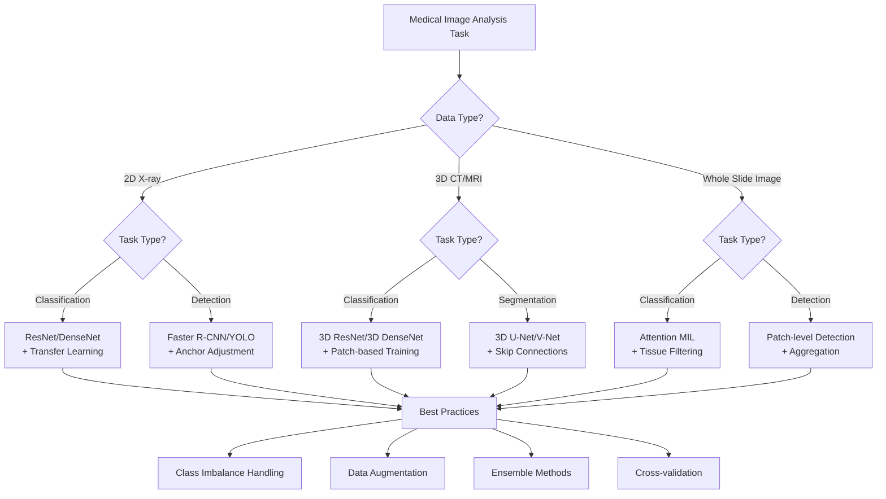

# 5.3 Classification and Detection

> "Medical image classification and detection are moving from computer-aided detection (CADe) to computer-aided diagnosis (CADx), and gradually becoming an important assistant for clinicians." — — Litjens et al., "A survey on deep learning in medical image analysis", Medical Image Analysis 2017

In the previous sections, we learned in detail about preprocessing techniques and U-Net-based segmentation methods. Now, we enter another important area of medical image analysis: **classification and detection**. Unlike the pixel-level precision requirements of segmentation, classification and detection focus more on accurately identifying diseases and locating lesions.

Medical image classification and detection face unique challenges: extreme class imbalance (the ratio of positive to negative samples can reach 1:1000), tiny lesion sizes, image quality variations, and the need for high precision and recall. In this section, we will explore how to use deep learning technology to solve these problems.

---

## <å Classification vs Detection: Core Concepts and Differences

### Basic Task Definition

#### Image Classification

**Image classification** determines whether an image contains specific disease or abnormality:

- **Binary classification**: Normal vs Abnormal
- **Multi-class classification**: Specific disease type identification
- **Multi-label classification**: An image may contain multiple diseases

#### Object Detection

**Object detection** not only identifies diseases but also determines their location:

- **Bounding box detection**: Frame the lesion area
- **Lesion localization**: Provide precise coordinates
- **Multi-lesion detection**: Detect multiple lesions simultaneously

| Task Type | Input | Output | Clinical Application | Difficulty Level |
|-----------|-------|--------|---------------------|-----------------|
| **Classification** | Complete medical image | Disease label/category | Initial screening, triage |  |
| **Detection** | Complete medical image | Bounding box + category | Lesion localization, surgical planning |  |
| **Segmentation** | Complete medical image | Pixel-level mask | Precise measurement, 3D reconstruction |  |

### Medical Particularities

#### Class Imbalance Problem

Medical imaging data often has severe class imbalance:

```python
def analyze_class_imbalance(dataset):
    """
    Analyze class imbalance in medical dataset
    """
    class_counts = {}
    for label in dataset.labels:
        class_counts[label] = class_counts.get(label, 0) + 1

    total_samples = len(dataset)
    imbalance_ratios = {}

    for class_name, count in class_counts.items():
        ratio = count / total_samples
        imbalance_ratios[class_name] = {
            'count': count,
            'percentage': ratio * 100,
            'imbalance_factor': max(class_counts.values()) / count
        }

    return imbalance_ratios

# Example output
# {
#     'normal': {'count': 9500, 'percentage': 95.0, 'imbalance_factor': 1.0},
#     'pneumonia': {'count': 300, 'percentage': 3.0, 'imbalance_factor': 31.7},
#     'tuberculosis': {'count': 150, 'percentage': 1.5, 'imbalance_factor': 63.3},
#     'cancer': {'count': 50, 'percentage': 0.5, 'imbalance_factor': 190.0}
# }
```

#### Uncertainty and Interpretability

Medical diagnosis requires high interpretability:

```python
class MedicalClassificationModel(nn.Module):
    """
    Interpretable medical classification model
    """
    def __init__(self, backbone, num_classes):
        super().__init__()
        self.backbone = backbone
        self.classifier = nn.Linear(backbone.feature_dim, num_classes)
        self.attention_map = nn.Conv2d(backbone.feature_dim, 1, 1)

    def forward(self, x):
        features = self.backbone.extract_features(x)

        # Classification prediction
        logits = self.classifier(F.adaptive_avg_pool2d(features, 1).flatten(1))
        probs = F.softmax(logits, dim=1)

        # Attention map visualization
        attention = F.sigmoid(self.attention_map(features))

        return {
            'predictions': probs,
            'attention_maps': attention,
            'features': features
        }
```

---

## =ø 2D CNN-based X-ray Classification

### X-ray Classification Characteristics

#### Whole Image Understanding

X-ray classification requires understanding the overall context:

- **Global features**: Overall organ morphology
- **Local features**: Specific lesion signs
- **Relative positions**: Spatial relationships between anatomical structures


*Deep learning-based chest X-ray classification, the model automatically learns disease features*

### Classic 2D CNN Architectures

#### ResNet-based Medical Classification

```python
import torch.nn as nn
import torch.nn.functional as F
from torchvision.models import resnet50

class MedicalResNet(nn.Module):
    """
    ResNet-based medical image classification model
    """
    def __init__(self, num_classes, pretrained=True, dropout_rate=0.5):
        super().__init__()

        # Load pretrained ResNet
        self.backbone = resnet50(pretrained=pretrained)

        # Modify first layer to adapt to medical grayscale images
        self.backbone.conv1 = nn.Conv2d(
            1, 64, kernel_size=7, stride=2, padding=3, bias=False
        )

        # Replace classifier
        feature_dim = self.backbone.fc.in_features
        self.backbone.fc = nn.Identity()

        # Custom classification head
        self.classifier = nn.Sequential(
            nn.AdaptiveAvgPool2d(1),
            nn.Flatten(),
            nn.Dropout(dropout_rate),
            nn.Linear(feature_dim, 512),
            nn.ReLU(inplace=True),
            nn.Dropout(dropout_rate * 0.5),
            nn.Linear(512, num_classes)
        )

    def forward(self, x):
        features = self.backbone(x)
        return self.classifier(features)
```

#### DenseNet Advantages

**DenseNet** is especially suitable for medical image classification:

```python
class DenseNetMedical(nn.Module):
    """
    DenseNet-based medical classification model
    """
    def __init__(self, num_classes, growth_rate=32, block_config=(6, 12, 24, 16)):
        super().__init__()

        # DenseNet feature extractor
        self.features = self._make_dense_layers(growth_rate, block_config)

        # Classification head
        self.classifier = nn.Sequential(
            nn.BatchNorm2d(block_config[-1] * growth_rate),
            nn.ReLU(inplace=True),
            nn.AdaptiveAvgPool2d(1),
            nn.Flatten(),
            nn.Linear(block_config[-1] * growth_rate, num_classes)
        )

    def _make_dense_layers(self, growth_rate, block_config):
        """
        Build DenseNet layers
        """
        layers = []

        # Initial convolution
        layers += [
            nn.Conv2d(1, 2 * growth_rate, 7, stride=2, padding=3, bias=False),
            nn.BatchNorm2d(2 * growth_rate),
            nn.ReLU(inplace=True),
            nn.MaxPool2d(3, stride=2, padding=1)
        ]

        # Dense blocks
        num_features = 2 * growth_rate
        for i, num_layers in enumerate(block_config):
            layers.append(self._make_dense_block(num_features, num_layers, growth_rate))
            num_features += num_layers * growth_rate

            if i != len(block_config) - 1:
                layers.append(self._make_transition_layer(num_features, num_features // 2))
                num_features = num_features // 2

        return nn.Sequential(*layers)

    def _make_dense_block(self, in_channels, num_layers, growth_rate):
        """
        Build Dense block
        """
        layers = []
        for _ in range(num_layers):
            layers.append(self._make_dense_layer(in_channels, growth_rate))
            in_channels += growth_rate
        return nn.Sequential(*layers)

    def _make_dense_layer(self, in_channels, growth_rate):
        """
        Build Dense layer
        """
        return nn.Sequential(
            nn.BatchNorm2d(in_channels),
            nn.ReLU(inplace=True),
            nn.Conv2d(in_channels, 4 * growth_rate, 1, bias=False),
            nn.BatchNorm2d(4 * growth_rate),
            nn.ReLU(inplace=True),
            nn.Conv2d(4 * growth_rate, growth_rate, 3, padding=1, bias=False)
        )
```

### Data Imbalance Handling Strategies

#### Loss Function Design

```python
class FocalLoss(nn.Module):
    """
    Focal Loss: solves class imbalance problem
    """
    def __init__(self, alpha=1, gamma=2, reduction='mean'):
        super().__init__()
        self.alpha = alpha
        self.gamma = gamma
        self.reduction = reduction

    def forward(self, inputs, targets):
        ce_loss = F.cross_entropy(inputs, targets, reduction='none')
        pt = torch.exp(-ce_loss)
        focal_loss = self.alpha * (1 - pt) ** self.gamma * ce_loss

        if self.reduction == 'mean':
            return focal_loss.mean()
        elif self.reduction == 'sum':
            return focal_loss.sum()
        else:
            return focal_loss

class BalancedCrossEntropyLoss(nn.Module):
    """
    Balanced cross-entropy loss
    """
    def __init__(self, class_weights=None):
        super().__init__()
        self.class_weights = class_weights

    def forward(self, inputs, targets):
        if self.class_weights is not None:
            weight = self.class_weights[targets]
            ce_loss = F.cross_entropy(inputs, targets, weight=weight, reduction='none')
        else:
            ce_loss = F.cross_entropy(inputs, targets, reduction='none')

        return ce_loss.mean()
```

#### Data Sampling Strategies

```python
class BalancedSampler(torch.utils.data.Sampler):
    """
    Balanced sampler: ensures each batch has balanced samples
    """
    def __init__(self, dataset, samples_per_class):
        self.dataset = dataset
        self.samples_per_class = samples_per_class

        # Group by class
        self.class_indices = {}
        for idx, label in enumerate(dataset.labels):
            if label not in self.class_indices:
                self.class_indices[label] = []
            self.class_indices[label].append(idx)

    def __iter__(self):
        batch = []
        for _ in range(len(self) // self.samples_per_class):
            # Randomly select samples from each class
            sampled_indices = []
            for class_indices in self.class_indices.values():
                if len(class_indices) > 0:
                    sampled_idx = np.random.choice(class_indices)
                    sampled_indices.append(sampled_idx)

            batch.extend(sampled_indices)

        np.random.shuffle(batch)
        return iter(batch)

    def __len__(self):
        return len(self.dataset)
```

---

## >Ê 3D CNN for Volumetric Medical Data Analysis

### From 2D to 3D: Challenges and Opportunities

#### 3D Data Characteristics

Volumetric medical data (CT, MRI) has unique characteristics:

| Feature | 2D Image | 3D Volume |
|---------|----------|-----------|
| **Spatial Information** | Plane context | Full 3D spatial relationships |
| **Computational Complexity** | O(H×W) | O(H×W×D) |
| **Memory Requirements** | MB | GB |
| **Inter-slice Information** | Lost | Preserved |
| **Clinical Value** | Localized diagnosis | Comprehensive analysis |

#### 3D Convolution Operation

```python
class Conv3DBlock(nn.Module):
    """
    3D convolution block
    """
    def __init__(self, in_channels, out_channels, kernel_size=3, stride=1, padding=1):
        super().__init__()
        self.conv = nn.Conv3d(in_channels, out_channels, kernel_size, stride, padding, bias=False)
        self.bn = nn.BatchNorm3d(out_channels)
        self.relu = nn.ReLU(inplace=True)

    def forward(self, x):
        return self.relu(self.bn(self.conv(x)))

class ResNet3DBlock(nn.Module):
    """
    3D residual block
    """
    def __init__(self, in_channels, out_channels, stride=1):
        super().__init__()

        self.conv1 = Conv3DBlock(in_channels, out_channels, stride=stride)
        self.conv2 = nn.Sequential(
            nn.Conv3d(out_channels, out_channels, 3, padding=1, bias=False),
            nn.BatchNorm3d(out_channels)
        )

        self.shortcut = nn.Sequential()
        if stride != 1 or in_channels != out_channels:
            self.shortcut = nn.Sequential(
                nn.Conv3d(in_channels, out_channels, 1, stride, bias=False),
                nn.BatchNorm3d(out_channels)
            )

    def forward(self, x):
        residual = self.shortcut(x)
        out = self.conv1(x)
        out = self.conv2(out)
        out += residual
        return F.relu(out)
```

### 3D CNN Architecture Design

#### Medical 3D ResNet

```python
class Medical3DResNet(nn.Module):
    """
    3D ResNet for volumetric medical image classification
    """
    def __init__(self, block, layers, num_classes=2):
        super().__init__()

        self.in_channels = 64

        # Initial convolution
        self.conv1 = nn.Sequential(
            nn.Conv3d(1, 64, kernel_size=7, stride=2, padding=3, bias=False),
            nn.BatchNorm3d(64),
            nn.ReLU(inplace=True),
            nn.MaxPool3d(kernel_size=3, stride=2, padding=1)
        )

        # Residual blocks
        self.layer1 = self._make_layer(block, 64, layers[0])
        self.layer2 = self._make_layer(block, 128, layers[1], stride=2)
        self.layer3 = self._make_layer(block, 256, layers[2], stride=2)
        self.layer4 = self._make_layer(block, 512, layers[3], stride=2)

        # Classification head
        self.avgpool = nn.AdaptiveAvgPool3d((1, 1, 1))
        self.fc = nn.Linear(512 * block.expansion, num_classes)

        # Initialize weights
        self._initialize_weights()

    def _make_layer(self, block, out_channels, blocks, stride=1):
        layers = []
        layers.append(block(self.in_channels, out_channels, stride))
        self.in_channels = out_channels * block.expansion

        for _ in range(1, blocks):
            layers.append(block(self.in_channels, out_channels))

        return nn.Sequential(*layers)

    def _initialize_weights(self):
        for m in self.modules():
            if isinstance(m, nn.Conv3d):
                nn.init.kaiming_normal_(m.weight, mode='fan_out', nonlinearity='relu')
            elif isinstance(m, nn.BatchNorm3d):
                nn.init.constant_(m.weight, 1)
                nn.init.constant_(m.bias, 0)

    def forward(self, x):
        x = self.conv1(x)
        x = self.layer1(x)
        x = self.layer2(x)
        x = self.layer3(x)
        x = self.layer4(x)

        x = self.avgpool(x)
        x = torch.flatten(x, 1)
        x = self.fc(x)

        return x

# Model instantiation
def create_medical_3d_resnet(num_classes=2):
    return Medical3DResNet(ResNet3DBlock, [2, 2, 2, 2], num_classes)
```

#### 3D DenseNet Architecture

```python
class DenseBlock3D(nn.Module):
    """
    3D Dense block
    """
    def __init__(self, num_layers, in_channels, growth_rate):
        super().__init__()
        self.layers = nn.ModuleList()

        for i in range(num_layers):
            layer = nn.Sequential(
                nn.BatchNorm3d(in_channels + i * growth_rate),
                nn.ReLU(inplace=True),
                nn.Conv3d(in_channels + i * growth_rate, 4 * growth_rate, 1, bias=False),
                nn.BatchNorm3d(4 * growth_rate),
                nn.ReLU(inplace=True),
                nn.Conv3d(4 * growth_rate, growth_rate, 3, padding=1, bias=False)
            )
            self.layers.append(layer)

    def forward(self, x):
        features = [x]

        for layer in self.layers:
            new_features = layer(torch.cat(features, dim=1))
            features.append(new_features)

        return torch.cat(features, dim=1)
```

### Memory Optimization Strategies

#### Patch-based Training

```python
class Patch3DDataset(torch.utils.data.Dataset):
    """
    3D patch dataset
    """
    def __init__(self, volume_path, label_path, patch_size=(64, 64, 64), stride=32):
        self.patch_size = patch_size
        self.stride = stride

        # Load volume and label
        self.volume = nib.load(volume_path).get_fdata()
        self.label = nib.load(label_path).get_fdata()

        # Generate patch coordinates
        self.patches = self._generate_patches()

    def _generate_patches(self):
        """
        Generate 3D patch coordinates
        """
        patches = []
        D, H, W = self.volume.shape
        pd, ph, pw = self.patch_size

        for d in range(0, D - pd + 1, self.stride):
            for h in range(0, H - ph + 1, self.stride):
                for w in range(0, W - pw + 1, self.stride):
                    patch_volume = self.volume[d:d+pd, h:h+ph, w:w+pw]
                    patch_label = self.label[d:d+pd, h:h+ph, w:w+pw]

                    # Filter out background patches
                    if np.sum(patch_label > 0) > 0.1 * np.prod(self.patch_size):
                        patches.append((d, h, w))

        return patches

    def __getitem__(self, idx):
        d, h, w = self.patches[idx]
        pd, ph, pw = self.patch_size

        volume_patch = self.volume[d:d+pd, h:h+ph, w:w+pw]
        label_patch = self.label[d:d+pd, h:h+ph, w:w+pw]

        # Normalize
        volume_patch = self._normalize_volume(volume_patch)

        return torch.FloatTensor(volume_patch).unsqueeze(0), torch.LongTensor([label_patch.max()])
```

#### Gradient Checkpointing

```python
from torch.utils.checkpoint import checkpoint

class MemoryEfficient3DNet(nn.Module):
    """
    Memory-efficient 3D network
    """
    def __init__(self):
        super().__init__()
        self.layer1 = self._create_layer(1, 64)
        self.layer2 = self._create_layer(64, 128)
        self.layer3 = self._create_layer(128, 256)
        self.layer4 = self._create_layer(256, 512)

    def _create_layer(self, in_channels, out_channels):
        return nn.Sequential(
            nn.Conv3d(in_channels, out_channels, 3, padding=1),
            nn.BatchNorm3d(out_channels),
            nn.ReLU(inplace=True),
            nn.Conv3d(out_channels, out_channels, 3, padding=1),
            nn.BatchNorm3d(out_channels),
            nn.ReLU(inplace=True)
        )

    def forward(self, x):
        # Use gradient checkpointing to save memory
        x1 = checkpoint(self.layer1, x)
        x2 = checkpoint(self.layer2, x1)
        x3 = checkpoint(self.layer3, x2)
        x4 = checkpoint(self.layer4, x3)

        return x4
```

---

## 🔬 MIL for Whole Slide Image Analysis

### Whole Slide Image Challenges

#### WSI Characteristics

**Whole Slide Images (WSI)** have unique characteristics:

- **Ultra-high resolution**: 100,000×100,000 pixels or higher
- **Huge file size**: Several GB
- **Variable magnification**: Different objective lenses (4x, 10x, 20x, 40x)
- **Only slide-level labels**: Often only known whether the patient has cancer


*MIL-based cancer detection workflow for gigapixel WSI*

### MIL Fundamentals

#### Problem Formalization

In MIL, a slide is considered a **bag**, patches extracted from it are **instances**:

- **Bag label**: Known (e.g., cancerous/normal)
- **Instance labels**: Unknown (which patches contain cancer)
- **Assumption**: If the bag is positive, at least one instance is positive

```python
class MILDataset(torch.utils.data.Dataset):
    """
    Multiple Instance Learning dataset
    """
    def __init__(self, wsi_paths, labels, patch_size=256, magnification=20):
        self.wsi_paths = wsi_paths
        self.labels = labels
        self.patch_size = patch_size
        self.magnification = magnification

        # Pre-extract patches or dynamically extract
        self.patch_cache = {}

    def extract_patches(self, wsi_path, num_patches=100):
        """
        Extract patches from WSI
        """
        wsi = openslide.OpenSlide(wsi_path)

        # Get image dimensions
        level = self._get_best_level(wsi, self.magnification)
        dimensions = wsi.level_dimensions[level]

        patches = []
        for _ in range(num_patches):
            # Random sampling
            x = np.random.randint(0, dimensions[0] - self.patch_size)
            y = np.random.randint(0, dimensions[1] - self.patch_size)

            patch = wsi.read_region((x, y), level,
                                  (self.patch_size, self.patch_size))
            patch = patch.convert('RGB')

            # Tissue filtering
            if self._is_tissue_patch(patch):
                patches.append(np.array(patch))

        return patches

    def _is_tissue_patch(self, patch, threshold=0.1):
        """
        Check if patch contains tissue
        """
        # Convert to HSV space for tissue detection
        hsv = cv2.cvtColor(patch, cv2.COLOR_RGB2HSV)

        # Tissue typically appears in specific H, S ranges
        tissue_mask = (hsv[:, :, 0] > 0.1) & (hsv[:, :, 1] > 0.1)
        tissue_ratio = np.sum(tissue_mask) / patch.size

        return tissue_ratio > threshold

    def __getitem__(self, idx):
        if idx not in self.patch_cache:
            self.patch_cache[idx] = self.extract_patches(self.wsi_paths[idx])

        patches = self.patch_cache[idx]
        label = self.labels[idx]

        # Convert to tensor
        patches_tensor = torch.FloatTensor(np.array(patches)).permute(0, 3, 1, 2)
        label_tensor = torch.LongTensor([label])

        return patches_tensor, label_tensor
```

### MIL Algorithm Implementation

#### Instance-level Attention

```python
class AttentionMIL(nn.Module):
    """
    Attention-based Multiple Instance Learning model
    """
    def __init__(self, input_size=256*256*3, hidden_size=512, attention_size=256, num_classes=2):
        super().__init__()

        # Feature extractor
        self.feature_extractor = nn.Sequential(
            nn.Linear(input_size, hidden_size),
            nn.ReLU(),
            nn.Dropout(0.5),
            nn.Linear(hidden_size, hidden_size),
            nn.ReLU(),
            nn.Dropout(0.5)
        )

        # Attention mechanism
        self.attention = nn.Sequential(
            nn.Linear(hidden_size, attention_size),
            nn.Tanh(),
            nn.Linear(attention_size, 1)
        )

        # Classifier
        self.classifier = nn.Linear(hidden_size, num_classes)

    def forward(self, bag):
        """
        Forward pass
        Args:
            bag: (batch_size, num_instances, channels, height, width)
        """
        batch_size, num_instances, C, H, W = bag.shape

        # Reshape to process each instance
        bag = bag.view(-1, C, H, W)

        # Feature extraction
        features = self.feature_extractor(bag.view(bag.size(0), -1))

        # Reshape back to bag format
        features = features.view(batch_size, num_instances, -1)

        # Attention calculation
        attention_weights = self.attention(features)  # (batch_size, num_instances, 1)
        attention_weights = F.softmax(attention_weights, dim=1)

        # Weighted pooling
        weighted_features = torch.sum(features * attention_weights, dim=1)

        # Classification
        logits = self.classifier(weighted_features)

        return {
            'logits': logits,
            'attention_weights': attention_weights,
            'instance_features': features
        }

    def calculate_loss(self, outputs, targets, attention_reg_strength=0.001):
        """
        Calculate MIL loss
        """
        # Classification loss
        classification_loss = F.cross_entropy(outputs['logits'], targets)

        # Attention regularization (prevent attention from focusing on a single instance)
        attention_entropy = -torch.mean(
            torch.sum(outputs['attention_weights'] *
                     torch.log(outputs['attention_weights'] + 1e-8), dim=1)
        )

        total_loss = classification_loss - attention_reg_strength * attention_entropy

        return total_loss
```

#### Deep MIL Framework

```python
class DeepMIL(nn.Module):
    """
    Deep Multiple Instance Learning framework
    """
    def __init__(self, backbone='resnet50', mil_type='attention', num_classes=2):
        super().__init__()

        self.backbone = self._create_backbone(backbone)
        self.mil_layer = self._create_mil_layer(mil_type)
        self.classifier = nn.Linear(2048, num_classes)  # ResNet50 output dimension

    def _create_backbone(self, backbone_name):
        """
        Create CNN backbone
        """
        if backbone_name == 'resnet50':
            from torchvision.models import resnet50
            backbone = resnet50(pretrained=True)
            # Remove the last fully connected layer
            backbone = nn.Sequential(*list(backbone.children())[:-1])

        return backbone

    def _create_mil_layer(self, mil_type):
        """
        Create MIL layer
        """
        if mil_type == 'attention':
            return AttentionMIL()
        elif mil_type == 'max_pooling':
            return nn.AdaptiveMaxPool2d(1)
        elif mil_type == 'mean_pooling':
            return nn.AdaptiveAvgPool2d(1)
        else:
            raise ValueError(f"Unsupported MIL type: {mil_type}")

    def forward(self, bag):
        """
        Forward pass
        Args:
            bag: (batch_size, num_instances, 3, H, W)
        """
        batch_size, num_instances = bag.shape[:2]

        # Reshape to process each instance
        instances = bag.view(-1, *bag.shape[2:])

        # Feature extraction
        with torch.no_grad():
            features = self.backbone(instances)  # (batch_size * num_instances, 2048, 1, 1)
            features = features.view(features.size(0), -1)  # Flatten

        # Reshape to bag format
        features = features.view(batch_size, num_instances, -1)

        # MIL aggregation
        if isinstance(self.mil_layer, AttentionMIL):
            mil_output = self.mil_layer({'features': features})
            bag_features = mil_output['bag_features']
            attention_weights = mil_output['attention_weights']
        else:
            features = features.view(batch_size * num_instances, -1)
            bag_features = self.mil_layer(features.view(batch_size, num_instances, -1, 1, 1))
            bag_features = bag_features.view(batch_size, -1)
            attention_weights = None

        # Classification
        logits = self.classifier(bag_features)

        return {
            'logits': logits,
            'attention_weights': attention_weights,
            'bag_features': bag_features
        }
```

### Visualization and Interpretability

#### Attention Map Visualization

```python
def visualize_attention_map(wsi_path, model, attention_weights, patch_coordinates, save_path):
    """
    Visualize attention map on WSI
    """
    import matplotlib.pyplot as plt
    from matplotlib.patches import Rectangle

    # Load WSI
    wsi = openslide.OpenSlide(wsi_path)

    # Get thumbnail
    thumbnail = wsi.get_thumbnail((wsi.dimensions[0] // 10, wsi.dimensions[1] // 10))

    fig, ax = plt.subplots(1, 1, figsize=(15, 10))
    ax.imshow(thumbnail)

    # Draw attention weights
    scale_factor = 10  # Thumbnail scaling factor

    for (x, y), weight in zip(patch_coordinates, attention_weights):
        rect = Rectangle((x // scale_factor, y // scale_factor),
                        256 // scale_factor, 256 // scale_factor,
                        linewidth=1, edgecolor='red',
                        facecolor='red', alpha=weight.item())
        ax.add_patch(rect)

    ax.set_title('Attention Map Visualization')
    ax.axis('off')
    plt.tight_layout()
    plt.savefig(save_path, dpi=150, bbox_inches='tight')
    plt.close()
```

---

## <¯ Object Detection in Medical Imaging

### Medical Object Detection Characteristics

#### Differences from General Object Detection

| Feature | General Object Detection | Medical Object Detection |
|---------|------------------------|--------------------------|
| **Target** | Common objects | Lesions, nodules, anomalies |
| **Size Variation** | Moderate | Very large (pixel to full image) |
| **Shape** | Regular | Irregular, fuzzy boundaries |
| **Class Balance** | Balanced | Extreme imbalance |
| **Label Cost** | Low | Very high (expert annotation) |
| **Requirement** | Speed | Accuracy and interpretability |

#### Special Challenges

1. **Tiny lesions**: Some nodules may be only a few pixels
2. **Low contrast**: Similar density to surrounding tissue
3. **Boundary ambiguity**: Irregular lesion boundaries
4. **Class imbalance**: Negative samples far outnumber positive ones

### Classic Object Detection Frameworks

#### Faster R-CNN Adaptation

```python
import torchvision
from torchvision.models.detection.faster_rcnn import FastRCNNPredictor

class MedicalFasterRCNN(nn.Module):
    """
    Faster R-CNN adapted for medical imaging
    """
    def __init__(self, num_classes, pretrained=True):
        super().__init__()

        # Load pretrained Faster R-CNN
        self.model = torchvision.models.detection.fasterrcnn_resnet50_fpn(pretrained=pretrained)

        # Modify for grayscale images
        self.model.backbone.body.conv1 = nn.Conv2d(1, 64, kernel_size=7, stride=2, padding=3, bias=False)

        # Replace predictor
        in_features = self.model.roi_heads.box_predictor.cls_score.in_features
        self.model.roi_heads.box_predictor = FastRCNNPredictor(in_features, num_classes)

        # Adjust anchors for medical imaging
        self._adjust_anchors()

    def _adjust_anchors(self):
        """
        Adjust anchor box sizes for medical lesions
        """
        # Medical lesions are usually smaller
        anchor_sizes = ((4, 8, 16), (8, 16, 32), (16, 32, 64))
        aspect_ratios = ((0.5, 1.0, 2.0),) * len(anchor_sizes)

        self.model.rpn.anchor_generator.sizes = anchor_sizes
        self.model.rpn.anchor_generator.aspect_ratios = aspect_ratios

    def forward(self, images, targets=None):
        return self.model(images, targets)

def train_medical_detector(model, dataloader, optimizer, device, num_epochs):
    """
    Train medical object detector
    """
    model.train()

    for epoch in range(num_epochs):
        for images, targets in dataloader:
            images = list(image.to(device) for image in images)
            targets = [{k: v.to(device) for k, v in t.items()} for t in targets]

            # Forward pass
            loss_dict = model(images, targets)
            losses = sum(loss for loss in loss_dict.values())

            # Backward pass
            optimizer.zero_grad()
            losses.backward()
            optimizer.step()

        print(f"Epoch {epoch+1}/{num_epochs}, Loss: {losses.item():.4f}")
```

#### YOLO Adaptation

```python
class MedicalYOLO(nn.Module):
    """
    YOLO adapted for medical imaging
    """
    def __init__(self, num_classes, input_size=512, grid_size=16):
        super().__init__()

        self.input_size = input_size
        self.grid_size = grid_size
        self.num_classes = num_classes
        self.num_boxes = 2  # Number of boxes per grid cell

        # Backbone (simplified Darknet)
        self.backbone = self._create_backbone()

        # Detection head
        self.detection_head = self._create_detection_head()

    def _create_backbone(self):
        """
        Create backbone network
        """
        layers = []

        # First block
        layers += [
            nn.Conv2d(1, 32, 3, padding=1),
            nn.BatchNorm2d(32),
            nn.LeakyReLU(0.1),
            nn.MaxPool2d(2),

            nn.Conv2d(32, 64, 3, padding=1),
            nn.BatchNorm2d(64),
            nn.LeakyReLU(0.1),
            nn.MaxPool2d(2),

            nn.Conv2d(64, 128, 3, padding=1),
            nn.BatchNorm2d(128),
            nn.LeakyReLU(0.1),
            nn.Conv2d(128, 64, 1),
            nn.BatchNorm2d(64),
            nn.LeakyReLU(0.1),
            nn.Conv2d(64, 128, 3, padding=1),
            nn.BatchNorm2d(128),
            nn.LeakyReLU(0.1),
            nn.MaxPool2d(2),
        ]

        return nn.Sequential(*layers)

    def _create_detection_head(self):
        """
        Create detection head
        """
        feature_size = 128 * (self.input_size // 32) ** 2
        grid_total = self.grid_size ** 2

        return nn.Sequential(
            nn.Linear(feature_size, 1024),
            nn.LeakyReLU(0.1),
            nn.Dropout(0.5),
            nn.Linear(1024, grid_total * self.num_boxes * (5 + self.num_classes)),
            nn.Sigmoid()
        )

    def forward(self, x):
        features = self.backbone(x)
        batch_size = features.size(0)
        features = features.view(batch_size, -1)

        detections = self.detection_head(features)
        detections = detections.view(
            batch_size, self.grid_size, self.grid_size,
            self.num_boxes, 5 + self.num_classes
        )

        return detections
```

### Loss Function Design

#### Focal Loss for Object Detection

```python
class FocalLossForDetection(nn.Module):
    """
    Focal Loss for medical object detection
    """
    def __init__(self, alpha=0.25, gamma=2.0):
        super().__init__()
        self.alpha = alpha
        self.gamma = gamma

    def forward(self, predictions, targets):
        """
        Args:
            predictions: (batch_size, grid_size, grid_size, num_boxes, 5 + num_classes)
            targets: (batch_size, grid_size, grid_size, num_boxes, 5 + num_classes)
        """
        # Objectness loss
        pred_obj = predictions[..., 4]
        target_obj = targets[..., 4]

        focal_loss = self.alpha * (1 - pred_obj) ** self.gamma * \
                    F.binary_cross_entropy(pred_obj, target_obj, reduction='none')

        # Class loss (only for object cells)
        pred_class = predictions[..., 5:]
        target_class = targets[..., 5:]

        class_loss = F.binary_cross_entropy(pred_class, target_class, reduction='none')

        # Apply only where there are objects
        class_loss = class_loss * target_obj.unsqueeze(-1)

        # Coordinate loss (only for object cells)
        pred_coord = predictions[..., :4]
        target_coord = targets[..., :4]

        coord_loss = F.mse_loss(pred_coord, target_coord, reduction='none')
        coord_loss = coord_loss.sum(dim=-1) * target_obj

        # Total loss
        total_loss = focal_loss + class_loss.sum(dim=-1) + coord_loss

        return total_loss.mean()
```

### Medical-specific Optimization Strategies

#### Hard Negative Mining

```python
class HardNegativeMiner:
    """
    Hard negative mining for medical object detection
    """
    def __init__(self, negative_ratio=3):
        self.negative_ratio = negative_ratio

    def mine_hard_negatives(self, predictions, targets):
        """
        Mine hard negative samples
        """
        # Calculate IoU for each predicted box and ground truth
        ious = self._calculate_ious(predictions, targets)

        # Identify negative samples (IoU < threshold)
        negative_mask = ious < 0.3
        negative_indices = torch.where(negative_mask)

        if len(negative_indices[0]) == 0:
            return None

        # Calculate confidence scores for negative samples
        negative_confidences = predictions[negative_indices][:, 4]

        # Select hard negatives (highest confidence negative samples)
        num_negatives = min(len(negative_confidences),
                          self.negative_ratio * len(torch.where(ious >= 0.5)[0]))

        _, hard_indices = torch.topk(negative_confidences, num_negatives)

        return negative_indices[0][hard_indices]

    def _calculate_ious(self, predictions, targets):
        """
        Calculate IoU between predicted and target boxes
        """
        # Simplified IoU calculation
        pred_boxes = predictions[:, :4]
        target_boxes = targets[:, :4]

        # Calculate intersection
        inter_x1 = torch.max(pred_boxes[:, 0], target_boxes[:, 0])
        inter_y1 = torch.max(pred_boxes[:, 1], target_boxes[:, 1])
        inter_x2 = torch.min(pred_boxes[:, 2], target_boxes[:, 2])
        inter_y2 = torch.min(pred_boxes[:, 3], target_boxes[:, 3])

        inter_area = torch.clamp(inter_x2 - inter_x1, min=0) * \
                    torch.clamp(inter_y2 - inter_y1, min=0)

        # Calculate union
        pred_area = (pred_boxes[:, 2] - pred_boxes[:, 0]) * (pred_boxes[:, 3] - pred_boxes[:, 1])
        target_area = (target_boxes[:, 2] - target_boxes[:, 0]) * (target_boxes[:, 3] - target_boxes[:, 1])

        union_area = pred_area + target_area - inter_area

        return inter_area / (union_area + 1e-8)
```

---

## =Ê Performance Comparison and Best Practices

### Evaluation Metrics

#### Classification Metrics

```python
def calculate_medical_classification_metrics(y_true, y_pred, y_prob=None):
    """
    Calculate medical classification evaluation metrics
    """
    from sklearn.metrics import accuracy_score, precision_score, recall_score, f1_score
    from sklearn.metrics import roc_auc_score, confusion_matrix, classification_report

    metrics = {}

    # Basic metrics
    metrics['accuracy'] = accuracy_score(y_true, y_pred)
    metrics['precision'] = precision_score(y_true, y_pred, average='weighted')
    metrics['recall'] = recall_score(y_true, y_pred, average='weighted')
    metrics['f1_score'] = f1_score(y_true, y_pred, average='weighted')

    # Medical-specific metrics
    metrics['sensitivity'] = recall_score(y_true, y_pred, pos_label=1)  # True Positive Rate
    metrics['specificity'] = recall_score(y_true, y_pred, pos_label=0,
                                         average='binary')  # True Negative Rate

    # AUC-ROC
    if y_prob is not None:
        metrics['auc_roc'] = roc_auc_score(y_true, y_prob[:, 1])

    # Confusion matrix
    cm = confusion_matrix(y_true, y_pred)
    metrics['confusion_matrix'] = cm

    # Detailed report
    metrics['classification_report'] = classification_report(y_true, y_pred)

    return metrics
```

#### Detection Metrics

```python
def calculate_detection_metrics(predictions, targets, iou_threshold=0.5):
    """
    Calculate object detection metrics
    """
    detections = []
    ground_truths = []

    for pred, target in zip(predictions, targets):
        # Convert to standard format
        det_boxes = pred['boxes'].cpu().numpy()
        det_scores = pred['scores'].cpu().numpy()
        det_labels = pred['labels'].cpu().numpy()

        gt_boxes = target['boxes'].cpu().numpy()
        gt_labels = target['labels'].cpu().numpy()

        # Calculate IoU matrix
        iou_matrix = calculate_iou_matrix(det_boxes, gt_boxes)

        # Match predictions with ground truths
        matches = match_detections(iou_matrix, iou_threshold)

        detections.extend(det_boxes)
        ground_truths.extend(gt_boxes)

    # Calculate mAP
    mAP = calculate_map(detections, ground_truths, iou_threshold)

    return {
        'mAP': mAP,
        'total_predictions': len(detections),
        'total_ground_truths': len(ground_truths)
    }

def calculate_map(detections, ground_truths, iou_threshold=0.5):
    """
    Calculate mean Average Precision (mAP)
    """
    # Sort by confidence
    detections.sort(key=lambda x: x['score'], reverse=True)

    # Calculate precision and recall
    tp = 0
    fp = 0
    fn = len(ground_truths)

    precisions = []
    recalls = []

    for det in detections:
        # Check if it's a true positive
        is_tp = False
        for gt in ground_truths:
            if calculate_iou(det['box'], gt['box']) > iou_threshold:
                tp += 1
                fn -= 1
                is_tp = True
                break

        if not is_tp:
            fp += 1

        precision = tp / (tp + fp) if (tp + fp) > 0 else 0
        recall = tp / (tp + fn) if (tp + fn) > 0 else 0

        precisions.append(precision)
        recalls.append(recall)

    # Calculate AP
    ap = calculate_ap_from_pr(precisions, recalls)

    return ap
```

### Model Selection Guidelines

#### Task-driven Model Selection



#### Performance Comparison

| Model | Data Type | Task | mAP/Accuracy | Memory Usage | Training Time | Clinical Applicability |
|-------|-----------|------|--------------|--------------|---------------|---------------------|
| **ResNet50** | 2D X-ray | Classification | 0.85-0.92 | 2GB | Medium |  |
| **DenseNet121** | 2D X-ray | Classification | 0.87-0.94 | 2.5GB | Medium |  |
| **3D ResNet** | 3D CT/MRI | Classification | 0.82-0.89 | 8GB | High |  |
| **Faster R-CNN** | 2D X-ray | Detection | 0.78-0.85 | 4GB | High |  |
| **YOLOv5** | 2D X-ray | Detection | 0.75-0.82 | 1.5GB | Low |  |
| **Attention MIL** | WSI | Classification | 0.80-0.88 | 6GB | Very High |  |

---

## 🎯 Technical Insights & Future Trends

### 1. Classification Techniques
- **2D CNN** for X-ray: ResNet, DenseNet-based transfer learning
- **3D CNN** for volumetric data: 3D ResNet, memory optimization strategies
- **Data imbalance handling**: Focal Loss, balanced sampling

### 2. Detection Strategies
- **Classic frameworks**: Faster R-CNN, YOLO medical adaptation
- **Medical-specific**: Hard negative mining, anchor adjustment
- **Evaluation metrics**: mAP, IoU, clinical indicators

### 3. Whole Slide Image Analysis
- **MIL framework**: Attention mechanism, instance-level learning
- **Memory efficiency**: Patch-based processing, caching strategy
- **Interpretability**: Attention map visualization

### 4. Best Practices
- **Clinical requirements**: Accuracy first, speed second
- **Data quality**: High-quality annotation, multi-center validation
- **Regulatory compliance**: Model interpretability, decision support

### 5. Future Trends
- **Multimodal fusion**: Comprehensive analysis combining imaging and clinical data
- **Weakly supervised learning**: Reducing annotation requirements
- **Federated learning**: Multi-center collaboration, privacy protection

---

::: info =¡ Next Learning
Now you have mastered the core technologies of medical image classification and detection. In the next section (5.4 Image Augmentation and Recovery), we will explore how to overcome data scarcity challenges through advanced data enhancement techniques and recover lost image information.
:::