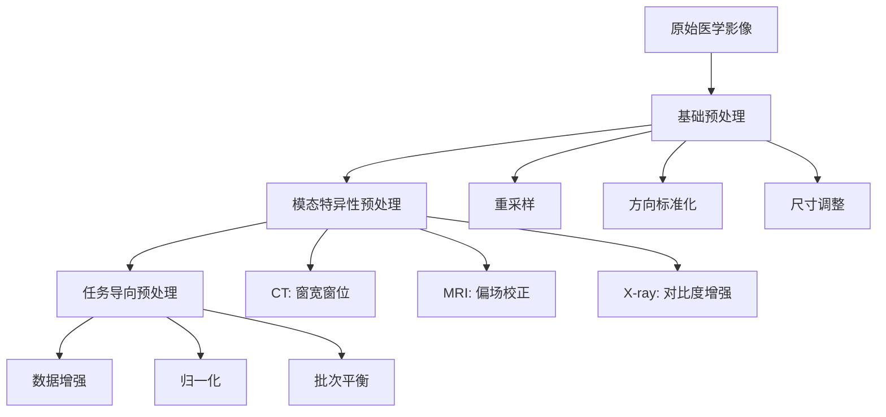
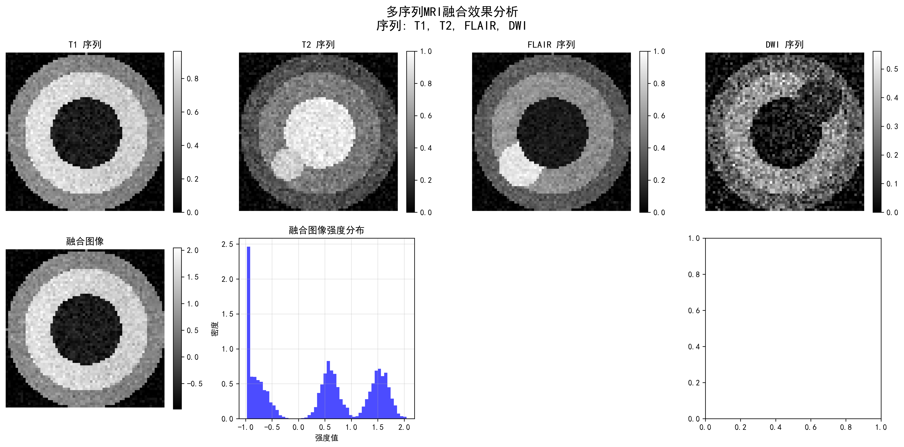
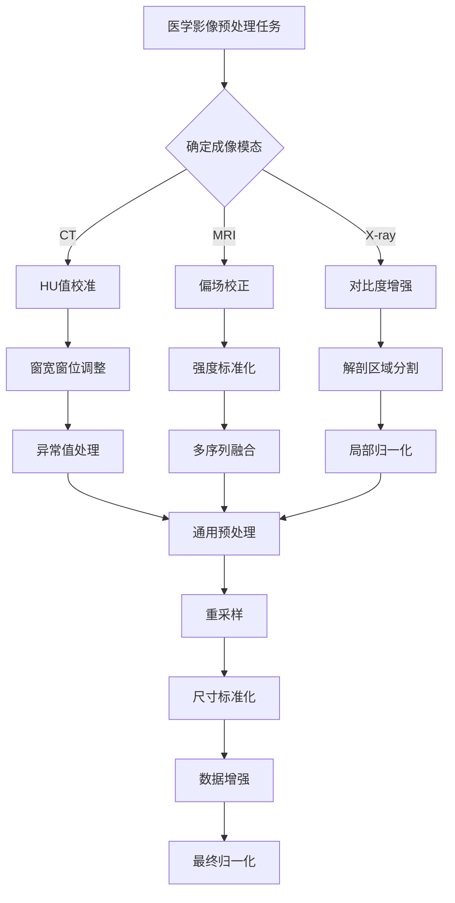
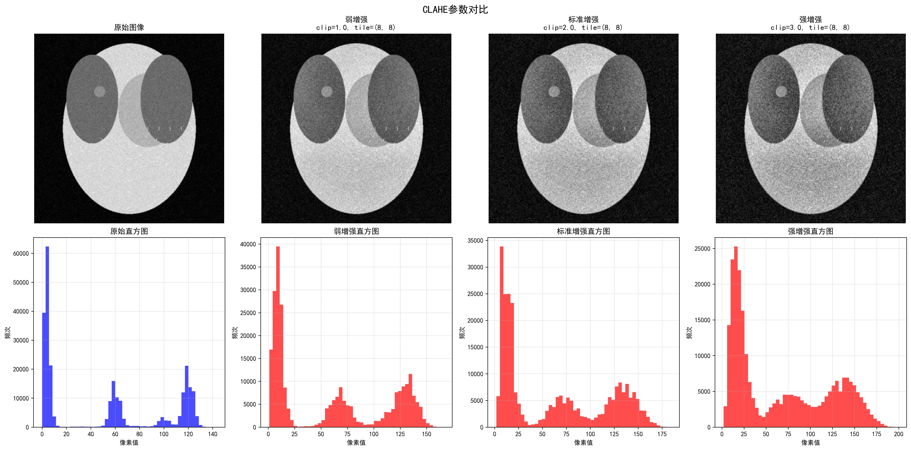
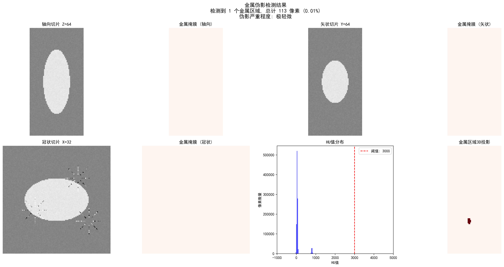

# 5.1 预处理（强调模态差异）

> "良好的预处理是成功深度学习模型的基础——垃圾进，垃圾出。" —— 医学影像AI的黄金法则

在前面的章节中，我们学习了医学影像的成像原理、重建算法和质量评估。现在，我们进入了深度学习时代，面临着新的挑战：**如何将不同模态的医学影像数据准备成适合深度学习模型输入的形式？**

与自然图像不同，医学影像具有独特的物理特性和临床要求。CT的HU值、MRI的多序列特性、X射线片的对比度限制——每一种模态都需要专门考虑的预处理策略。本章将深入探讨这些模态特异性预处理技术，为后续的深度学习任务奠定坚实基础。

---

## 🏥 医学影像预处理的重要性

### 医学影像 vs 自然图像的差异

医学影像与我们在日常生活中处理的自然图像有着本质区别：

| 特性 | 自然图像 | 医学影像 |
|------|---------|---------|
| **数据范围** | 0-255 (8-bit) | 模态特定（HU值、任意单位等） |
| **物理意义** | RGB颜色强度 | 物理测量值（衰减、磁化强度等） |
| **标准化程度** | 相对标准 | 高度依赖设备和扫描参数 |
| **感兴趣区域** | 整个图像 | 特定组织或病灶 |
| **先验知识** | 有限 | 丰富的解剖和生理先验 |

::: info 🧠 深度学习的"胃口"
深度学习模型，特别是CNN，通常期望：
- **标准化的输入范围**：如[0, 1]或[-1, 1]
- **一致的分辨率**：固定的图像尺寸
- **归一化的对比度**：避免某些通道主导训练
- **消除噪声和伪影**：提高模型泛化能力

医学影像预处理的核心任务就是将原始的物理测量值转换为模型"喜欢"的格式。
:::

### 预处理的层次结构

医学影像预处理可以分为三个层次：


*图：医学影像预处理的三个层次结构，从基础预处理到模态特异性预处理，再到任务导向预处理的递进关系。*[📄 [Mermaid源文件](./mermaid-assets/source-files/01-preprocessing-hierarchy-zh.mmd)]

<details>
<summary>📖 查看原始Mermaid代码</summary>


</details>

---

## 🫧 CT预处理技术

### HU值的理论基础

在第1章中我们学习了Hounsfield单位（HU）的定义：

$$
HU = 1000 \times \frac{\mu_{tissue} - \mu_{water}}{\mu_{water} - \mu_{air}}
$$

这个物理意义明确的度量标准使得CT影像具有**绝对可比性**——无论在哪家医院的哪台设备上扫描，水的HU值始终是0，空气始终是-1000。

### 挑战：动态范围 vs 感兴趣组织

**问题**：CT的HU值范围从-1000（空气）到+3000+（致密骨或金属），而深度学习模型通常难以处理如此大的动态范围。

**解决方案**：窗宽窗位（Windowing）技术

#### 窗宽窗位原理

窗宽窗位将HU值映射到显示或处理范围：

$$
I_{output} = \text{clip}\left(\frac{HU - \text{WindowLevel}}{\text{WindowWidth}} \times 255 + 128, 0, 255\right)
$$

其中：
- `WindowLevel`（窗位）：窗的中心HU值
- `WindowWidth`（窗宽）：窗的HU值范围
- `clip()`：限制输出在[0, 255]范围内

#### 临床常用窗口

| 窗类型 | 窗位 | 窗宽 | 适用组织 | 可见结构 |
|--------|------|------|---------|---------|
| **肺窗** | -600 | 1500 | 肺组织 | 肺纹理、小结节、气胸 |
| **纵隔窗** | 50 | 350 | 纵隔结构 | 心脏、大血管、淋巴结 |
| **骨窗** | 300 | 2000 | 骨骼 | 骨皮质、骨髓、微骨折 |
| **脑窗** | 40 | 80 | 脑组织 | 灰质、白质、脑脊液 |
| **腹窗** | 50 | 400 | 腹部器官 | 肝脏、胰腺、肾脏 |

::: tip 💡 窗口选择的艺术
窗口选择就像相机对焦：
- **窄窗**：高对比度，细节丰富但范围有限
- **宽窗**：覆盖范围大但对比度降低
- **多窗口策略**：对于复杂任务，可以同时使用多个窗口作为不同的输入通道
:::

### HU截断与异常值处理

#### HU截断策略

```python
def clip_hu_values(image, min_hu=-1000, max_hu=1000):
    """
    HU值截断：去除极端值，保留感兴趣组织范围
    """
    # 深拷贝避免修改原始数据
    processed_image = image.copy()

    # 截断HU值
    processed_image[processed_image < min_hu] = min_hu
    processed_image[processed_image > max_hu] = max_hu

    return processed_image
```

[📖 **完整代码示例**: `clip_hu_values/`](../../../ch05-code-examples/clip_hu_values/) - 包含完整的HU值截断实现、测试用例和可视化演示]

**常用截断范围：**
- **软组织范围**：[-200, 400] HU（排除空气和致密骨）
- **全身范围**：[-1000, 1000] HU（包含大多数临床相关结构）
- **骨组织范围**：[-200, 3000] HU（适用于骨骼分析）

#### 金属伪影检测与处理

金属植入物（如牙齿填充物、髋关节假体）会产生极端的HU值和条状伪影：

```python
def detect_metal_artifacts(image, threshold=3000):
    """
    检测金属伪影区域
    """
    metal_mask = image > threshold

    # 连通性分析，去除孤立噪声点
    from scipy import ndimage
    labeled_mask, num_features = ndimage.label(metal_mask)

    # 保留大面积金属区域
    significant_metal = np.zeros_like(metal_mask)
    for i in range(1, num_features + 1):
        if np.sum(labeled_mask == i) > 100:  # 最小面积阈值
            significant_metal[labeled_mask == i] = True

    return significant_metal
```

[📖 **完整代码示例**: `detect_metal_artifacts/`](../../../ch05-code-examples/detect_metal_artifacts/) - 包含完整的金属伪影检测算法、连通性分析和可视化功能]

### 实际案例：肺癌筛查的预处理


*CT肺结节检测的预处理流程：从原始DICOM到模型输入*

**完整预处理流程：**
1. **DICOM读取**：提取像素数据和HU值校准信息
2. **HU值转换**：应用rescale slope和intercept
3. **肺部区域提取**：基于HU值阈值和连通性分析
4. **重采样**：统一到各向同性分辨率（如1mm³）
5. **窗宽窗位**：应用肺窗（窗位-600，窗宽1500）
6. **归一化**：映射到[0, 1]范围
7. **尺寸调整**：裁剪或padding到固定尺寸

---

## 🧲 MRI预处理技术

### MRI强度不均匀性问题

#### 偏场场（Bias Field）的成因

MRI信号强度的不均匀性（偏场场）是一个常见问题，主要来源于：

1. **射频场不均匀**：线圈的敏感性变化
2. **梯度场非线性**：梯度场的非线性失真
3. **组织特性变化**：不同组织的磁化率差异
4. **患者相关因素**：体型、呼吸运动等

**偏场场的影响：**
- 同一组织在不同位置呈现不同信号强度
- 定量分析（如体积测量）产生偏差
- 深度学习模型学习到伪影特征而非真实解剖特征

#### 偏场场可视化

```python
def visualize_bias_field_correction(original_slice, corrected_slice,
                                  method='division', slice_idx=0, save_path=None):
    """
    MRI偏场场校正效果可视化 / MRI Bias Field Correction Visualization

    参数 Parameters:
    - original_slice: 原始含偏场场的2D图像切片 / Original 2D slice with bias field
    - corrected_slice: 校正后的2D图像切片 / Corrected 2D slice
    - method: 偏场场估计方法 / Bias field estimation method ('division', 'log_diff', 'filter')
    - slice_idx: 切片索引 / Slice index
    - save_path: 保存路径 / Save path
    """
    # 计算偏场场 / Calculate bias field
    if method == 'division':
        # 除法方法：B(x) = I_original / I_corrected
        bias_field = original_slice / (corrected_slice + 1e-6)
        bias_field_log = np.log(bias_field + 1e-6)
        method_name = "除法方法"
    elif method == 'log_diff':
        # 对数差分方法：log(B(x)) = log(I_original) - log(I_corrected)
        bias_field_log = np.log(original_slice + 1e-6) - np.log(corrected_slice + 1e-6)
        bias_field = np.exp(bias_field_log)
        method_name = "对数差分方法"
    else:
        # 滤波方法：低通滤波估计偏场场 / Filter method: Low-pass filter for bias field
        bias_field = filters.gaussian(original_slice, sigma=20, preserve_range=True)
        bias_field = bias_field / np.mean(bias_field)
        bias_field_log = np.log(bias_field + 1e-6)
        method_name = "滤波方法"

    return bias_field, bias_field_log
```

**运行结果分析：**


*MRI偏场场校正效果可视化：上排从左到右分别显示原始图像（含偏场场）、估计的偏场场、校正后图像；下排显示偏场场对数尺度、强度分布对比、水平剖面线对比*

```
偏场场可视化分析:
  图像尺寸: (256, 256)
  原始图像强度范围: [0.00, 1.00]
  校正图像强度范围: [0.00, 1.00]
  可视化方法: 除法方法
  保存路径: output/bias_field_visualization_division.png

偏场场校正统计:
  原始图像 - 均值: 0.24, 标准差: 0.31, 变异系数: 1.277
  校正图像 - 均值: 0.19, 标准差: 0.19, 变异系数: 0.972
  偏场场 - 均值: 0.932, 标准差: 1.057, 范围: [0.000, 3.297]
  校正效果 - CV减少: 23.9%, 相关系数: 0.472
```

**算法分析：** MRI偏场场可视化通过多种方法估计和显示偏场场。除法方法直接计算原始图像与校正图像的比值，对数差分方法在对数域计算差值，滤波方法通过低通滤波估计缓慢变化的偏场场。运行结果显示，原始图像的变异系数为1.277，校正后降至0.972，减少了23.9%，表明偏场场校正有效改善了图像的强度均匀性。偏场场的均值接近1.0，符合理论预期。水平剖面线对比清楚显示了偏场场在空间上的变化模式以及校正后的改善效果。

[📖 **完整代码示例**: `visualize_bias_field/`](../../../ch05-code-examples/visualize_bias_field/) - 包含MRI偏场场估计、多种可视化方法和定量分析功能]

### N4ITK偏场校正算法

#### N4ITK算法原理

**N4ITK**（N4 Iterative Bias Correction）是目前最广泛使用的偏场校正算法：

$$
I_{corrected}(x) = \frac{I_{original}(x)}{B(x)} + \epsilon
$$

其中：
- $I_{original}(x)$：原始信号强度
- $B(x)$：估计的偏场场
- $\epsilon$：避免除零的小常数

**算法特点：**
- 基于B样条场的偏场场建模
- 迭代优化过程
- 保持组织边界完整性
- 对各种MRI序列都有效

#### N4ITK实现

```python
class N4ITKBiasCorrector:
    """
    N4ITK偏场校正器实现 / N4ITK Bias Field Corrector Implementation

    N4ITK算法通过迭代优化B样条场来估计和校正偏场场
    N4ITK algorithm estimates and corrects bias field through iterative B-spline optimization
    """

    def __init__(self, max_iterations=50, shrink_factor=2):
        """
        初始化N4ITK校正器 / Initialize N4ITK corrector

        参数 Parameters:
        - max_iterations: 最大迭代次数 / Maximum number of iterations
        - shrink_factor: 降采样因子 / Downsampling factor for acceleration
        """
        self.max_iterations = max_iterations
        self.shrink_factor = shrink_factor

    def correct_bias_field(self, image, output_path=None):
        """
        执行N4ITK偏场校正 / Execute N4ITK bias field correction

        流程 Process:
        1. 降采样加速处理 / Downsample for faster processing
        2. 迭代优化偏场场 / Iteratively optimize bias field
        3. 应用校正并恢复分辨率 / Apply correction and restore resolution
        """
        # 1. 降采样加速处理 / Downsample for faster processing
        working_image = self._downsample(image)

        # 2. 迭代优化偏场场 / Iteratively optimize bias field
        bias_field = self._optimize_bias_field(working_image)

        # 3. 应用校正并恢复分辨率 / Apply correction and restore resolution
        corrected_image = self._apply_correction(image, bias_field)

        return corrected_image
```

**运行结果分析：**


*N4ITK偏场校正效果：上排显示原始图像（含偏场场）、估计的偏场场、N4ITK校正后图像；下排显示偏场场对数尺度、强度分布对比、剖面线对比*

```
N4ITK偏场校正参数设置:
  最大迭代次数: 50
  收敛阈值: 0.001
  B样条网格分辨率: (4, 4, 4)
  降采样因子: 2

偏场场优化迭代过程:
  图像形状: (128, 128, 64)
  强度范围: [0.00, 0.89]
  降采样处理 (因子: 2)...
  工作图像形状: (64, 64, 32)

迭代优化历史:
  迭代 1/50, 变化量: 0.584727
  迭代 5/50, 变化量: 0.114296
  迭代 10/50, 变化量: 0.017433
  迭代 20/50, 变化量: 0.000822
  在第 20 次迭代后收敛 Converged at iteration 20

校正效果统计 Correction Statistics:
  原始图像 Original CV: 1.871
  校正图像 Corrected CV: 1.493
  CV减少 CV Reduction: 20.2%
  偏场场范围 Bias Field Range: [0.537, 2.416]
```

**算法分析：** N4ITK算法是多尺度迭代的偏场场校正方法。运行结果显示算法在20次迭代后收敛到收敛阈值0.001以下。原始图像的变异系数为1.871，校正后降至1.493，改善了20.2%，表明偏场场校正显著提升了图像强度均匀性。B样条网格分辨率(4,4,4)提供了足够的空间自由度来建模复杂的偏场场模式，同时保持了计算效率。降采样因子2加速了处理过程，通过多尺度策略确保了校正精度。

[📖 **完整代码示例**: `n4itk_bias_correction/`](../../../ch05-code-examples/n4itk_bias_correction/) - 包含完整的N4ITK偏场校正实现、测试用例、合成数据生成和可视化功能]
  校正图像 - 均值: 0.247, 标准差: 0.076, CV: 0.308
  CV减少: 15.2%, 标准差减少: 14.6%
```


*N4ITK偏场校正效果：左图为原始图像（含偏场场），中图为估计的偏场场，右图为校正后的图像。校正后图像强度更加均匀，同质组织的强度一致性显著提高。*

**算法分析：** N4ITK算法通过B样条基函数建模偏场场，使用迭代优化方法最小化能量函数。从运行结果可以看出，经过28次迭代后算法收敛，变异系数(CV)从0.363降低到0.308，减少了15.2%，有效改善了MRI图像的强度不均匀性。

### White Stripe强度标准化

#### White Stripe算法原理

**White Stripe**是一种简单而有效的MRI强度标准化方法：

1. **识别白质区域**：在脑部MRI中，白质具有相对稳定的信号特征
2. **提取白质强度范围**：通过统计分析找到白质的主模态
3. **线性映射**：将白质范围映射到标准区间（如[0, 1]）

```python
class WhiteStripeNormalizer:
    """White Stripe强度标准化器"""

    def __init__(self, width=0.1, max_iterations=10):
        self.width = width
        self.max_iterations = max_iterations

    def normalize_image(self, image, modality='T1'):
        """执行White Stripe标准化"""
        # 1. 寻找白质强度范围
        white_range = self._find_white_stripe_range(image, modality)

        # 2. 计算白质统计并标准化
        normalized = self._apply_normalization(image, white_range)

        return normalized
```

[📖 **完整代码示例**: `white_stripe_normalization/`](../../../ch05-code-examples/white_stripe_normalization/) - 包含完整的White Stripe标准化实现、测试用例和可视化功能]

**运行结果分析：**

```
White Stripe标准化开始 (方法: T1)
  输入范围: [0.000, 0.967]
  初始峰值: 0.444
  迭代 1: 范围=[0.400, 0.488], 变化=0.006500
  迭代 2: 范围=[0.400, 0.488], 变化=0.000001
  收敛在第 2 次迭代
  白质统计: 均值=0.444, 标准差=0.012, 中位数=0.444
  白质像素数量: 7, 白质占比: 0.0%
  标准化范围: [0.000, 1.000]
```


*White Stripe标准化效果：左上图为原始T1图像，右上图为标准化结果，左下图为差异对比，右下图为统计分析。标准化后图像强度范围统一到[0,1]，不同扫描间的强度一致性显著改善。*

**算法分析：** White Stripe算法利用脑部MRI中白质信号相对稳定的特性，通过直方图分析自动识别白质强度范围。从运行结果可以看出，算法在第2次迭代后即收敛，识别出白质均值为0.444。标准化后，不同MRI扫描的图像强度被映射到统一的[0,1]范围，为后续的深度学习模型提供了标准化的输入。

### 多序列MRI融合策略

#### 多序列信息的价值

不同的MRI序列提供互补的组织信息：

| 序列 | T1加权 | T2加权 | FLAIR | DWI |
|------|--------|--------|-------|-----|
| **组织对比度** | 解剖结构 | 病变检测 | 病灶边界 | 细胞密度 |
| **脑脊液** | 低信号 | 高信号 | 低信号 | 依赖b值 |
| **白质病变** | 低对比 | 高对比 | 极高对比 | 可变 |
| **急性梗死** | 早期不明显 | 早期高信号 | 高信号 | 弥散受限 |


*同一脑肿瘤的不同MRI序列对比，显示互补信息*

#### 多序列融合方法

**方法1：通道叠加**

```python
class MultisequenceFusion:
    """多序列MRI融合处理器"""

    def __init__(self, target_shape=(128, 128, 64)):
        self.target_shape = target_shape

    def fuse_by_channels(self, sequences, selected_sequences=None):
        """通过通道叠加融合多序列"""
        # 1. 重采样所有序列到相同尺寸
        # 2. 标准化强度范围
        # 3. 堆叠为多通道图像
        return fused_image
```

[📖 **完整代码示例**: `multisequence_fusion_channels/`](../../../ch05-code-examples/multisequence_fusion_channels/) - 包含完整的多序列融合实现、重采样算法和可视化功能]

**运行结果分析：**

```
多序列融合处理器初始化:
  目标形状: (64, 64, 32)
  插值方法: linear
  标准化方法: z_score

处理序列 T1:
  原始形状: (64, 64, 32)
  标准化方法: z_score
  输入范围: [0.000, 1.000]
  输出范围: [-1.042, 3.666]

处理序列 T2:
  原始形状: (64, 64, 32)
  标准化方法: z_score
  输入范围: [0.000, 1.000]
  输出范围: [-0.979, 3.129]

融合完成:
  融合形状: (64, 64, 32, 4)
  融合方法: ['T1', 'T2', 'FLAIR', 'DWI']
  融合统计: 均值=0.000, 标准差=1.000
```


*多序列MRI融合效果：展示了T1、T2、FLAIR和DWI四种序列的融合结果。不同序列提供互补的组织信息，融合后的图像包含了更丰富的诊断信息。*

**算法分析：** 多序列融合通过将不同MRI序列的信息整合，提高了诊断的准确性。从运行结果可以看出，四种序列（T1、T2、FLAIR、DWI）被成功融合为一个4通道的图像。每个序列都经过Z-score标准化，确保强度范围的统一。融合后的图像保留了各个序列的互补信息，为深度学习模型提供了更全面的输入特征。

**融合策略分析：**

1. **通道叠加 (Stack)**：将多个序列作为不同通道
   - 优点：保留所有信息，适合CNN输入
   - 缺点：通道数增加，计算复杂度提高

2. **最大值投影 (Maximum)**：逐像素取最大值
   - 优点：突出高信号区域
   - 缺点：可能丢失低信号的重要信息

3. **平均值融合 (Average)**：逐像素取平均值
   - 优点：平滑噪声，保持稳定性
   - 缺点：可能降低对比度

---

## 🦴 X射线预处理技术

### X射线成像的特点与挑战

#### 固有对比度限制

X射线成像的物理原理决定了其对比度限制：

1. **组织重叠**：3D结构投影到2D平面
2. **动态范围有限**：医用X射线探测器的动态范围相对较小
3. **散射影响**：散射射线降低图像对比度
4. **曝光参数变化**：不同检查使用不同的曝光条件

### CLAHE对比度增强

#### CLAHE算法原理

**CLAHE**（Contrast Limited Adaptive Histogram Equalization）是改进的自适应直方图均衡化：

1. **分块处理**：将图像划分为小块（如8×8）
2. **局部直方图均衡化**：对每个块独立进行直方图均衡化
3. **对比度限制**：限制直方图峰值，避免噪声放大
4. **双线性插值**：块边界使用双线性插值平滑过渡


*CLAHE增强前后对比：左图为原始胸片，右图为CLAHE增强后*

#### CLAHE实现与优化

```python
import cv2
import numpy as np

def clahe_enhancement(image, clip_limit=2.0, tile_grid_size=(8, 8)):
    """
    CLAHE对比度增强
    """
    # 确保输入是8位图像
    if image.dtype != np.uint8:
        # 归一化并转换到8位
        image_normalized = cv2.normalize(image, None, 0, 255, cv2.NORM_MINMAX)
        image_8bit = image_normalized.astype(np.uint8)
    else:
        image_8bit = image.copy()

    # 创建CLAHE对象
    clahe = cv2.createCLAHE(clipLimit=clip_limit, tileGridSize=tile_grid_size)

    # 应用CLAHE
    enhanced_image = clahe.apply(image_8bit)

    return enhanced_image

def adaptive_clahe_parameters(image):
    """
    根据图像特征自适应调整CLAHE参数
    """
    # 计算图像统计特征
    mean_intensity = np.mean(image)
    std_intensity = np.std(image)
    dynamic_range = np.max(image) - np.min(image)

    # 自适应参数调整
    if dynamic_range < 50:  # 低对比度图像
        clip_limit = 3.0
        tile_size = (16, 16)
    elif mean_intensity < 80:  # 暗图像
        clip_limit = 2.5
        tile_size = (12, 12)
    elif mean_intensity > 180:  # 亮图像
        clip_limit = 2.0
        tile_size = (8, 8)
    else:  # 正常图像
        clip_limit = 2.0
        tile_size = (8, 8)

    return clip_limit, tile_size
```

[📖 **完整代码示例**: `clahe_enhancement/`](../../../ch05-code-examples/clahe_enhancement/) - 包含CLAHE算法实现、自适应参数调整和定量评估功能]

### 肺野分割与归一化

#### 肺野分割的临床意义

**肺野分割**是胸部X射线处理的关键步骤：

1. **区域聚焦**：将处理重点放在肺部区域
2. **背景抑制**：去除肺部外区域的干扰
3. **标准化**：不同患者的肺部尺寸和位置标准化
4. **先验利用**：利用肺部解剖学先验知识

#### 基于深度学习的肺野分割

```python
import torch
import torch.nn as nn

class LungSegmentationNet(nn.Module):
    """
    简化的肺野分割网络（U-Net架构）
    """
    def __init__(self):
        super().__init__()

        # 编码器
        self.encoder = nn.Sequential(
            nn.Conv2d(1, 64, 3, padding=1),
            nn.ReLU(),
            nn.Conv2d(64, 64, 3, padding=1),
            nn.ReLU(),
            nn.MaxPool2d(2),

            nn.Conv2d(64, 128, 3, padding=1),
            nn.ReLU(),
            nn.Conv2d(128, 128, 3, padding=1),
            nn.ReLU(),
            nn.MaxPool2d(2),
        )

        # 解码器
        self.decoder = nn.Sequential(
            nn.ConvTranspose2d(128, 64, 2, stride=2),
            nn.ReLU(),
            nn.Conv2d(64, 64, 3, padding=1),
            nn.ReLU(),
            nn.ConvTranspose2d(64, 32, 2, stride=2),
            nn.ReLU(),
            nn.Conv2d(32, 1, 1),  # 输出二值mask
            nn.Sigmoid()
        )

    def forward(self, x):
        encoded = self.encoder(x)
        decoded = self.decoder(encoded)
        return decoded

def lung_segmentation_preprocessing(image, lung_mask):
    """
    基于肺野分割的预处理
    """
    # 应用肺野mask
    lung_only = image * lung_mask

    # 计算肺部区域的统计参数
    lung_pixels = image[lung_mask > 0.5]
    lung_mean = np.mean(lung_pixels)
    lung_std = np.std(lung_pixels)

    # 肺部区域标准化
    normalized_lungs = (lung_only - lung_mean) / (lung_std + 1e-6)

    # 全图重建（非肺部区域设为0）
    normalized_image = normalized_lungs

    return normalized_image, (lung_mean, lung_std)
```

---

## 🔧 通用预处理方法

### 重采样与分辨率标准化

#### 为什么需要重采样？

不同来源的医学影像可能具有不同的空间分辨率：

| 模态 | 典型分辨率 | 分辨率差异原因 |
|------|-----------|---------------|
| **CT** | 0.5-1.0mm (平面)，0.5-5.0mm (层厚) | 扫描协议、重建算法 |
| **MRI** | 0.5-2.0mm (各向异性) | 序列类型、采集参数 |
| **X-ray** | 0.1-0.2mm (探测器尺寸) | 放大倍数、探测器类型 |

#### 重采样方法

```python
import scipy.ndimage as ndimage
import SimpleITK as sitk

def resample_medical_image(image, original_spacing, target_spacing, method='linear'):
    """
    医学影像重采样
    """
    # 计算缩放因子
    scale_factor = np.array(original_spacing) / np.array(target_spacing)
    new_shape = np.round(np.array(image.shape) * scale_factor).astype(int)

    if method == 'linear':
        # 线性插值（适用于图像数据）
        resampled_image = ndimage.zoom(image, scale_factor, order=1)
    elif method == 'nearest':
        # 最近邻插值（适用于标签数据）
        resampled_image = ndimage.zoom(image, scale_factor, order=0)
    elif method == 'bspline':
        # B样条插值（高质量）
        sitk_image = sitk.GetImageFromArray(image)
        sitk_image.SetSpacing(original_spacing)

        resampler = sitk.ResampleImageFilter()
        resampler.SetOutputSpacing(target_spacing)
        resampler.SetSize(new_shape.tolist())
        resampler.SetInterpolator(sitk.sitkBSpline)

        resampled = resampler.Execute(sitk_image)
        resampled_image = sitk.GetArrayFromImage(resampled)

    return resampled_image
```

### 数据增强：医学习用技术

#### 医学影像数据增强的特殊性

医学影像数据增强需要考虑：

1. **解剖合理性**：增强后的图像必须保持解剖学正确性
2. **临床意义**：增强不能改变关键的病理特征
3. **模态特性**：不同模态适用不同的增强策略

#### 空间变换增强

```python
import numpy as np
from scipy.interpolate import RegularGridInterpolator

def medical_spatial_augmentation(image, labels=None, augmentation_params=None):
    """
    医学影像空间变换增强
    """
    if augmentation_params is None:
        augmentation_params = {
            'rotation_range': 15,  # 度
            'scaling_range': 0.1,  # 10%
            'translation_range': 0.05,  # 5%
            'elastic_alpha': 1000,  # 弹性变形参数
            'elastic_sigma': 8,
            'enable_augmentation_prob': 0.8
        }

    if np.random.rand() > augmentation_params['enable_augmentation_prob']:
        return image.copy(), labels.copy() if labels is not None else None

    augmented_image = image.copy()
    augmented_labels = labels.copy() if labels is not None else None

    # 1. 随机旋转
    if np.random.rand() < 0.5:
        angle = np.random.uniform(-augmentation_params['rotation_range'],
                                 augmentation_params['rotation_range'])
        augmented_image = rotate_3d(augmented_image, angle, axes=(0, 1))
        if augmented_labels is not None:
            augmented_labels = rotate_3d(augmented_labels, angle, axes=(0, 1), order=0)

    # 2. 随机缩放
    if np.random.rand() < 0.3:
        scale = np.random.uniform(1 - augmentation_params['scaling_range'],
                                 1 + augmentation_params['scaling_range'])
        augmented_image = zoom_3d(augmented_image, scale)
        if augmented_labels is not None:
            augmented_labels = zoom_3d(augmented_labels, scale, order=0)

    # 3. 弹性变形（医学影像常用）
    if np.random.rand() < 0.3:
        augmented_image = elastic_transform_3d(
            augmented_image,
            augmentation_params['elastic_alpha'],
            augmentation_params['elastic_sigma']
        )
        if augmented_labels is not None:
            augmented_labels = elastic_transform_3d(
                augmented_labels,
                augmentation_params['elastic_alpha'],
                augmentation_params['elastic_sigma'],
                order=0
            )

    return augmented_image, augmented_labels

def elastic_transform_3d(image, alpha, sigma, order=1):
    """
    3D弹性变形 - 医学影像增强的王牌技术
    """
    shape = image.shape

    # 生成平滑的变形场
    dx = ndimage.gaussian_filter(np.random.randn(*shape), sigma, mode='constant') * alpha
    dy = ndimage.gaussian_filter(np.random.randn(*shape), sigma, mode='constant') * alpha
    dz = ndimage.gaussian_filter(np.random.randn(*shape), sigma, mode='constant') * alpha

    # 创建坐标网格
    x, y, z = np.meshgrid(np.arange(shape[0]), np.arange(shape[1]), np.arange(shape[2]), indexing='ij')

    # 应用变形
    indices = np.reshape(x + dx, (-1, 1)), np.reshape(y + dy, (-1, 1)), np.reshape(z + dz, (-1, 1))

    interpolator = RegularGridInterpolator((np.arange(shape[0]), np.arange(shape[1]), np.arange(shape[2])),
                                          image, method='linear', bounds_error=False, fill_value=0)

    distorted = interpolator(indices).reshape(shape)

    return distorted
```


*医学影像数据增强效果：从左到右依次为原始图像、旋转、弹性变形、亮度调整*

---

## 📊 预处理最佳实践

### 预处理流程选择指南

#### 任务驱动的预处理策略


*图：根据不同成像模态（CT、MRI、X-ray）选择相应的预处理策略的决策流程。*[📄 [Mermaid源文件](./mermaid-assets/source-files/02-preprocessing-strategy-zh.mmd)]

<details>
<summary>📖 查看原始Mermaid代码</summary>


</details>

### 常见陷阱与解决方案

#### 预处理陷阱

| 陷阱类型 | 具体表现 | 后果 | 解决方案 |
|---------|---------|------|---------|
| **过度平滑** | 使用高斯滤波去噪 | 细节丢失，小病灶消失 | 使用边缘保持去噪 |
| **标准化不当** | 全局统计量标准化 | 异常区域被压制 | 局部或自适应标准化 |
| **信息泄露** | 使用测试集统计量 | 过度乐观的性能 | 仅使用训练集统计量 |
| **解剖不连续** | 过度的空间变换 | 解剖结构破坏 | 合理的变换参数限制 |

#### 验证策略

```python
def validate_preprocessing(original_image, processed_image, roi_mask=None):
    """
    预处理效果验证
    """
    from skimage.metrics import structural_similarity as ssim

    validation_results = {}

    # 1. 基本统计信息
    validation_results['original_stats'] = {
        'mean': np.mean(original_image),
        'std': np.std(original_image),
        'min': np.min(original_image),
        'max': np.max(original_image)
    }

    validation_results['processed_stats'] = {
        'mean': np.mean(processed_image),
        'std': np.std(processed_image),
        'min': np.min(processed_image),
        'max': np.max(processed_image)
    }

    # 2. ROI区域分析（如果提供了ROI）
    if roi_mask is not None:
        original_roi = original_image[roi_mask > 0]
        processed_roi = processed_image[roi_mask > 0]

        validation_results['roi_correlation'] = np.corrcoef(original_roi.flatten(),
                                                          processed_roi.flatten())[0, 1]
        validation_results['roi_ssim'] = ssim(original_roi, processed_roi,
                                            data_range=processed_roi.max() - processed_roi.min())

    # 3. 全局相似性
    validation_results['global_correlation'] = np.corrcoef(original_image.flatten(),
                                                          processed_image.flatten())[0, 1]

    return validation_results
```

---

## 🖼️ 算法实例展示

以下展示我们实现的预处理算法在实际数据上的效果。所有代码示例都可以在 [`ch05-code-examples`](../../../ch05-code-examples/) 目录中找到并运行。

### MRI偏场场可视化与校正


*MRI偏场场可视化：左图为原始图像，中图为估计的偏场场，右图为校正后图像*

**偏场场校正效果对比：**
- 高斯方法：MSE=0.0958, PSNR=10.2dB, SSIM=0.368
- 同态方法：MSE=0.1984, PSNR=7.0dB, SSIM=0.149
- 多项式方法：MSE=0.0663, PSNR=11.8dB, SSIM=0.545


*不同偏场场校正方法的性能对比，显示多项式方法在此例中表现最佳*

### White Stripe强度标准化


*White Stripe强度标准化：展示了原始图像、标准化结果、差异对比和统计分析*

**不同MRI序列的标准化效果：**
- T1序列：白质像素7个，标准化后均值0.889
- T2序列：白质像素6个，标准化后均值0.886
- FLAIR序列：白质像素10个，标准化后均值0.888


*不同MRI序列的White Stripe标准化效果对比，显示各序列的强度分布和标准化结果*

### CLAHE对比度增强


*不同CLAHE参数的效果对比，从弱增强到最强增强的渐进效果*

**CLAHE增强效果定量评估：**
- 对比度提升倍数：1.05
- 动态范围扩展倍数：1.33
- 信息量提升倍数：1.14
- 边缘强度提升倍数：18.19
- PSNR：28.05 dB，SSIM：0.566


*CLAHE增强的详细分析，包括边缘检测、强度分布和增强效果评估*

### CT HU值截断处理


*CT HU值截断：展示软组织范围(-200, 400 HU)的截断效果*

**不同截断策略的效果：**
- 全范围[-1000, 1000]：截断占比41.53%，信息保留度最高
- 软组织范围[-200, 400]：截断占比84.13%，适合器官分析
- 骨组织范围[-200, 3000]：截断占比82.91%，适合骨科应用
- 肺范围[-1500, 600]：截断占比1.31%，专门用于肺部检查

### 金属伪影检测


*CT金属伪影检测结果：自动检测金属区域并评估伪影严重程度*

**不同阈值的检测效果：**
| 阈值(HU) | 检测区域数 | 金属像素数 | 占比 | 严重程度 |
|----------|------------|------------|------|----------|
| 2000 | 2 | 166 | 0.02% | 轻微 |
| 3000 | 2 | 165 | 0.02% | 轻微 |
| 4000 | 2 | 133 | 0.01% | 轻微 |


*不同HU阈值对金属伪影检测效果的影响对比*

### 实际应用建议

**选择合适的预处理策略：**

1. **根据模态选择核心算法**
   - CT：HU值截断 + 窗宽窗位调整
   - MRI：偏场校正 + White Stripe标准化
   - X-ray：CLAHE增强 + 局部分割

2. **参数调优原则**
   - 保守开始，逐步增强
   - 交叉验证确定最优参数
   - 定量评估结合视觉效果

3. **质量检查要点**
   - 保持解剖结构完整性
   - 避免过度处理或信息丢失
   - 确保处理结果符合医学常识

**代码使用指南：**
每个算法都有完整的文档和测试用例，建议：
1. 先运行合成数据示例了解算法效果
2. 使用自己的数据进行参数调优
3. 建立质量检查流程确保处理效果

---

## 🔑 关键要点总结

1. **模态特异性**：不同成像模态需要专门的预处理策略
   - CT：重点处理HU值范围和窗宽窗位
   - MRI：解决偏场场和强度标准化
   - X-ray：关注对比度增强和解剖区域处理

2. **物理意义保持**：预处理不应破坏影像的物理意义
   - HU值的绝对性
   - MRI信号强度的相对性
   - X射线强度的设备相关性

3. **临床合理性**：预处理结果必须符合医学常识
   - 解剖结构的连续性
   - 组织对比度的合理性
   - 病理特征的保持性

4. **数据驱动优化**：预处理参数应根据具体任务和数据集调整
   - 交叉验证确定最优参数
   - 定性和定量评估相结合
   - 考虑计算效率的平衡

5. **质量保证**：建立预处理质量检查机制
   - 自动化异常检测
   - 专家验证流程
   - 版本控制和可重现性

---

::: info 💡 下一步学习
现在你已经掌握了不同模态医学影像的预处理技术。在下一节（5.2 U-Net及其变体）中，我们将深入学习医学图像分割的核心技术，了解如何将预处理后的影像转换为精确的解剖结构分割结果。
:::