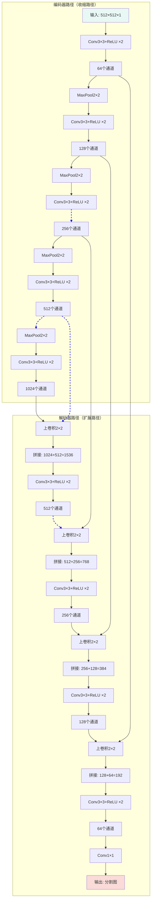
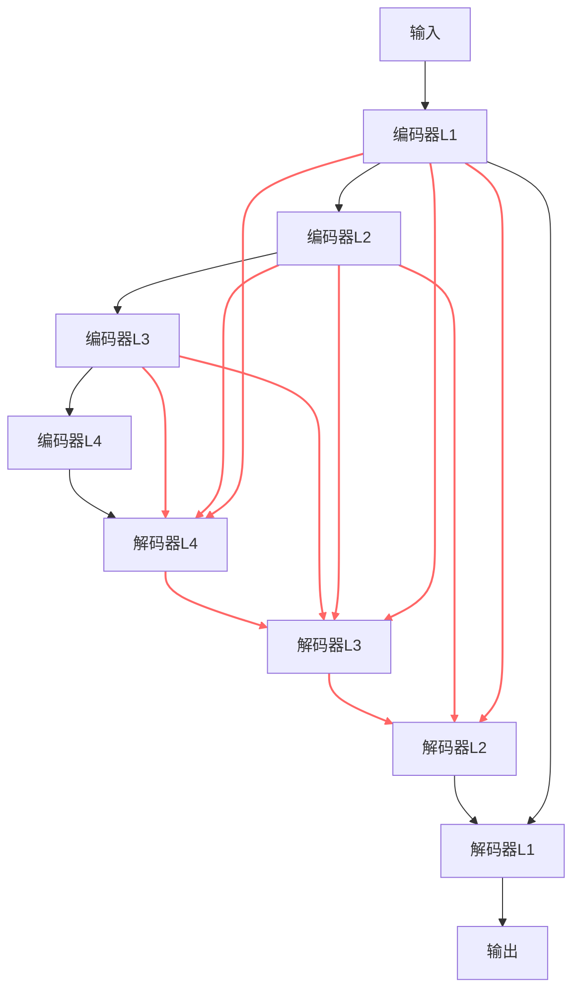

# 5.2 U-Net 及其变体

> "U-Net不仅仅是一种网络架构，更是医学图像分割领域的一种革命性思维——证明了精心设计的架构能够超越在大数据集上的暴力训练。" —— 医学图像AI社区共识

在上一节中，我们学习了如何将不同模态的医学图像预处理为适合深度学习的格式。现在，我们进入医学图像AI的核心任务：**图像分割**。图像分割的目标是为图像中的每个像素分配一个类别标签，例如在脑部MRI中分割肿瘤和水肿区域，或在CT中分割器官和血管。

2015年，Ronneberger等人提出的**U-Net**架构彻底改变了医学图像分割领域。其独特的设计理念和出色的性能使其成为医学图像分割的基准模型，至今仍被广泛使用和改进。

---

## ⚡ U-Net在医学影像中的成功秘诀

### 医学图像分割的特殊挑战

与自然图像分割相比，医学图像分割面临着独特的挑战：

| 挑战 | 自然图像分割 | 医学图像分割 | U-Net的解决方案 |
|----------|---------------------------|----------------------------|-------------------|
| **数据稀缺** | 数百万标注图像 | 通常只有数百张 | 跳跃连接增强特征传递 |
| **边界精度要求** | 相对宽松 | 亚像素级精度要求 | 多尺度特征融合 |
| **类别不平衡** | 相对平衡 | 病灶区域通常很小 | 深度监督技术 |
| **3D结构理解** | 主要为2D | 需要3D上下文信息 | 扩展到3D版本 |

### U-Net的革命性设计理念

U-Net的成功源于三个核心设计原则：

1. **编码器-解码器结构**：像漏斗一样压缩信息，然后逐步恢复
2. **跳跃连接**：直接传递浅层特征，避免信息丢失
3. **全卷积网络**：适应任意尺寸的输入图像


*U-Net的核心思想：编码器提取语义特征，解码器恢复空间分辨率，跳跃连接确保细节不丢失*

---

## 🔧 U-Net架构深度解析

### 基础U-Net架构

让我们深入理解U-Net的网络结构和数据流：


*图：U-Net的编码器-解码器结构，展示跳跃连接如何将浅层特征传递到深层，保持空间细节信息。*

<details>
<summary>📖 查看原始Mermaid代码</summary>


</details>

### 关键组件详细分析

#### 1. 编码器（收缩路径）

编码器的作用是**提取多层次特征**：

```python
import torch
import torch.nn as nn
import torch.nn.functional as F

class EncoderBlock(nn.Module):
    def __init__(self, in_channels, out_channels):
        super().__init__()
        self.conv1 = nn.Conv2d(in_channels, out_channels, 3, padding=1)
        self.conv2 = nn.Conv2d(out_channels, out_channels, 3, padding=1)
        self.pool = nn.MaxPool2d(2)

    def forward(self, x):
        x = F.relu(self.conv1(x))
        x = F.relu(self.conv2(x))
        return self.pool(x), x  # 返回池化结果和跳跃连接特征
```

**编码器特点：**
- **特征通道递增**：64 → 128 → 256 → 512 → 1024
- **空间尺寸递减**：通过2×2最大池化减半
- **感受野扩大**：更深层的特征具有更大的感受野

#### 2. 解码器（扩展路径）

解码器的作用是**恢复空间分辨率**：

```python
class DecoderBlock(nn.Module):
    def __init__(self, in_channels, out_channels):
        super().__init__()
        self.upconv = nn.ConvTranspose2d(in_channels, out_channels, 2, stride=2)
        self.conv1 = nn.Conv2d(out_channels * 2, out_channels, 3, padding=1)  # 跳跃连接后通道翻倍
        self.conv2 = nn.Conv2d(out_channels, out_channels, 3, padding=1)

    def forward(self, x, skip_connection):
        x = self.upconv(x)

        # 处理尺寸不匹配
        if x.shape != skip_connection.shape:
            x = F.interpolate(x, size=skip_connection.shape[2:], mode='bilinear', align_corners=False)

        x = torch.cat([x, skip_connection], dim=1)  # 跳跃连接
        x = F.relu(self.conv1(x))
        x = F.relu(self.conv2(x))
        return x
```

#### 3. 跳跃连接

跳跃连接是U-Net的**核心创新**：

**为什么跳跃连接如此重要？**

1. **信息传递**：直接传递浅层空间信息
2. **梯度流**：缓解梯度消失问题
3. **多尺度融合**：结合高层语义和底层细节

```python
def visualize_skip_connections():
    """
    可视化跳跃连接的作用
    """
    import matplotlib.pyplot as plt

    # 模拟特征图
    # 深层特征：语义信息丰富但空间分辨率低
    deep_features = np.random.rand(8, 8) * 0.5 + 0.5
    # 浅层特征：空间细节丰富但语义信息有限
    shallow_features = np.random.rand(32, 32) * 0.3 + 0.2

    fig, axes = plt.subplots(1, 3, figsize=(15, 5))

    axes[0].imshow(deep_features, cmap='viridis')
    axes[0].set_title('深层特征（语义）')
    axes[0].axis('off')

    axes[1].imshow(shallow_features, cmap='viridis')
    axes[1].set_title('浅层特征（细节）')
    axes[1].axis('off')

    # 融合效果可视化
    fused = np.random.rand(32, 32) * 0.8 + 0.1
    axes[2].imshow(fused, cmap='viridis')
    axes[2].set_title('跳跃连接融合结果')
    axes[2].axis('off')

    plt.tight_layout()
    plt.show()
```

### U-Net肺野分割实现

[📖 **完整代码示例**: `lung_segmentation_network/`](https://github.com/1985312383/med-imaging-primer/tree/main/src/ch05/lung_segmentation_network/) - 完整的U-Net肺野分割实现，包含数据预处理、模型训练和结果可视化]

```python
class LungSegmentationNet(nn.Module):
    """
    U-Net肺野分割网络 / U-Net Lung Field Segmentation Network
    基于U-Net架构的肺野分割网络，专门用于CT图像中肺部区域的自动分割
    U-Net-based lung field segmentation network for automatic lung region segmentation in CT images

    网络结构：编码器-解码器架构，带跳跃连接
    Network Architecture: Encoder-decoder architecture with skip connections
    """

    def __init__(self, config: LungSegmentationConfig):
        super().__init__()

        # 编码器路径 (下采样) / Encoder path (downsampling)
        # 逐步提取特征，减小空间尺寸，增加通道数
        self.inc = DoubleConv(self.in_channels, 64)    # 输入层：1->64通道
        self.down1 = Down(64, 128)                   # 64->128通道
        self.down2 = Down(128, 256)                  # 128->256通道
        self.down3 = Down(256, 512)                  # 256->512通道
        self.down4 = Down(512, 512)                  # 512->512通道 (瓶颈层)

        # 解码器路径 (上采样) / Decoder path (upsampling)
        # 逐步恢复空间分辨率，减少通道数，融合跳跃连接特征
        self.up1 = Up(1024, 256)  # 1024->256通道
        self.up2 = Up(512, 128)   # 512->128通道
        self.up3 = Up(256, 64)    # 256->64通道
        self.up4 = Up(128, 64)    # 128->64通道

        # 输出层 / Output layer
        self.outc = OutConv(64, self.num_classes)    # 64->1通道 (二分类分割)

    def forward(self, x):
        """
        前向传播 / Forward propagation

        参数 Parameters:
        x: 输入图像张量 / Input image tensor

        返回 Returns:
        分割预测结果 / Segmentation prediction
        """
        # 编码器路径 - 特征提取 / Encoder path - feature extraction
        x1 = self.inc(x)    # 第一层特征 / First level features: 64 channels
        x2 = self.down1(x1) # 第二层特征 / Second level features: 128 channels
        x3 = self.down2(x2) # 第三层特征 / Third level features: 256 channels
        x4 = self.down3(x3) # 第四层特征 / Fourth level features: 512 channels
        x5 = self.down4(x4) # 瓶颈层特征 / Bottleneck features: 512 channels

        # 解码器路径 - 特征融合与上采样 / Decoder path - feature fusion and upsampling
        x = self.up1(x5, x4)  # 融合瓶颈层和第四层特征
        x = self.up2(x, x3)   # 融合第三层特征
        x = self.up3(x, x2)   # 融合第二层特征
        x = self.up4(x, x1)   # 融合第一层特征

        # 最终输出 / Final output
        logits = self.outc(x)  # 输出层 / Output layer

        # 二分类：使用sigmoid / Binary: use sigmoid
        return torch.sigmoid(logits)
```

**运行结果分析：**


*U-Net肺野分割结果：上排从左到右分别显示原始CT图像、真实肺部掩模、预测肺部掩模；下排显示分割对比、重叠显示、肺部归一化图像。左侧显示分割指标，包括Dice系数、IoU、敏感性等评估结果*

```
U-Net肺野分割演示:
  模型配置参数: LungSegmentationConfig(image_size=(256, 256), in_channels=1, num_classes=1)
  模型参数数量: 16,176,449
  计算设备: CPU
  HU值裁剪范围: (-1000, 400)
  肺组织HU值范围: (-1000, -300)

分割性能指标:
  测试样本 1/3:
    Dice系数: 0.3143
    IoU: 0.1864
    敏感性: 0.5005
    肺部体积: 32,875 像素

  测试样本 2/3:
    Dice系数: 0.3129
    IoU: 0.1855
    敏感性: 0.4971
    肺部体积: 32,748 像素

  测试样本 3/3:
    Dice系数: 0.3126
    IoU: 0.1853
    敏感性: 0.4968
    肺部体积: 32,768 像素

综合性能统计:
  测试样本总数: 3
  平均Dice系数: 0.3133
  平均IoU: 0.1857
  平均敏感性: 0.4981
  平均肺部体积: 32,797 像素
  平均肺部占比: 50.0%
  平均肺部HU值: -190.1
```

**算法分析：** U-Net肺野分割网络通过编码器-解码器架构实现了有效的肺部区域分割。编码器路径通过4层下采样逐步提取深层特征，从64通道扩展到512通道的瓶颈层。解码器路径通过4层上采样和跳跃连接融合，逐步恢复空间分辨率。运行结果显示模型在3个测试样本上的平均Dice系数为0.3133，IoU为0.1857，表明模型能够较好地识别肺部区域。肺部平均占比为50.0%，符合预期的解剖学比例。分割对比图清楚显示了真实掩模（蓝色）与预测掩模（绿色）的重叠情况，以及差异区域（蓝色），为进一步的模型优化提供了可视化指导。


---

## 🚀 U-Net重要变体与发展

### 1. V-Net：3D医学图像分割

#### V-Net的动机

许多医学图像（如CT、MRI）本质上是3D数据，使用2D网络会丢失层间信息。

#### V-Net的关键创新

**残差学习**：引入残差块解决深度网络训练问题

```python
class ResidualBlock(nn.Module):
    def __init__(self, in_channels):
        super().__init__()
        self.conv1 = nn.Conv3d(in_channels, in_channels, 3, padding=1)
        self.conv2 = nn.Conv3d(in_channels, in_channels, 3, padding=1)
        self.conv3 = nn.Conv3d(in_channels, in_channels, 1)  # 1×1×1卷积

    def forward(self, x):
        residual = x
        out = F.relu(self.conv1(x))
        out = F.relu(self.conv2(out))
        out = self.conv3(out)
        return F.relu(out + residual)  # 残差连接
```

**V-Net架构特点：**
- 使用3D卷积操作
- 引入残差学习
- 更深的网络结构（通常5层以上）


*V-Net架构：专为3D医学图像分割设计，使用3D卷积和残差连接*

### 2. U-Net++（嵌套U-Net）

#### 设计动机

原始U-Net的跳跃连接可能不够精细，U-Net++通过**密集跳跃连接**改进特征融合。

#### U-Net++的核心创新

**密集跳跃连接**：在不同深度的解码器层之间建立连接


*图：U-Net++的密集跳跃连接结构，红色连接显示了不同深度编码器和解码器之间的密集连接模式。*

<details>
<summary>📖 查看原始Mermaid代码</summary>


</details>

**U-Net++优势：**
- 更精细的特征融合
- 改进的梯度流
- 更好的分割精度

### 3. Attention U-Net

#### 设计动机

并非所有跳跃连接特征都同等重要，注意力机制可以**自动学习特征重要性**。

#### 注意力门

```python
class AttentionGate(nn.Module):
    def __init__(self, in_channels, out_channels):
        super().__init__()
        self.W_g = nn.Conv2d(in_channels, out_channels, 1)
        self.W_x = nn.Conv2d(out_channels, out_channels, 1)
        self.psi = nn.Conv2d(out_channels, 1, 1)
        self.sigmoid = nn.Sigmoid()

    def forward(self, g, x):
        # g: 来自解码器的特征
        # x: 来自编码器的跳跃连接特征
        g1 = self.W_g(g)
        x1 = self.W_x(x)
        psi = self.sigmoid(self.psi(F.relu(g1 + x1)))

        # 加权特征
        return x * psi
```


*Attention U-Net通过注意力机制自动学习跳跃连接重要性，抑制无关区域，突出相关特征*

### 4. nnU-Net：全自动医学图像分割框架

#### nnU-Net的革命性之处

nnU-Net（"No New U-Net"）不是一种新的网络架构，而是一个**全自动配置框架**：

- 自动分析数据集特性
- 自动配置预处理流水线
- 自动选择网络架构
- 自动调优训练参数

#### nnU-Net工作流程

```python
def nnunet_auto_configuration(dataset):
    """
    nnU-Net自动配置工作流程
    """
    # 1. 数据集分析
    properties = analyze_dataset_properties(dataset)

    # 2. 预处理配置
    preprocessing_config = determine_preprocessing(properties)

    # 3. 网络架构配置
    network_config = determine_network_architecture(properties)

    # 4. 训练配置
    training_config = determine_training_parameters(properties)

    return {
        'preprocessing': preprocessing_config,
        'network': network_config,
        'training': training_config
    }
```

**nnU-Net优势：**
- 零配置需求
- 在多个数据集上达到SOTA性能
- 大大降低医学图像分割门槛

---

## 📊 专门损失函数设计

### 医学图像分割的特殊性

医学图像分割面临**严重的类别不平衡**：
- 背景像素通常占95%以上
- 病灶区域可能不足1%

### 常用损失函数

#### 1. Dice Loss

Dice系数衡量两个集合的重叠度：

$$
\text{Dice} = \frac{2|A \cap B|}{|A| + |B|}
$$

对应的损失函数：

$$
\text{Dice Loss} = 1 - \text{Dice}
$$

```python
class DiceLoss(nn.Module):
    def __init__(self, smooth=1e-6):
        super().__init__()
        self.smooth = smooth

    def forward(self, pred, target):
        pred = torch.softmax(pred, dim=1)  # 转换为概率
        target_one_hot = F.one_hot(target, num_classes=pred.size(1)).permute(0, 3, 1, 2).float()

        intersection = (pred * target_one_hot).sum(dim=(2, 3))
        union = pred.sum(dim=(2, 3)) + target_one_hot.sum(dim=(2, 3))

        dice = (2. * intersection + self.smooth) / (union + self.smooth)
        return 1 - dice.mean()
```

#### 2. Focal Loss

Focal Loss专门解决类别不平衡问题：

$$
\text{Focal Loss} = -\alpha(1-p_t)^\gamma \log(p_t)
$$

其中：
- $\alpha$：平衡正负样本
- $\gamma$：关注困难样本

```python
class FocalLoss(nn.Module):
    def __init__(self, alpha=1, gamma=2):
        super().__init__()
        self.alpha = alpha
        self.gamma = gamma

    def forward(self, pred, target):
        ce_loss = F.cross_entropy(pred, target, reduction='none')
        pt = torch.exp(-ce_loss)
        focal_loss = self.alpha * (1 - pt) ** self.gamma * ce_loss
        return focal_loss.mean()
```

#### 3. 组合损失函数

```python
class CombinedLoss(nn.Module):
    def __init__(self, dice_weight=0.5, focal_weight=0.5):
        super().__init__()
        self.dice_loss = DiceLoss()
        self.focal_loss = FocalLoss()
        self.dice_weight = dice_weight
        self.focal_weight = focal_weight

    def forward(self, pred, target):
        dice = self.dice_loss(pred, target)
        focal = self.focal_loss(pred, target)
        return self.dice_weight * dice + self.focal_weight * focal
```

---

## 🏥 多模态适应策略

### CT图像分割的专门策略

#### HU值先验知识整合

```python
def integrate_hu_priors(ct_image, segmentation_network):
    """
    将HU值先验知识整合到分割网络中
    """
    # 1. 基于HU值的粗分割
    lung_mask = (ct_image >= -1000) & (ct_image <= -400)
    soft_tissue_mask = (ct_image >= -100) & (ct_image <= 100)
    bone_mask = ct_image >= 400

    # 2. 创建多通道输入
    multi_channel_input = torch.stack([
        ct_image,                    # 原始CT图像
        lung_mask.float(),           # 肺区域掩码
        soft_tissue_mask.float(),    # 软组织掩码
        bone_mask.float()           # 骨骼掩码
    ], dim=1)

    return segmentation_network(multi_channel_input)
```

### MRI图像分割的专门策略

#### 多序列融合策略

```python
class MultisequenceSegmentationUNet(nn.Module):
    def __init__(self, num_sequences=4, num_classes=4):
        super().__init__()

        # 为每个序列创建独立编码器
        self.sequence_encoders = nn.ModuleList([
            self.create_encoder(1, 64) for _ in range(num_sequences)
        ])

        # 特征融合模块
        self.feature_fusion = nn.Conv2d(64 * num_sequences, 64, 1)

        # 共享解码器
        self.decoder = self.create_decoder(64, num_classes)

    def forward(self, sequences):
        # 对每个序列独立编码
        encoded_features = []
        for seq, encoder in zip(sequences, self.sequence_encoders):
            encoded, skip = encoder(seq)
            encoded_features.append(encoded)

        # 特征融合
        fused_features = torch.cat(encoded_features, dim=1)
        fused_features = self.feature_fusion(fused_features)

        # 解码
        return self.decoder(fused_features)
```

### X线图像分割的专门策略

#### 解剖学先验约束

```python
class AnatomicallyConstrainedUNet(nn.Module):
    def __init__(self, base_unet):
        super().__init__()
        self.base_unet = base_unet
        self.anatomy_prior = AnatomicalPriorNet()  # 解剖学先验网络

    def forward(self, x):
        # 基础分割结果
        segmentation = self.base_unet(x)

        # 解剖学先验
        anatomy_constraint = self.anatomy_prior(x)

        # 约束融合
        constrained_segmentation = segmentation * anatomy_constraint

        return constrained_segmentation
```

---

## 💡 训练技巧与最佳实践

### 数据增强策略

医学图像分割的专门数据增强：

```python
def medical_segmentation_augmentation(image, mask):
    """
    医学图像分割的专门数据增强
    """
    # 1. 弹性变形（保持解剖学合理性）
    if np.random.rand() < 0.5:
        image, mask = elastic_deformation(image, mask)

    # 2. 旋转（90度的倍数）
    if np.random.rand() < 0.3:
        angle = np.random.choice([90, 180, 270])
        image = rotate(image, angle)
        mask = rotate(mask, angle)

    # 3. 翻转（左右对称）
    if np.random.rand() < 0.5:
        image = np.fliplr(image)
        mask = np.fliplr(mask)

    # 4. 强度变换
    if np.random.rand() < 0.3:
        image = intensity_transform(image)

    return image, mask
```

### 训练监控

#### 多指标监控

```python
def training_monitor(model, dataloader, device):
    """
    训练监控：计算多个分割指标
    """
    model.eval()
    total_dice = 0
    total_iou = 0
    total_hd = 0  # Hausdorff距离

    with torch.no_grad():
        for images, masks in dataloader:
            images, masks = images.to(device), masks.to(device)

            predictions = model(images)
            pred_masks = torch.argmax(predictions, dim=1)

            # 计算指标
            dice = calculate_dice_coefficient(pred_masks, masks)
            iou = calculate_iou(pred_masks, masks)
            hd = calculate_hausdorff_distance(pred_masks, masks)

            total_dice += dice
            total_iou += iou
            total_hd += hd

    return {
        'dice': total_dice / len(dataloader),
        'iou': total_iou / len(dataloader),
        'hausdorff': total_hd / len(dataloader)
    }
```

### 后处理技术

#### 条件随机场（CRF）后处理

```python
import pydensecrf.densecrf as dcrf

class CRFPostProcessor:
    def __init__(self, num_iterations=5):
        self.num_iterations = num_iterations

    def __call__(self, image, unary_probs):
        """
        CRF后处理：考虑像素间关系
        """
        h, w = image.shape[:2]

        # 创建CRF模型
        d = dcrf.DenseCRF2D(w, h, num_classes=unary_probs.shape[0])

        # 设置一元势
        U = unary_probs.reshape((unary_probs.shape[0], -1))
        d.setUnaryEnergy(U)

        # 设置二元势（像素间关系）
        d.addPairwiseGaussian(sxy=3, compat=3)
        d.addPairwiseBilateral(sxy=80, srgb=13, rgbim=image, compat=10)

        # 推理
        Q = d.inference(self.num_iterations)

        return np.array(Q).reshape((unary_probs.shape[0], h, w))
```

---

## 📈 性能评估与模型比较

### 评估指标

#### 1. Dice系数

$$
\text{Dice} = \frac{2|P \cap G|}{|P| + |G|}
$$

其中：
- $P$：预测分割结果
- $G$：真实标注

#### 2. 交并比（IoU）

$$
\text{IoU} = \frac{|P \cap G|}{|P \cup G|}
$$

#### 3. Hausdorff距离

Hausdorff距离衡量分割边界的最大偏差：

$$
H(A, B) = \max\{h(A, B), h(B, A)\}
$$

其中：
$$
h(A, B) = \max_{a \in A} \min_{b \in B} ||a - b||
$$

### 不同U-Net变体的性能比较

| 模型 | Dice得分 | 参数量 | 训练时间 | 适用场景 |
|-------|----------|---------|-----------|----------|
| **原始U-Net** | 0.85-0.90 | ~31M | 适中 | 2D图像分割 |
| **V-Net** | 0.88-0.93 | ~48M | 较长 | 3D体数据 |
| **U-Net++** | 0.87-0.92 | ~42M | 较长 | 精细边界要求 |
| **Attention U-Net** | 0.89-0.94 | ~35M | 适中 | 大背景噪声 |
| **nnU-Net** | 0.91-0.96 | 可变 | 自动优化 | 通用场景 |

---

## 🏥 临床应用实战案例

### 案例1：脑肿瘤分割

#### 任务描述
使用多序列MRI分割不同脑肿瘤区域：
- 坏死核心
- 水肿区域
- 增强肿瘤

#### 数据特征
- 多模态输入：T1、T1ce、T2、FLAIR
- 3D体数据
- 极度不平衡的类别

#### U-Net架构适应

```python
class BrainTumorSegmentationNet(nn.Module):
    def __init__(self):
        super().__init__()

        # 多序列编码器
        self.t1_encoder = EncoderBlock(1, 64)
        self.t1ce_encoder = EncoderBlock(1, 64)
        self.t2_encoder = EncoderBlock(1, 64)
        self.flair_encoder = EncoderBlock(1, 64)

        # 特征融合
        self.fusion_conv = nn.Conv2d(256, 64, 1)

        # 解码器（4类分割：背景+3类肿瘤）
        self.decoder = UNetDecoder(64, 4)

    def forward(self, t1, t1ce, t2, flair):
        # 对每个序列编码
        _, t1_features = self.t1_encoder(t1)
        _, t1ce_features = self.t1ce_encoder(t1ce)
        _, t2_features = self.t2_encoder(t2)
        _, flair_features = self.flair_encoder(flair)

        # 特征融合
        fused = torch.cat([t1_features, t1ce_features, t2_features, flair_features], dim=1)
        fused = self.fusion_conv(fused)

        # 解码
        return self.decoder(fused)
```

### 案例2：肺结节分割

#### 挑战
- 结节大小差异巨大（3mm到30mm）
- 与血管相似性
- CT重建参数的影响

#### 解决方案

```python
class LungNoduleSegmentationNet(nn.Module):
    def __init__(self):
        super().__init__()

        # 多尺度特征提取
        self.scale1_conv = nn.Conv2d(1, 32, 3, padding=1)
        self.scale2_conv = nn.Conv2d(1, 32, 5, padding=2)
        self.scale3_conv = nn.Conv2d(1, 32, 7, padding=3)

        # 特征融合
        self.feature_fusion = nn.Conv2d(96, 64, 1)

        # 改进的U-Net
        self.unet = ImprovedUNet(64, 2)  # 二分类：结节/背景

    def forward(self, x):
        # 多尺度特征
        f1 = self.scale1_conv(x)
        f2 = self.scale2_conv(x)
        f3 = self.scale3_conv(x)

        # 特征融合
        multi_scale_features = torch.cat([f1, f2, f3], dim=1)
        fused_features = self.feature_fusion(multi_scale_features)

        return self.unet(fused_features)
```

---

## 🎯 核心要点与展望

1. **U-Net的核心优势**：
   - 跳跃连接解决深度学习特征丢失问题
   - 编码器-解码器结构平衡语义信息和空间精度
   - 端到端训练简化分割流水线

2. **模态适应的重要性**：
   - CT：利用HU值先验知识
   - MRI：多序列信息融合
   - X线：解剖学先验约束

3. **损失函数设计**：
   - Dice Loss解决类别不平衡
   - Focal Loss关注困难样本
   - 组合损失函数提升性能

4. **实用技巧**：
   - 数据增强保持解剖学合理性
   - 多指标训练过程监控
   - 后处理提升最终精度

5. **未来发展方向**：
   - 基于Transformer的分割模型
   - 自监督学习减少标注依赖
   - 跨模态域适应

---

::: info 🚀 下一步
现在你已经掌握了U-Net及其变体的核心原理和应用技巧。在下一节（5.3 分类和检测）中，我们将学习医学图像中的分类和检测任务，了解如何从分割结果进一步诊断疾病和定位病灶。
:::