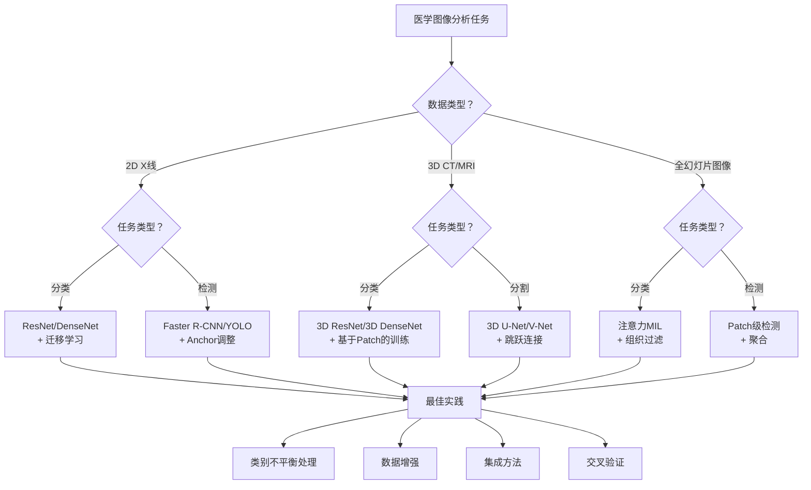

# 5.3 分类和检测

> "医学图像分类和检测正在从计算机辅助检测（CADe）向计算机辅助诊断（CADx）发展，并逐渐成为临床医生的重要助手。" —— AI医学影像发展趋势

在之前的章节中，我们详细学习了预处理技术和基于U-Net的分割方法。现在，我们进入医学图像分析的另一个重要领域：**分类和检测**。与分割的像素级精度要求不同，分类和检测更关注准确地识别疾病和定位病灶。

医学图像分类和检测面临着独特的挑战：极端的类别不平衡（正负样本比例可达1:1000）、微小的病灶尺寸、图像质量变化，以及对高精度和高召回率的要求。在本节中，我们将探讨如何使用深度学习技术来解决这些问题。

---

## 🔍 分类检测核心概念对比

### 基础任务定义

#### 图像分类

**图像分类**确定图像是否包含特定的疾病或异常：

- **二分类**：正常 vs 异常
- **多类分类**：特定疾病类型识别
- **多标签分类**：一张图像可能包含多种疾病

#### 目标检测

**目标检测**不仅识别疾病，还确定其位置：

- **边界框检测**：框出病灶区域
- **病灶定位**：提供精确坐标
- **多病灶检测**：同时检测多个病灶

| 任务类型 | 输入 | 输出 | 临床应用 | 难度等级 |
|-----------|-------|--------|---------------------|-----------------|
| **分类** | 完整医学图像 | 疾病标签/类别 | 初筛、分诊 | ⭐⭐ |
| **检测** | 完整医学图像 | 边界框 + 类别 | 病灶定位、手术规划 | ⭐⭐⭐ |
| **分割** | 完整医学图像 | 像素级掩码 | 精确测量、3D重建 | ⭐⭐⭐⭐ |

### 医学特殊性

#### 类别不平衡问题

医学成像数据通常存在严重的类别不平衡：

```python
def analyze_class_imbalance(dataset):
    """
    分析医学数据集中的类别不平衡
    """
    class_counts = {}
    for label in dataset.labels:
        class_counts[label] = class_counts.get(label, 0) + 1

    total_samples = len(dataset)
    imbalance_ratios = {}

    for class_name, count in class_counts.items():
        ratio = count / total_samples
        imbalance_ratios[class_name] = {
            'count': count,
            'percentage': ratio * 100,
            'imbalance_factor': max(class_counts.values()) / count
        }

    return imbalance_ratios

# 示例输出
# {
#     'normal': {'count': 9500, 'percentage': 95.0, 'imbalance_factor': 1.0},
#     'pneumonia': {'count': 300, 'percentage': 3.0, 'imbalance_factor': 31.7},
#     'tuberculosis': {'count': 150, 'percentage': 1.5, 'imbalance_factor': 63.3},
#     'cancer': {'count': 50, 'percentage': 0.5, 'imbalance_factor': 190.0}
# }
```

#### 不确定性和可解释性

医学诊断需要高可解释性：

```python
class MedicalClassificationModel(nn.Module):
    """
    可解释的医学分类模型
    """
    def __init__(self, backbone, num_classes):
        super().__init__()
        self.backbone = backbone
        self.classifier = nn.Linear(backbone.feature_dim, num_classes)
        self.attention_map = nn.Conv2d(backbone.feature_dim, 1, 1)

    def forward(self, x):
        features = self.backbone.extract_features(x)

        # 分类预测
        logits = self.classifier(F.adaptive_avg_pool2d(features, 1).flatten(1))
        probs = F.softmax(logits, dim=1)

        # 注意力图可视化
        attention = F.sigmoid(self.attention_map(features))

        return {
            'predictions': probs,
            'attention_maps': attention,
            'features': features
        }
```

---

## 🏥 2D CNN X线图像分类技术

### X线分类特征

#### 整体图像理解

X线分类需要理解整体上下文：

- **全局特征**：整体器官形态
- **局部特征**：特定病灶征象
- **相对位置**：解剖结构间的空间关系


*基于深度学习的胸部X线分类，模型自动学习疾病特征*

### 经典2D CNN架构

#### 基于ResNet的医学分类

```python
import torch.nn as nn
import torch.nn.functional as F
from torchvision.models import resnet50

class MedicalResNet(nn.Module):
    """
    基于ResNet的医学图像分类模型
    """
    def __init__(self, num_classes, pretrained=True, dropout_rate=0.5):
        super().__init__()

        # 加载预训练ResNet
        self.backbone = resnet50(pretrained=pretrained)

        # 修改第一层以适应医学灰度图像
        self.backbone.conv1 = nn.Conv2d(
            1, 64, kernel_size=7, stride=2, padding=3, bias=False
        )

        # 替换分类器
        feature_dim = self.backbone.fc.in_features
        self.backbone.fc = nn.Identity()

        # 自定义分类头
        self.classifier = nn.Sequential(
            nn.AdaptiveAvgPool2d(1),
            nn.Flatten(),
            nn.Dropout(dropout_rate),
            nn.Linear(feature_dim, 512),
            nn.ReLU(inplace=True),
            nn.Dropout(dropout_rate * 0.5),
            nn.Linear(512, num_classes)
        )

    def forward(self, x):
        features = self.backbone(x)
        return self.classifier(features)
```

#### DenseNet的优势

**DenseNet**特别适合医学图像分类：

```python
class DenseNetMedical(nn.Module):
    """
    基于DenseNet的医学分类模型
    """
    def __init__(self, num_classes, growth_rate=32, block_config=(6, 12, 24, 16)):
        super().__init__()

        # DenseNet特征提取器
        self.features = self._make_dense_layers(growth_rate, block_config)

        # 分类头
        self.classifier = nn.Sequential(
            nn.BatchNorm2d(block_config[-1] * growth_rate),
            nn.ReLU(inplace=True),
            nn.AdaptiveAvgPool2d(1),
            nn.Flatten(),
            nn.Linear(block_config[-1] * growth_rate, num_classes)
        )

    def _make_dense_layers(self, growth_rate, block_config):
        """
        构建DenseNet层
        """
        layers = []

        # 初始卷积
        layers += [
            nn.Conv2d(1, 2 * growth_rate, 7, stride=2, padding=3, bias=False),
            nn.BatchNorm2d(2 * growth_rate),
            nn.ReLU(inplace=True),
            nn.MaxPool2d(3, stride=2, padding=1)
        ]

        # 密集块
        num_features = 2 * growth_rate
        for i, num_layers in enumerate(block_config):
            layers.append(self._make_dense_block(num_features, num_layers, growth_rate))
            num_features += num_layers * growth_rate

            if i != len(block_config) - 1:
                layers.append(self._make_transition_layer(num_features, num_features // 2))
                num_features = num_features // 2

        return nn.Sequential(*layers)

    def _make_dense_block(self, in_channels, num_layers, growth_rate):
        """
        构建密集块
        """
        layers = []
        for _ in range(num_layers):
            layers.append(self._make_dense_layer(in_channels, growth_rate))
            in_channels += growth_rate
        return nn.Sequential(*layers)

    def _make_dense_layer(self, in_channels, growth_rate):
        """
        构建密集层
        """
        return nn.Sequential(
            nn.BatchNorm2d(in_channels),
            nn.ReLU(inplace=True),
            nn.Conv2d(in_channels, 4 * growth_rate, 1, bias=False),
            nn.BatchNorm2d(4 * growth_rate),
            nn.ReLU(inplace=True),
            nn.Conv2d(4 * growth_rate, growth_rate, 3, padding=1, bias=False)
        )
```

### 数据不平衡处理策略

#### 损失函数设计

```python
class FocalLoss(nn.Module):
    """
    Focal Loss：解决类别不平衡问题
    """
    def __init__(self, alpha=1, gamma=2, reduction='mean'):
        super().__init__()
        self.alpha = alpha
        self.gamma = gamma
        self.reduction = reduction

    def forward(self, inputs, targets):
        ce_loss = F.cross_entropy(inputs, targets, reduction='none')
        pt = torch.exp(-ce_loss)
        focal_loss = self.alpha * (1 - pt) ** self.gamma * ce_loss

        if self.reduction == 'mean':
            return focal_loss.mean()
        elif self.reduction == 'sum':
            return focal_loss.sum()
        else:
            return focal_loss

class BalancedCrossEntropyLoss(nn.Module):
    """
    平衡交叉熵损失
    """
    def __init__(self, class_weights=None):
        super().__init__()
        self.class_weights = class_weights

    def forward(self, inputs, targets):
        if self.class_weights is not None:
            weight = self.class_weights[targets]
            ce_loss = F.cross_entropy(inputs, targets, weight=weight, reduction='none')
        else:
            ce_loss = F.cross_entropy(inputs, targets, reduction='none')

        return ce_loss.mean()
```

#### 数据采样策略

```python
class BalancedSampler(torch.utils.data.Sampler):
    """
    平衡采样器：确保每个batch有均衡的样本
    """
    def __init__(self, dataset, samples_per_class):
        self.dataset = dataset
        self.samples_per_class = samples_per_class

        # 按类别分组
        self.class_indices = {}
        for idx, label in enumerate(dataset.labels):
            if label not in self.class_indices:
                self.class_indices[label] = []
            self.class_indices[label].append(idx)

    def __iter__(self):
        batch = []
        for _ in range(len(self) // self.samples_per_class):
            # 从每个类别随机选择样本
            sampled_indices = []
            for class_indices in self.class_indices.values():
                if len(class_indices) > 0:
                    sampled_idx = np.random.choice(class_indices)
                    sampled_indices.append(sampled_idx)

            batch.extend(sampled_indices)

        np.random.shuffle(batch)
        return iter(batch)

    def __len__(self):
        return len(self.dataset)
```

---

## 🧠 3D CNN体积数据分析

### 从2D到3D：挑战与机遇

#### 3D数据特征

体积医学数据（CT、MRI）具有独特特征：

| 特征 | 2D图像 | 3D体积 |
|---------|----------|-----------|
| **空间信息** | 平面上下文 | 完整3D空间关系 |
| **计算复杂度** | O(H×W) | O(H×W×D) |
| **内存需求** | MB | GB |
| **层间信息** | 丢失 | 保留 |
| **临床价值** | 局部诊断 | 综合分析 |

#### 3D卷积操作

```python
class Conv3DBlock(nn.Module):
    """
    3D卷积块
    """
    def __init__(self, in_channels, out_channels, kernel_size=3, stride=1, padding=1):
        super().__init__()
        self.conv = nn.Conv3d(in_channels, out_channels, kernel_size, stride, padding, bias=False)
        self.bn = nn.BatchNorm3d(out_channels)
        self.relu = nn.ReLU(inplace=True)

    def forward(self, x):
        return self.relu(self.bn(self.conv(x)))

class ResNet3DBlock(nn.Module):
    """
    3D残差块
    """
    def __init__(self, in_channels, out_channels, stride=1):
        super().__init__()

        self.conv1 = Conv3DBlock(in_channels, out_channels, stride=stride)
        self.conv2 = nn.Sequential(
            nn.Conv3d(out_channels, out_channels, 3, padding=1, bias=False),
            nn.BatchNorm3d(out_channels)
        )

        self.shortcut = nn.Sequential()
        if stride != 1 or in_channels != out_channels:
            self.shortcut = nn.Sequential(
                nn.Conv3d(in_channels, out_channels, 1, stride, bias=False),
                nn.BatchNorm3d(out_channels)
            )

    def forward(self, x):
        residual = self.shortcut(x)
        out = self.conv1(x)
        out = self.conv2(out)
        out += residual
        return F.relu(out)
```

### 3D CNN架构设计

#### 医学3D ResNet

```python
class Medical3DResNet(nn.Module):
    """
    用于体积医学图像分类的3D ResNet
    """
    def __init__(self, block, layers, num_classes=2):
        super().__init__()

        self.in_channels = 64

        # 初始卷积
        self.conv1 = nn.Sequential(
            nn.Conv3d(1, 64, kernel_size=7, stride=2, padding=3, bias=False),
            nn.BatchNorm3d(64),
            nn.ReLU(inplace=True),
            nn.MaxPool3d(kernel_size=3, stride=2, padding=1)
        )

        # 残差块
        self.layer1 = self._make_layer(block, 64, layers[0])
        self.layer2 = self._make_layer(block, 128, layers[1], stride=2)
        self.layer3 = self._make_layer(block, 256, layers[2], stride=2)
        self.layer4 = self._make_layer(block, 512, layers[3], stride=2)

        # 分类头
        self.avgpool = nn.AdaptiveAvgPool3d((1, 1, 1))
        self.fc = nn.Linear(512 * block.expansion, num_classes)

        # 初始化权重
        self._initialize_weights()

    def _make_layer(self, block, out_channels, blocks, stride=1):
        layers = []
        layers.append(block(self.in_channels, out_channels, stride))
        self.in_channels = out_channels * block.expansion

        for _ in range(1, blocks):
            layers.append(block(self.in_channels, out_channels))

        return nn.Sequential(*layers)

    def _initialize_weights(self):
        for m in self.modules():
            if isinstance(m, nn.Conv3d):
                nn.init.kaiming_normal_(m.weight, mode='fan_out', nonlinearity='relu')
            elif isinstance(m, nn.BatchNorm3d):
                nn.init.constant_(m.weight, 1)
                nn.init.constant_(m.bias, 0)

    def forward(self, x):
        x = self.conv1(x)
        x = self.layer1(x)
        x = self.layer2(x)
        x = self.layer3(x)
        x = self.layer4(x)

        x = self.avgpool(x)
        x = torch.flatten(x, 1)
        x = self.fc(x)

        return x

# 模型实例化
def create_medical_3d_resnet(num_classes=2):
    return Medical3DResNet(ResNet3DBlock, [2, 2, 2, 2], num_classes)
```

#### 3D DenseNet架构

```python
class DenseBlock3D(nn.Module):
    """
    3D密集块
    """
    def __init__(self, num_layers, in_channels, growth_rate):
        super().__init__()
        self.layers = nn.ModuleList()

        for i in range(num_layers):
            layer = nn.Sequential(
                nn.BatchNorm3d(in_channels + i * growth_rate),
                nn.ReLU(inplace=True),
                nn.Conv3d(in_channels + i * growth_rate, 4 * growth_rate, 1, bias=False),
                nn.BatchNorm3d(4 * growth_rate),
                nn.ReLU(inplace=True),
                nn.Conv3d(4 * growth_rate, growth_rate, 3, padding=1, bias=False)
            )
            self.layers.append(layer)

    def forward(self, x):
        features = [x]

        for layer in self.layers:
            new_features = layer(torch.cat(features, dim=1))
            features.append(new_features)

        return torch.cat(features, dim=1)
```

### 内存优化策略

#### 基于Patches的训练

```python
class Patch3DDataset(torch.utils.data.Dataset):
    """
    3D patch数据集
    """
    def __init__(self, volume_path, label_path, patch_size=(64, 64, 64), stride=32):
        self.patch_size = patch_size
        self.stride = stride

        # 加载体积和标签
        self.volume = nib.load(volume_path).get_fdata()
        self.label = nib.load(label_path).get_fdata()

        # 生成patch坐标
        self.patches = self._generate_patches()

    def _generate_patches(self):
        """
        生成3D patch坐标
        """
        patches = []
        D, H, W = self.volume.shape
        pd, ph, pw = self.patch_size

        for d in range(0, D - pd + 1, self.stride):
            for h in range(0, H - ph + 1, self.stride):
                for w in range(0, W - pw + 1, self.stride):
                    patch_volume = self.volume[d:d+pd, h:h+ph, w:w+pw]
                    patch_label = self.label[d:d+pd, h:h+ph, w:w+pw]

                    # 过滤掉背景patches
                    if np.sum(patch_label > 0) > 0.1 * np.prod(self.patch_size):
                        patches.append((d, h, w))

        return patches

    def __getitem__(self, idx):
        d, h, w = self.patches[idx]
        pd, ph, pw = self.patch_size

        volume_patch = self.volume[d:d+pd, h:h+ph, w:w+pw]
        label_patch = self.label[d:d+pd, h:h+ph, w:w+pw]

        # 归一化
        volume_patch = self._normalize_volume(volume_patch)

        return torch.FloatTensor(volume_patch).unsqueeze(0), torch.LongTensor([label_patch.max()])
```

#### 梯度检查点

```python
from torch.utils.checkpoint import checkpoint

class MemoryEfficient3DNet(nn.Module):
    """
    内存高效的3D网络
    """
    def __init__(self):
        super().__init__()
        self.layer1 = self._create_layer(1, 64)
        self.layer2 = self._create_layer(64, 128)
        self.layer3 = self._create_layer(128, 256)
        self.layer4 = self._create_layer(256, 512)

    def _create_layer(self, in_channels, out_channels):
        return nn.Sequential(
            nn.Conv3d(in_channels, out_channels, 3, padding=1),
            nn.BatchNorm3d(out_channels),
            nn.ReLU(inplace=True),
            nn.Conv3d(out_channels, out_channels, 3, padding=1),
            nn.BatchNorm3d(out_channels),
            nn.ReLU(inplace=True)
        )

    def forward(self, x):
        # 使用梯度检查点节省内存
        x1 = checkpoint(self.layer1, x)
        x2 = checkpoint(self.layer2, x1)
        x3 = checkpoint(self.layer3, x2)
        x4 = checkpoint(self.layer4, x3)

        return x4
```

---

## 🔬 全幻灯片图像多示例学习

### 全幻灯片图像挑战

#### WSI特征

**全幻灯片图像（WSI）**具有独特特征：

- **超高分辨率**：100,000×100,000像素或更高
- **巨大文件大小**：数GB
- **可变放大倍数**：不同物镜（4x、10x、20x、40x）
- **仅有幻灯片级标签**：通常只知道患者是否患有癌症


*基于MIL的千兆像素WSI癌症检测工作流程*

### MIL基础

#### 问题形式化

在MIL中，一张幻灯片被视为一个**包（bag）**，从中提取的patches是**实例（instances）**：

- **包标签**：已知（如癌性/正常）
- **实例标签**：未知（哪些patches包含癌症）
- **假设**：如果包是阳性的，至少有一个实例是阳性的

```python
class MILDataset(torch.utils.data.Dataset):
    """
    多示例学习数据集
    """
    def __init__(self, wsi_paths, labels, patch_size=256, magnification=20):
        self.wsi_paths = wsi_paths
        self.labels = labels
        self.patch_size = patch_size
        self.magnification = magnification

        # 预提取patches或动态提取
        self.patch_cache = {}

    def extract_patches(self, wsi_path, num_patches=100):
        """
        从WSI提取patches
        """
        wsi = openslide.OpenSlide(wsi_path)

        # 获取图像尺寸
        level = self._get_best_level(wsi, self.magnification)
        dimensions = wsi.level_dimensions[level]

        patches = []
        for _ in range(num_patches):
            # 随机采样
            x = np.random.randint(0, dimensions[0] - self.patch_size)
            y = np.random.randint(0, dimensions[1] - self.patch_size)

            patch = wsi.read_region((x, y), level,
                                  (self.patch_size, self.patch_size))
            patch = patch.convert('RGB')

            # 组织过滤
            if self._is_tissue_patch(patch):
                patches.append(np.array(patch))

        return patches

    def _is_tissue_patch(self, patch, threshold=0.1):
        """
        检查patch是否包含组织
        """
        # 转换到HSV空间进行组织检测
        hsv = cv2.cvtColor(patch, cv2.COLOR_RGB2HSV)

        # 组织通常出现在特定的H、S范围内
        tissue_mask = (hsv[:, :, 0] > 0.1) & (hsv[:, :, 1] > 0.1)
        tissue_ratio = np.sum(tissue_mask) / patch.size

        return tissue_ratio > threshold

    def __getitem__(self, idx):
        if idx not in self.patch_cache:
            self.patch_cache[idx] = self.extract_patches(self.wsi_paths[idx])

        patches = self.patch_cache[idx]
        label = self.labels[idx]

        # 转换为tensor
        patches_tensor = torch.FloatTensor(np.array(patches)).permute(0, 3, 1, 2)
        label_tensor = torch.LongTensor([label])

        return patches_tensor, label_tensor
```

### MIL算法实现

#### 实例级注意力

```python
class AttentionMIL(nn.Module):
    """
    基于注意力的多示例学习模型
    """
    def __init__(self, input_size=256*256*3, hidden_size=512, attention_size=256, num_classes=2):
        super().__init__()

        # 特征提取器
        self.feature_extractor = nn.Sequential(
            nn.Linear(input_size, hidden_size),
            nn.ReLU(),
            nn.Dropout(0.5),
            nn.Linear(hidden_size, hidden_size),
            nn.ReLU(),
            nn.Dropout(0.5)
        )

        # 注意力机制
        self.attention = nn.Sequential(
            nn.Linear(hidden_size, attention_size),
            nn.Tanh(),
            nn.Linear(attention_size, 1)
        )

        # 分类器
        self.classifier = nn.Linear(hidden_size, num_classes)

    def forward(self, bag):
        """
        前向传播
        Args:
            bag: (batch_size, num_instances, channels, height, width)
        """
        batch_size, num_instances, C, H, W = bag.shape

        # 重塑以处理每个实例
        bag = bag.view(-1, C, H, W)

        # 特征提取
        features = self.feature_extractor(bag.view(bag.size(0), -1))

        # 重塑回bag格式
        features = features.view(batch_size, num_instances, -1)

        # 注意力计算
        attention_weights = self.attention(features)  # (batch_size, num_instances, 1)
        attention_weights = F.softmax(attention_weights, dim=1)

        # 加权池化
        weighted_features = torch.sum(features * attention_weights, dim=1)

        # 分类
        logits = self.classifier(weighted_features)

        return {
            'logits': logits,
            'attention_weights': attention_weights,
            'instance_features': features
        }

    def calculate_loss(self, outputs, targets, attention_reg_strength=0.001):
        """
        计算MIL损失
        """
        # 分类损失
        classification_loss = F.cross_entropy(outputs['logits'], targets)

        # 注意力正则化（防止注意力只集中在单个实例上）
        attention_entropy = -torch.mean(
            torch.sum(outputs['attention_weights'] *
                     torch.log(outputs['attention_weights'] + 1e-8), dim=1)
        )

        total_loss = classification_loss - attention_reg_strength * attention_entropy

        return total_loss
```

#### 深度MIL框架

```python
class DeepMIL(nn.Module):
    """
    深度多示例学习框架
    """
    def __init__(self, backbone='resnet50', mil_type='attention', num_classes=2):
        super().__init__()

        self.backbone = self._create_backbone(backbone)
        self.mil_layer = self._create_mil_layer(mil_type)
        self.classifier = nn.Linear(2048, num_classes)  # ResNet50输出维度

    def _create_backbone(self, backbone_name):
        """
        创建CNN backbone
        """
        if backbone_name == 'resnet50':
            from torchvision.models import resnet50
            backbone = resnet50(pretrained=True)
            # 移除最后的全连接层
            backbone = nn.Sequential(*list(backbone.children())[:-1])

        return backbone

    def _create_mil_layer(self, mil_type):
        """
        创建MIL层
        """
        if mil_type == 'attention':
            return AttentionMIL()
        elif mil_type == 'max_pooling':
            return nn.AdaptiveMaxPool2d(1)
        elif mil_type == 'mean_pooling':
            return nn.AdaptiveAvgPool2d(1)
        else:
            raise ValueError(f"不支持的MIL类型: {mil_type}")

    def forward(self, bag):
        """
        前向传播
        Args:
            bag: (batch_size, num_instances, 3, H, W)
        """
        batch_size, num_instances = bag.shape[:2]

        # 重塑以处理每个实例
        instances = bag.view(-1, *bag.shape[2:])

        # 特征提取
        with torch.no_grad():
            features = self.backbone(instances)  # (batch_size * num_instances, 2048, 1, 1)
            features = features.view(features.size(0), -1)  # 展平

        # 重塑为bag格式
        features = features.view(batch_size, num_instances, -1)

        # MIL聚合
        if isinstance(self.mil_layer, AttentionMIL):
            mil_output = self.mil_layer({'features': features})
            bag_features = mil_output['bag_features']
            attention_weights = mil_output['attention_weights']
        else:
            features = features.view(batch_size * num_instances, -1)
            bag_features = self.mil_layer(features.view(batch_size, num_instances, -1, 1, 1))
            bag_features = bag_features.view(batch_size, -1)
            attention_weights = None

        # 分类
        logits = self.classifier(bag_features)

        return {
            'logits': logits,
            'attention_weights': attention_weights,
            'bag_features': bag_features
        }
```

### 可视化和可解释性

#### 注意力图可视化

```python
def visualize_attention_map(wsi_path, model, attention_weights, patch_coordinates, save_path):
    """
    在WSI上可视化注意力图
    """
    import matplotlib.pyplot as plt
    from matplotlib.patches import Rectangle

    # 加载WSI
    wsi = openslide.OpenSlide(wsi_path)

    # 获取缩略图
    thumbnail = wsi.get_thumbnail((wsi.dimensions[0] // 10, wsi.dimensions[1] // 10))

    fig, ax = plt.subplots(1, 1, figsize=(15, 10))
    ax.imshow(thumbnail)

    # 绘制注意力权重
    scale_factor = 10  # 缩略图缩放因子

    for (x, y), weight in zip(patch_coordinates, attention_weights):
        rect = Rectangle((x // scale_factor, y // scale_factor),
                        256 // scale_factor, 256 // scale_factor,
                        linewidth=1, edgecolor='red',
                        facecolor='red', alpha=weight.item())
        ax.add_patch(rect)

    ax.set_title('注意力图可视化')
    ax.axis('off')
    plt.tight_layout()
    plt.savefig(save_path, dpi=150, bbox_inches='tight')
    plt.close()
```

---

## 🎯 医学影像目标检测技术

### 医学目标检测特征

#### 与一般目标检测的差异

| 特征 | 一般目标检测 | 医学目标检测 |
|---------|------------------------|--------------------------|
| **目标** | 常见物体 | 病灶、结节、异常 |
| **尺寸变化** | 适中 | 很大（像素到全图） |
| **形状** | 规则 | 不规则、边界模糊 |
| **类别平衡** | 平衡 | 极度不平衡 |
| **标注成本** | 低 | 很高（专家标注） |
| **要求** | 速度 | 准确性和可解释性 |

#### 特殊挑战

1. **微小病灶**：一些结节可能只有几个像素
2. **低对比度**：与周围组织密度相似
3. **边界模糊**：病灶边界不规则
4. **类别不平衡**：负样本远多于正样本

### 经典目标检测框架

#### Faster R-CNN适应

```python
import torchvision
from torchvision.models.detection.faster_rcnn import FastRCNNPredictor

class MedicalFasterRCNN(nn.Module):
    """
    为医学成像适配的Faster R-CNN
    """
    def __init__(self, num_classes, pretrained=True):
        super().__init__()

        # 加载预训练Faster R-CNN
        self.model = torchvision.models.detection.fasterrcnn_resnet50_fpn(pretrained=pretrained)

        # 为灰度图像修改
        self.model.backbone.body.conv1 = nn.Conv2d(1, 64, kernel_size=7, stride=2, padding=3, bias=False)

        # 替换预测器
        in_features = self.model.roi_heads.box_predictor.cls_score.in_features
        self.model.roi_heads.box_predictor = FastRCNNPredictor(in_features, num_classes)

        # 调整anchor以适应医学成像
        self._adjust_anchors()

    def _adjust_anchors(self):
        """
        为医学病灶调整anchor框大小
        """
        # 医学病灶通常较小
        anchor_sizes = ((4, 8, 16), (8, 16, 32), (16, 32, 64))
        aspect_ratios = ((0.5, 1.0, 2.0),) * len(anchor_sizes)

        self.model.rpn.anchor_generator.sizes = anchor_sizes
        self.model.rpn.anchor_generator.aspect_ratios = aspect_ratios

    def forward(self, images, targets=None):
        return self.model(images, targets)

def train_medical_detector(model, dataloader, optimizer, device, num_epochs):
    """
    训练医学目标检测器
    """
    model.train()

    for epoch in range(num_epochs):
        for images, targets in dataloader:
            images = list(image.to(device) for image in images)
            targets = [{k: v.to(device) for k, v in t.items()} for t in targets]

            # 前向传播
            loss_dict = model(images, targets)
            losses = sum(loss for loss in loss_dict.values())

            # 反向传播
            optimizer.zero_grad()
            losses.backward()
            optimizer.step()

        print(f"Epoch {epoch+1}/{num_epochs}, Loss: {losses.item():.4f}")
```

#### YOLO适应

```python
class MedicalYOLO(nn.Module):
    """
    为医学成像适配的YOLO
    """
    def __init__(self, num_classes, input_size=512, grid_size=16):
        super().__init__()

        self.input_size = input_size
        self.grid_size = grid_size
        self.num_classes = num_classes
        self.num_boxes = 2  # 每个网格单元的box数量

        # Backbone（简化Darknet）
        self.backbone = self._create_backbone()

        # 检测头
        self.detection_head = self._create_detection_head()

    def _create_backbone(self):
        """
        创建backbone网络
        """
        layers = []

        # 第一个块
        layers += [
            nn.Conv2d(1, 32, 3, padding=1),
            nn.BatchNorm2d(32),
            nn.LeakyReLU(0.1),
            nn.MaxPool2d(2),

            nn.Conv2d(32, 64, 3, padding=1),
            nn.BatchNorm2d(64),
            nn.LeakyReLU(0.1),
            nn.MaxPool2d(2),

            nn.Conv2d(64, 128, 3, padding=1),
            nn.BatchNorm2d(128),
            nn.LeakyReLU(0.1),
            nn.Conv2d(128, 64, 1),
            nn.BatchNorm2d(64),
            nn.LeakyReLU(0.1),
            nn.Conv2d(64, 128, 3, padding=1),
            nn.BatchNorm2d(128),
            nn.LeakyReLU(0.1),
            nn.MaxPool2d(2),
        ]

        return nn.Sequential(*layers)

    def _create_detection_head(self):
        """
        创建检测头
        """
        feature_size = 128 * (self.input_size // 32) ** 2
        grid_total = self.grid_size ** 2

        return nn.Sequential(
            nn.Linear(feature_size, 1024),
            nn.LeakyReLU(0.1),
            nn.Dropout(0.5),
            nn.Linear(1024, grid_total * self.num_boxes * (5 + self.num_classes)),
            nn.Sigmoid()
        )

    def forward(self, x):
        features = self.backbone(x)
        batch_size = features.size(0)
        features = features.view(batch_size, -1)

        detections = self.detection_head(features)
        detections = detections.view(
            batch_size, self.grid_size, self.grid_size,
            self.num_boxes, 5 + self.num_classes
        )

        return detections
```

### 损失函数设计

#### 目标检测的Focal Loss

```python
class FocalLossForDetection(nn.Module):
    """
    医学目标检测的Focal Loss
    """
    def __init__(self, alpha=0.25, gamma=2.0):
        super().__init__()
        self.alpha = alpha
        self.gamma = gamma

    def forward(self, predictions, targets):
        """
        Args:
            predictions: (batch_size, grid_size, grid_size, num_boxes, 5 + num_classes)
            targets: (batch_size, grid_size, grid_size, num_boxes, 5 + num_classes)
        """
        # 目标性损失
        pred_obj = predictions[..., 4]
        target_obj = targets[..., 4]

        focal_loss = self.alpha * (1 - pred_obj) ** self.gamma * \
                    F.binary_cross_entropy(pred_obj, target_obj, reduction='none')

        # 类别损失（仅对目标单元）
        pred_class = predictions[..., 5:]
        target_class = targets[..., 5:]

        class_loss = F.binary_cross_entropy(pred_class, target_class, reduction='none')

        # 仅在有目标的地方应用
        class_loss = class_loss * target_obj.unsqueeze(-1)

        # 坐标损失（仅对目标单元）
        pred_coord = predictions[..., :4]
        target_coord = targets[..., :4]

        coord_loss = F.mse_loss(pred_coord, target_coord, reduction='none')
        coord_loss = coord_loss.sum(dim=-1) * target_obj

        # 总损失
        total_loss = focal_loss + class_loss.sum(dim=-1) + coord_loss

        return total_loss.mean()
```

### 医学专用优化策略

#### 难负样本挖掘

```python
class HardNegativeMiner:
    """
    医学目标检测的难负样本挖掘
    """
    def __init__(self, negative_ratio=3):
        self.negative_ratio = negative_ratio

    def mine_hard_negatives(self, predictions, targets):
        """
        挖掘难负样本
        """
        # 计算每个预测框和真实框的IoU
        ious = self._calculate_ious(predictions, targets)

        # 识别负样本（IoU < 阈值）
        negative_mask = ious < 0.3
        negative_indices = torch.where(negative_mask)

        if len(negative_indices[0]) == 0:
            return None

        # 计算负样本的置信度分数
        negative_confidences = predictions[negative_indices][:, 4]

        # 选择难负样本（置信度最高的负样本）
        num_negatives = min(len(negative_confidences),
                          self.negative_ratio * len(torch.where(ious >= 0.5)[0]))

        _, hard_indices = torch.topk(negative_confidences, num_negatives)

        return negative_indices[0][hard_indices]

    def _calculate_ious(self, predictions, targets):
        """
        计算预测框和目标框之间的IoU
        """
        # 简化的IoU计算
        pred_boxes = predictions[:, :4]
        target_boxes = targets[:, :4]

        # 计算交集
        inter_x1 = torch.max(pred_boxes[:, 0], target_boxes[:, 0])
        inter_y1 = torch.max(pred_boxes[:, 1], target_boxes[:, 1])
        inter_x2 = torch.min(pred_boxes[:, 2], target_boxes[:, 2])
        inter_y2 = torch.min(pred_boxes[:, 3], target_boxes[:, 3])

        inter_area = torch.clamp(inter_x2 - inter_x1, min=0) * \
                    torch.clamp(inter_y2 - inter_y1, min=0)

        # 计算并集
        pred_area = (pred_boxes[:, 2] - pred_boxes[:, 0]) * (pred_boxes[:, 3] - pred_boxes[:, 1])
        target_area = (target_boxes[:, 2] - target_boxes[:, 0]) * (target_boxes[:, 3] - target_boxes[:, 1])

        union_area = pred_area + target_area - inter_area

        return inter_area / (union_area + 1e-8)
```

---

## 📊 性能对比与实践指南

### 评估指标

#### 分类指标

```python
def calculate_medical_classification_metrics(y_true, y_pred, y_prob=None):
    """
    计算医学分类评估指标
    """
    from sklearn.metrics import accuracy_score, precision_score, recall_score, f1_score
    from sklearn.metrics import roc_auc_score, confusion_matrix, classification_report

    metrics = {}

    # 基础指标
    metrics['accuracy'] = accuracy_score(y_true, y_pred)
    metrics['precision'] = precision_score(y_true, y_pred, average='weighted')
    metrics['recall'] = recall_score(y_true, y_pred, average='weighted')
    metrics['f1_score'] = f1_score(y_true, y_pred, average='weighted')

    # 医学专用指标
    metrics['sensitivity'] = recall_score(y_true, y_pred, pos_label=1)  # 真阳性率
    metrics['specificity'] = recall_score(y_true, y_pred, pos_label=0,
                                         average='binary')  # 真阴性率

    # AUC-ROC
    if y_prob is not None:
        metrics['auc_roc'] = roc_auc_score(y_true, y_prob[:, 1])

    # 混淆矩阵
    cm = confusion_matrix(y_true, y_pred)
    metrics['confusion_matrix'] = cm

    # 详细报告
    metrics['classification_report'] = classification_report(y_true, y_pred)

    return metrics
```

#### 检测指标

```python
def calculate_detection_metrics(predictions, targets, iou_threshold=0.5):
    """
    计算目标检测指标
    """
    detections = []
    ground_truths = []

    for pred, target in zip(predictions, targets):
        # 转换为标准格式
        det_boxes = pred['boxes'].cpu().numpy()
        det_scores = pred['scores'].cpu().numpy()
        det_labels = pred['labels'].cpu().numpy()

        gt_boxes = target['boxes'].cpu().numpy()
        gt_labels = target['labels'].cpu().numpy()

        # 计算IoU矩阵
        iou_matrix = calculate_iou_matrix(det_boxes, gt_boxes)

        # 匹配预测与真实值
        matches = match_detections(iou_matrix, iou_threshold)

        detections.extend(det_boxes)
        ground_truths.extend(gt_boxes)

    # 计算mAP
    mAP = calculate_map(detections, ground_truths, iou_threshold)

    return {
        'mAP': mAP,
        'total_predictions': len(detections),
        'total_ground_truths': len(ground_truths)
    }

def calculate_map(detections, ground_truths, iou_threshold=0.5):
    """
    计算平均精度均值（mAP）
    """
    # 按置信度排序
    detections.sort(key=lambda x: x['score'], reverse=True)

    # 计算精确度和召回率
    tp = 0
    fp = 0
    fn = len(ground_truths)

    precisions = []
    recalls = []

    for det in detections:
        # 检查是否为真阳性
        is_tp = False
        for gt in ground_truths:
            if calculate_iou(det['box'], gt['box']) > iou_threshold:
                tp += 1
                fn -= 1
                is_tp = True
                break

        if not is_tp:
            fp += 1

        precision = tp / (tp + fp) if (tp + fp) > 0 else 0
        recall = tp / (tp + fn) if (tp + fn) > 0 else 0

        precisions.append(precision)
        recalls.append(recall)

    # 计算AP
    ap = calculate_ap_from_pr(precisions, recalls)

    return ap
```

### 模型选择指南

#### 任务驱动的模型选择


*图：根据医学图像的数据类型（2D X线、3D CT/MRI、全幻灯片图像）和任务类型选择合适的深度学习模型。*[📄 [Mermaid源文件](./mermaid-assets/source-files/05-model-selection-zh.mmd)]

<details>
<summary>📖 查看原始Mermaid代码</summary>


</details>

#### 性能比较

| 模型 | 数据类型 | 任务 | mAP/准确率 | 内存使用 | 训练时间 | 临床适用性 |
|-------|-----------|------|--------------|--------------|---------------|---------------------|
| **ResNet50** | 2D X线 | 分类 | 0.85-0.92 | 2GB | 中等 | ⭐⭐⭐⭐⭐ |
| **DenseNet121** | 2D X线 | 分类 | 0.87-0.94 | 2.5GB | 中等 | ⭐⭐⭐⭐⭐ |
| **3D ResNet** | 3D CT/MRI | 分类 | 0.82-0.89 | 8GB | 高 | ⭐⭐⭐⭐⭐ |
| **Faster R-CNN** | 2D X线 | 检测 | 0.78-0.85 | 4GB | 高 | ⭐⭐⭐⭐⭐ |
| **YOLOv5** | 2D X线 | 检测 | 0.75-0.82 | 1.5GB | 低 | ⭐⭐⭐⭐⭐ |
| **注意力MIL** | WSI | 分类 | 0.80-0.88 | 6GB | 非常高 | ⭐⭐⭐⭐⭐ |

---

## 🎯 技术要点与发展趋势

### 1. 分类技术
- **2D CNN用于X线**：基于ResNet、DenseNet的迁移学习
- **3D CNN用于体积数据**：3D ResNet、内存优化策略
- **数据不平衡处理**：Focal Loss、平衡采样

### 2. 检测策略
- **经典框架**：Faster R-CNN、YOLO医学适应
- **医学专用**：难负样本挖掘、anchor调整
- **评估指标**：mAP、IoU、临床指标

### 3. 全幻灯片图像分析
- **MIL框架**：注意力机制、实例级学习
- **内存效率**：基于Patch的处理、缓存策略
- **可解释性**：注意力图可视化

### 4. 最佳实践
- **临床要求**：准确率第一，速度第二
- **数据质量**：高质量标注、多中心验证
- **法规合规**：模型可解释性、决策支持

### 5. 未来趋势
- **多模态融合**：结合成像和临床数据的综合分析
- **弱监督学习**：减少标注需求
- **联邦学习**：多中心合作、隐私保护

---

::: info 🚀 下一步学习
现在你已经掌握了医学图像分类和检测的核心技术。在下一节（5.4 图像增强和恢复）中，我们将探讨如何通过先进的数据增强技术克服数据稀缺挑战，并恢复丢失的图像信息。
:::